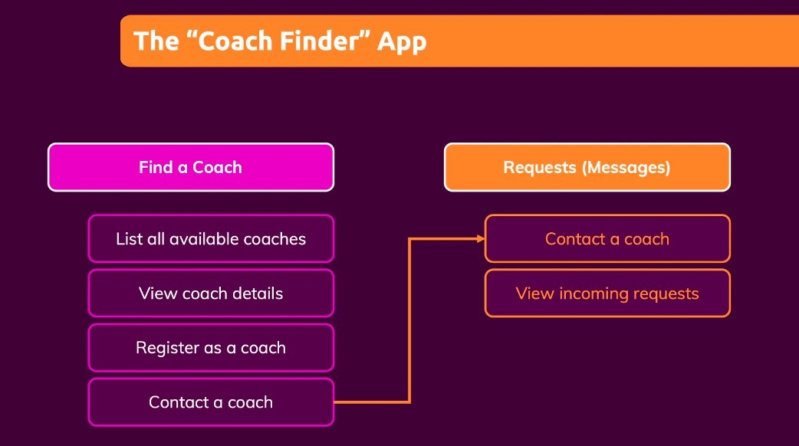
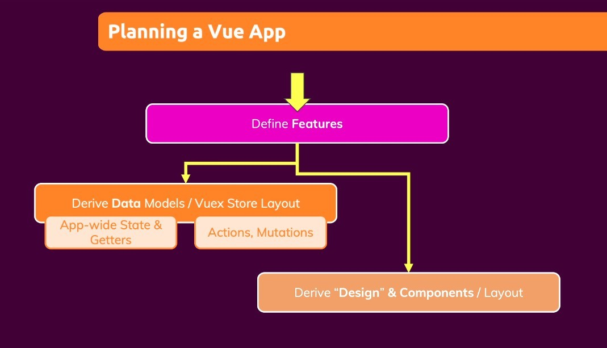

## **App Features**

## **Planing**

> In fact, planning is probably the main part of a Vue app project, otherwise it's hard to know what to code.

- There are many ways to plan, but the lecturer's preferred approach is to think about the above structure in terms of the main App features.
- Although the plan is very important, but also do not have to plan for several days before you start to code, usually are coding while revising the plan.
