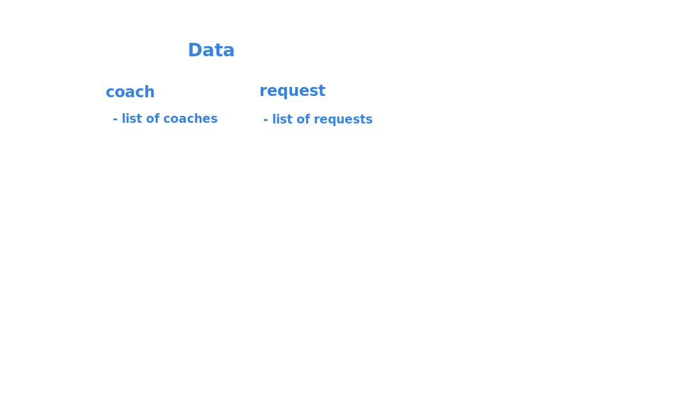
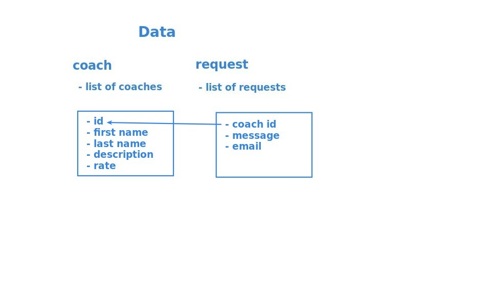
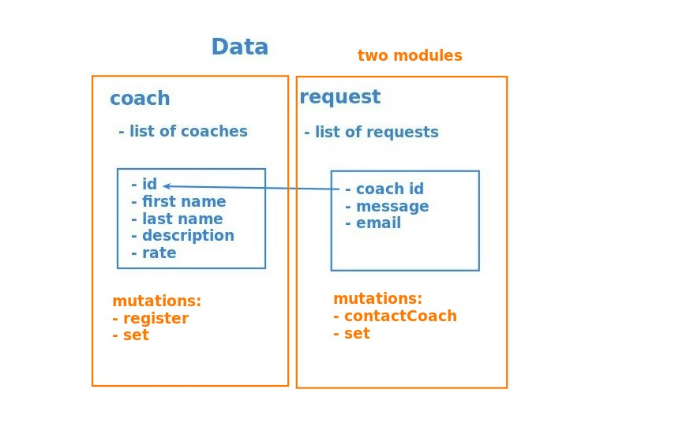

## **Main data**

## **Details of Data**

- 'set' means to extract data from the database and set it in the Vue store, which is also the work of mutations.

## **Other Features of Modules**

- contactCoach actually just adds a new request.
