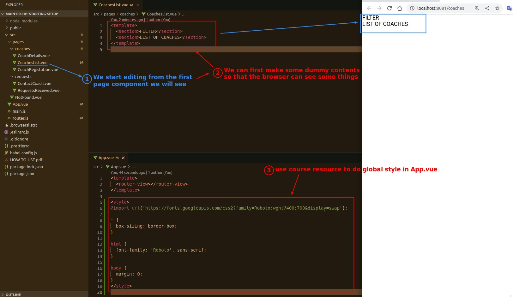
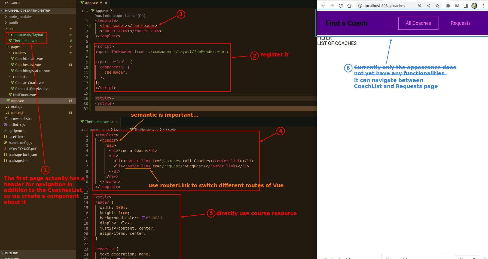
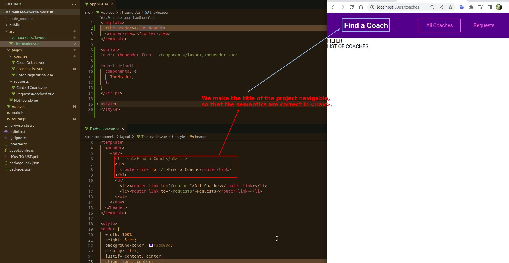

## **Start with what you see at the beginning**

## **The Header**

> In addition to the page component, the header with navigation function is also a resident component on the page, so we also make it first.

## **Semantic is Important...**

> Because <h1> is written in <nav> above, we simply make the content of <h1> navigable as well, because we want to conform that the semantics of HTML is correct...

