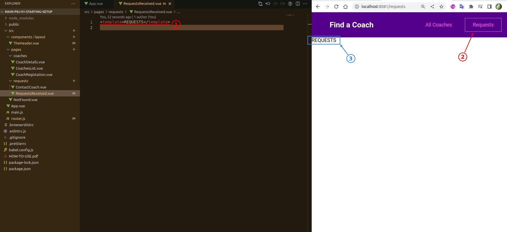
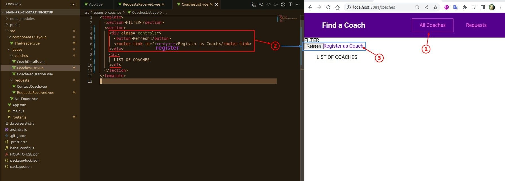
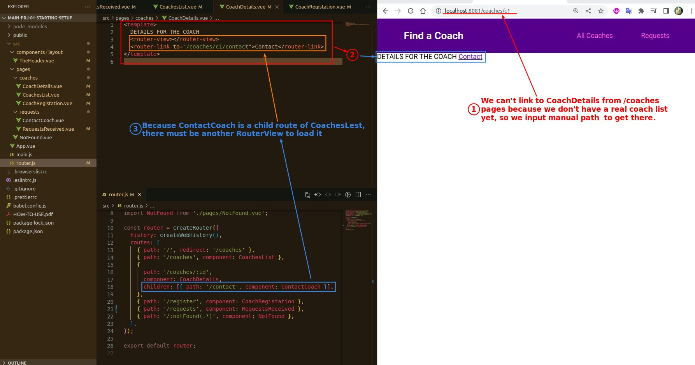
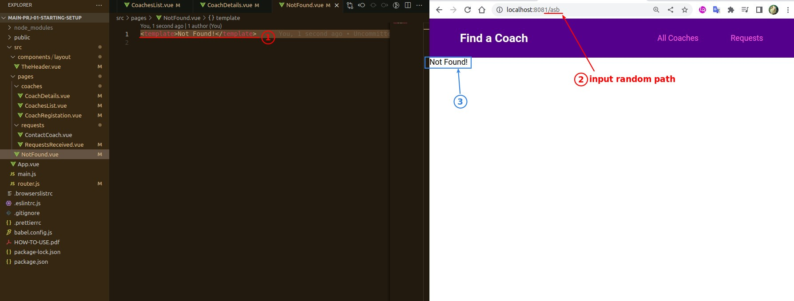

# **\*Wiring Up All Pages**

> The goal of this lecture is to connect each page component together using navigation and to make their dummy pages at least to present some content on the page to make sure it works properly.

## **RequestsReceived**

## **CoachesList**

## **CoachDetails & ContactCoach**

## **NotFound**

