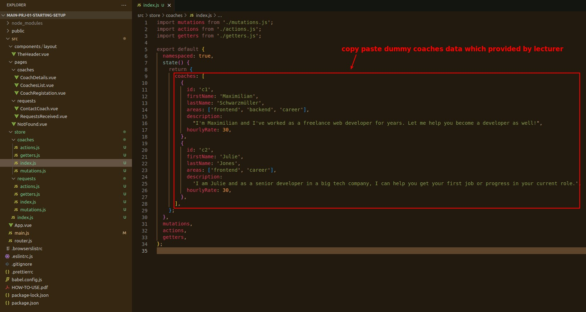

## **Vue Store Basic Structure**

## **Import Dummy Data & Getters**

> Put some dummy data into the store and write some getters method so that the component can use the data.

## **Usage in the Compoenent**

> Make the data in the Vuex store available on the page through components.

