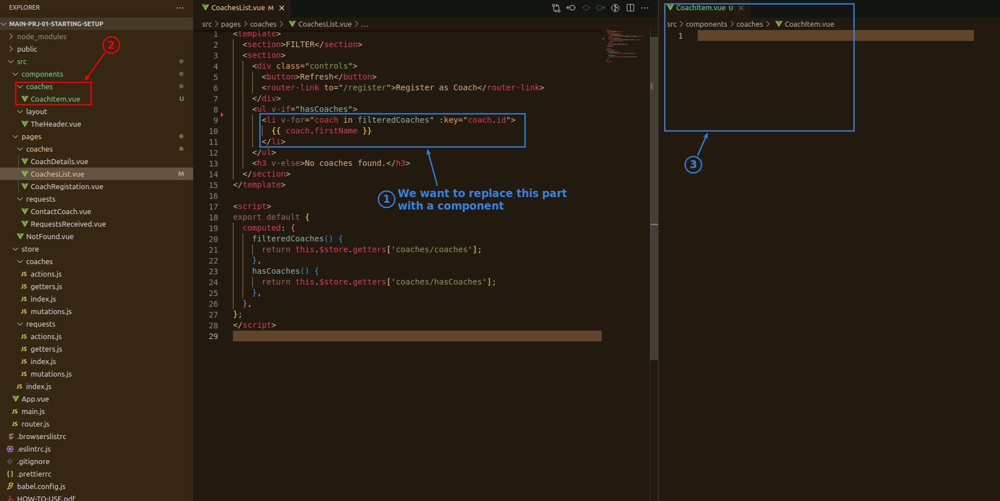
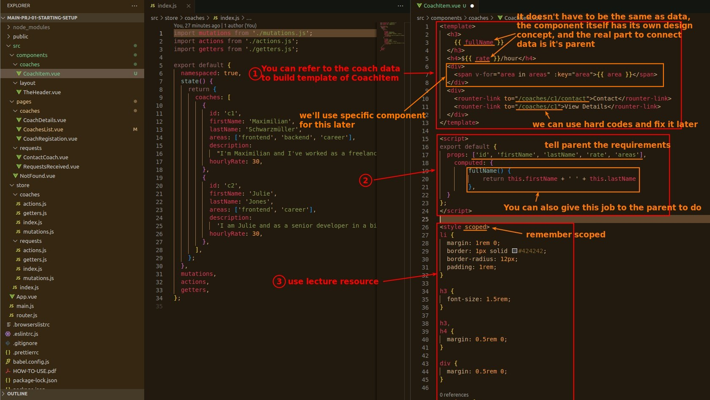
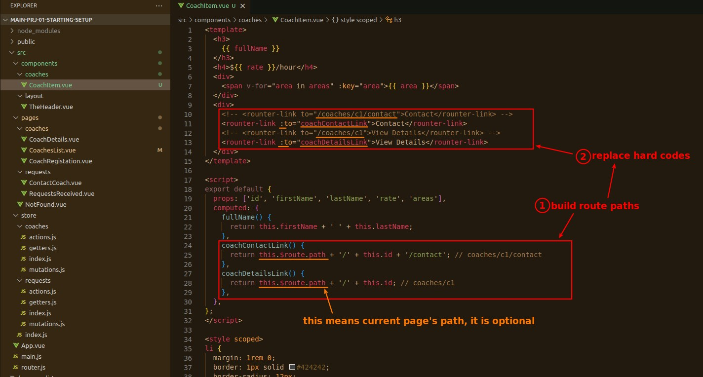
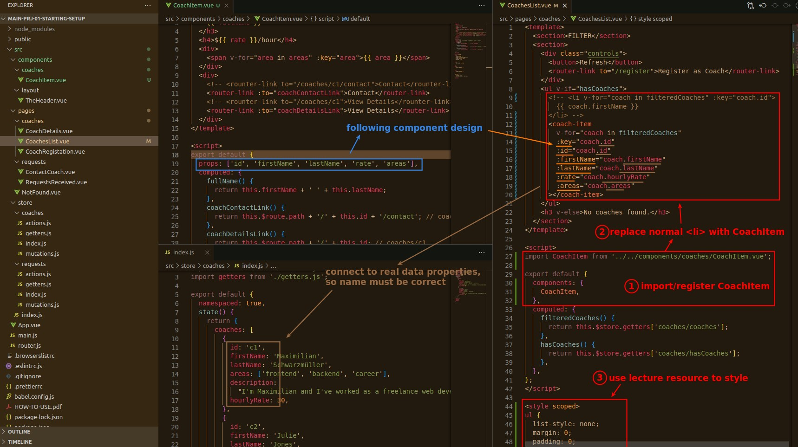
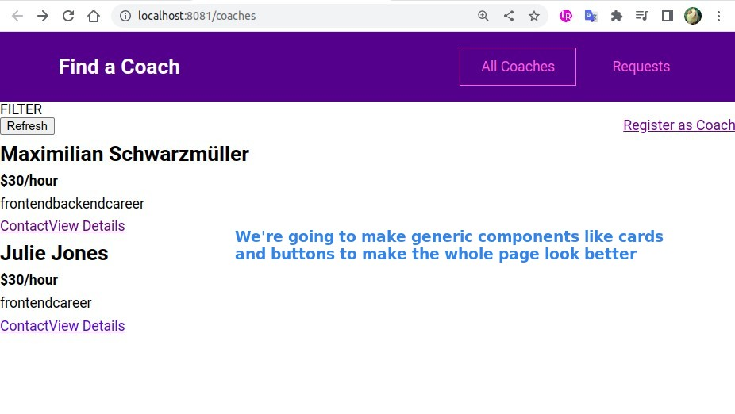

## **Plan**

- Technically we could implement everything in the CoachList, but it would be better to use additional component spliting codes.
  - This component belongs to the normal component.

## **CoachItem**

### _computed_

- From the above process, we can find that we can first write some results using normal HTML elements or even hard code, and then replace them, so it will be easier, instead of thinking very complicated at the beginning.

## **Replace original codes with CoachItem**

