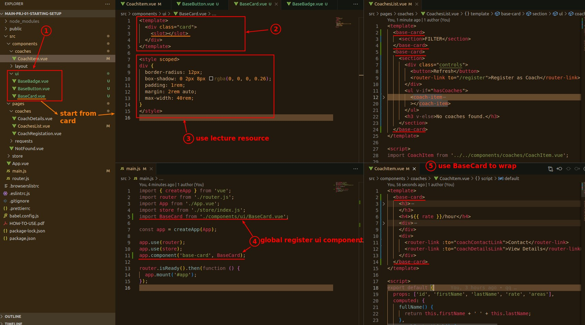
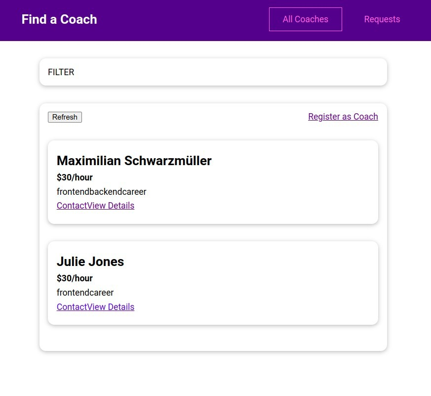
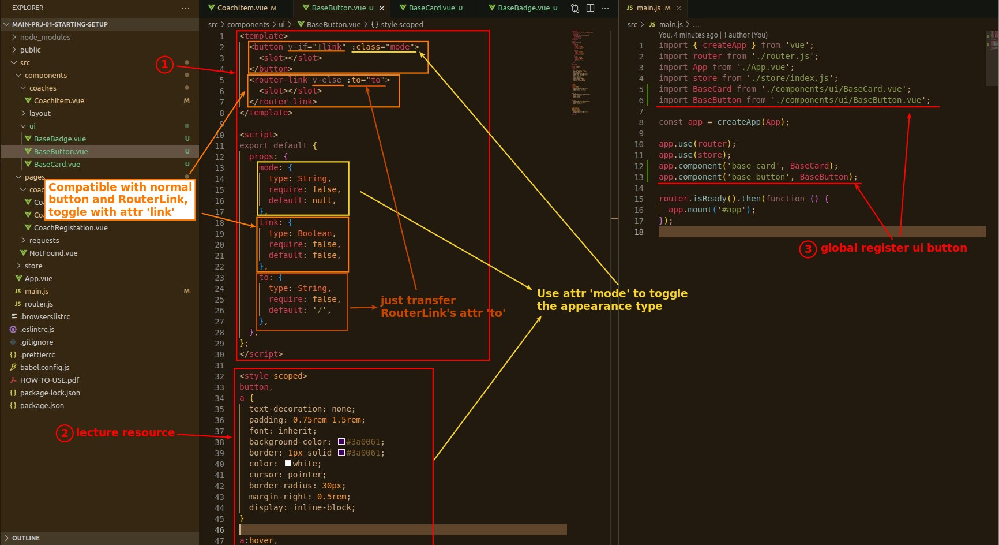
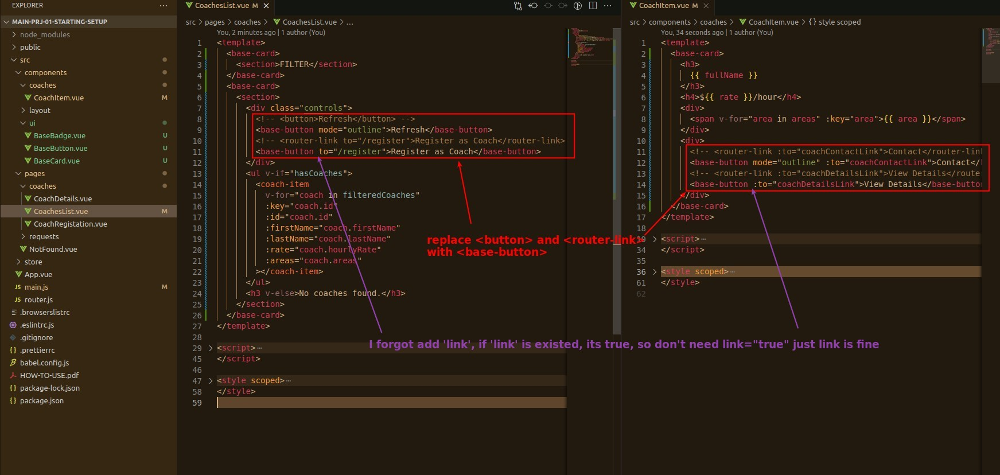
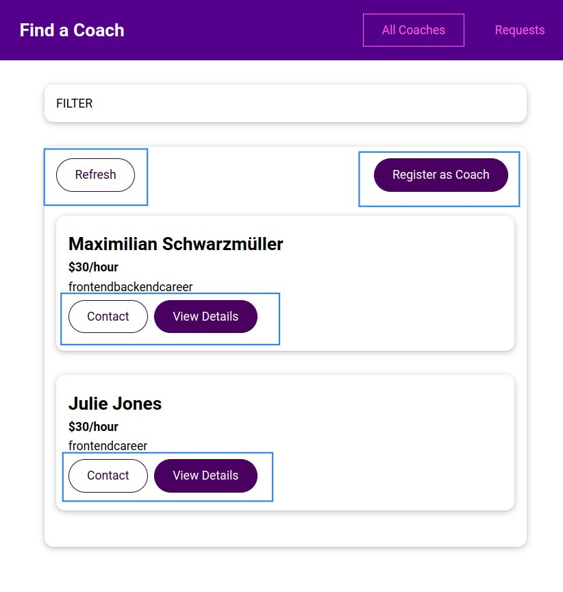
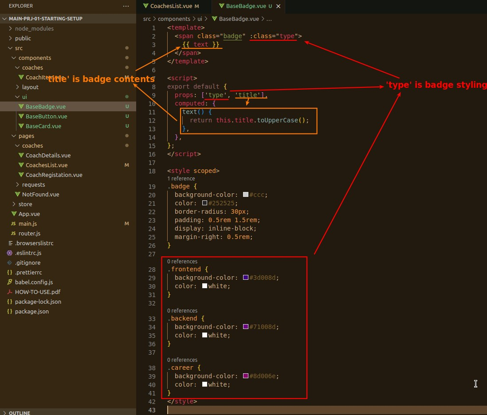
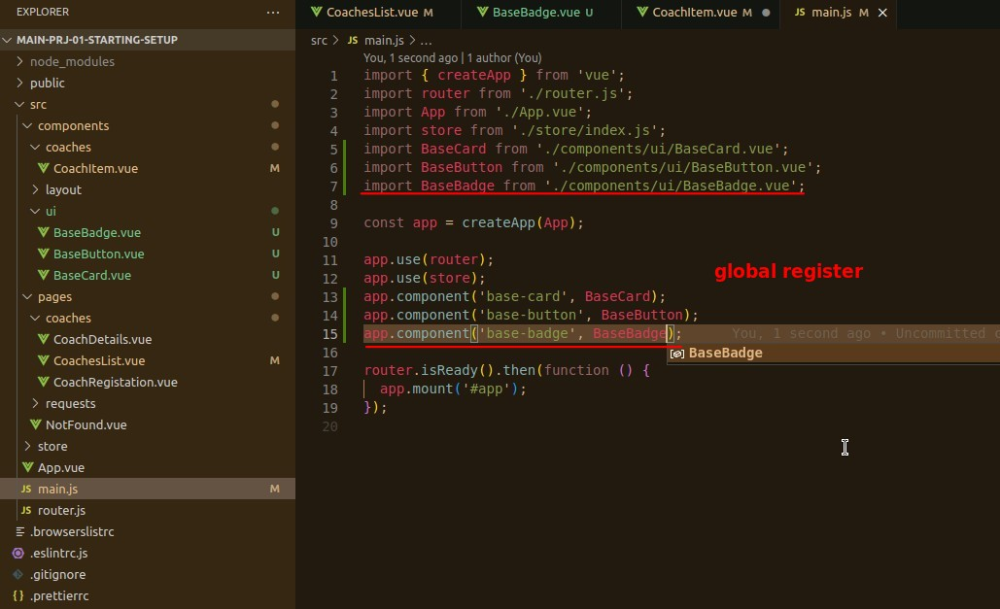
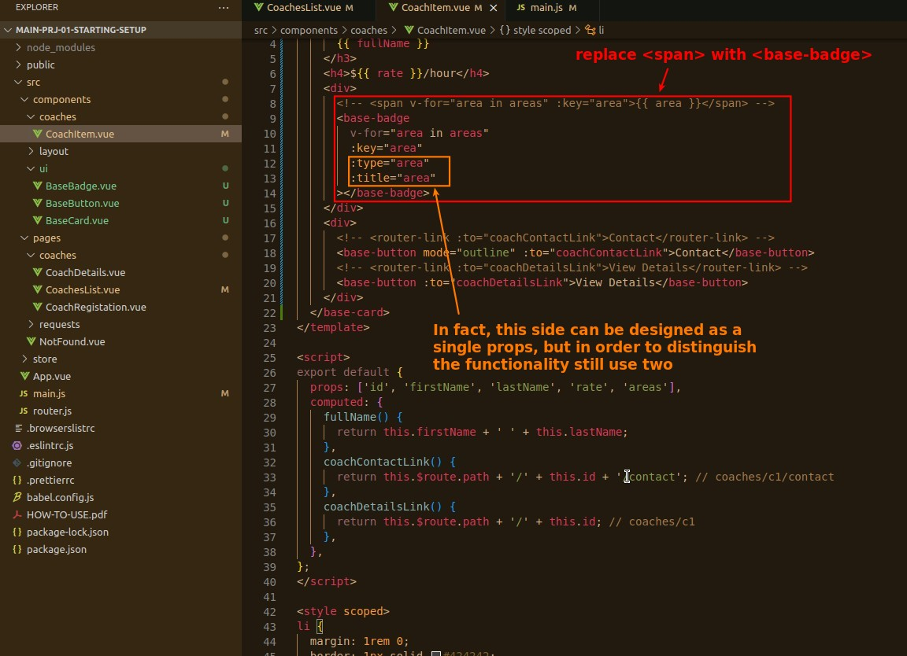
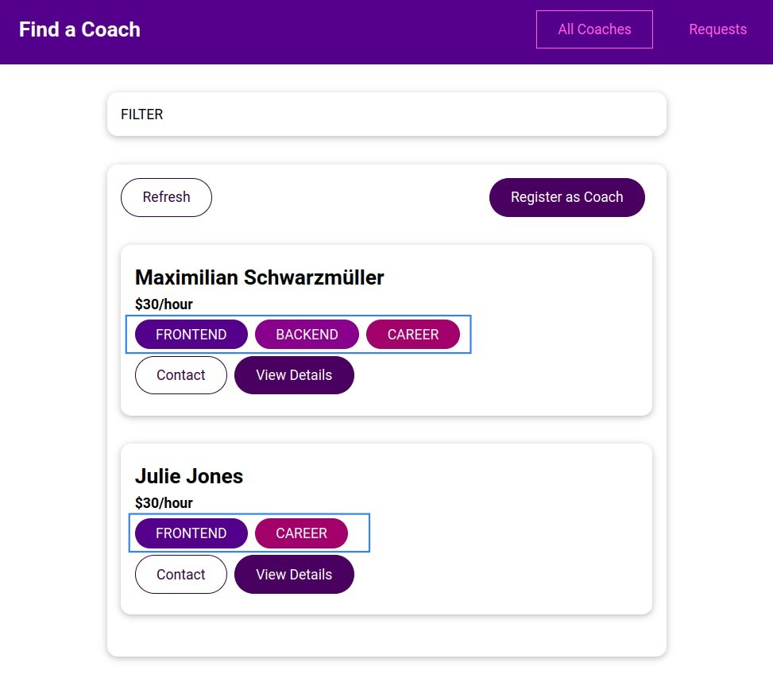

## **BaseCard**

### _design, register, implement_

### _result_

## **BaseButton**

### _design_

### _implement_

### _result_

## **BaseBadge**

### _design_

### _register_

### _implement_

### _result_

