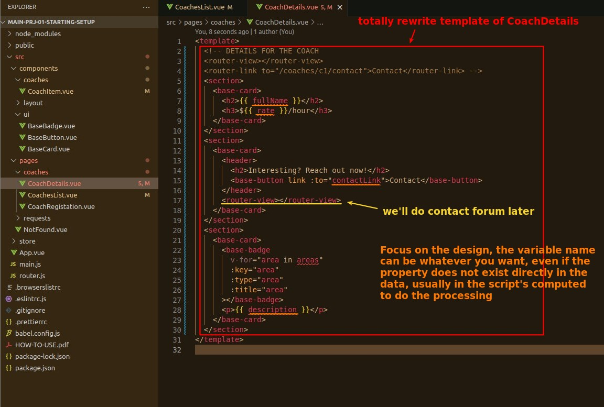
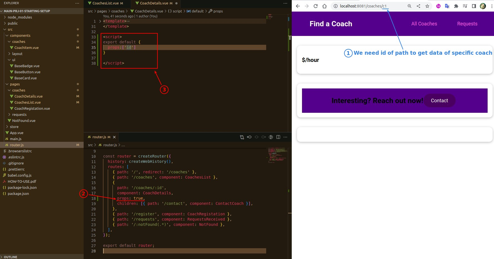
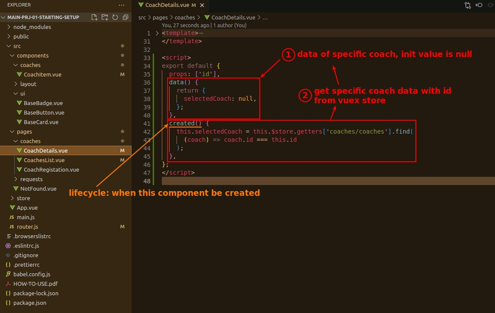
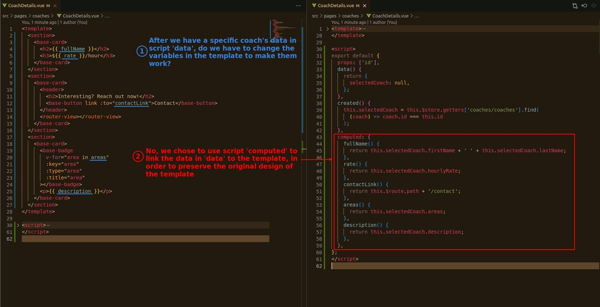

## **Rewrite Template**

## **Get URL params through props**

> We need the id (params) in the URL to fetch the vue store to get the specific coach data.

## **Fetch data from vue store in lifecycle created**

> Specific coaching data should be fetched into the component (memory) as soon as it is created.

## **Use computed to connect template and data**

> Instead of polluting the pure design concept of template, we have a better approach to let this component work properly.

