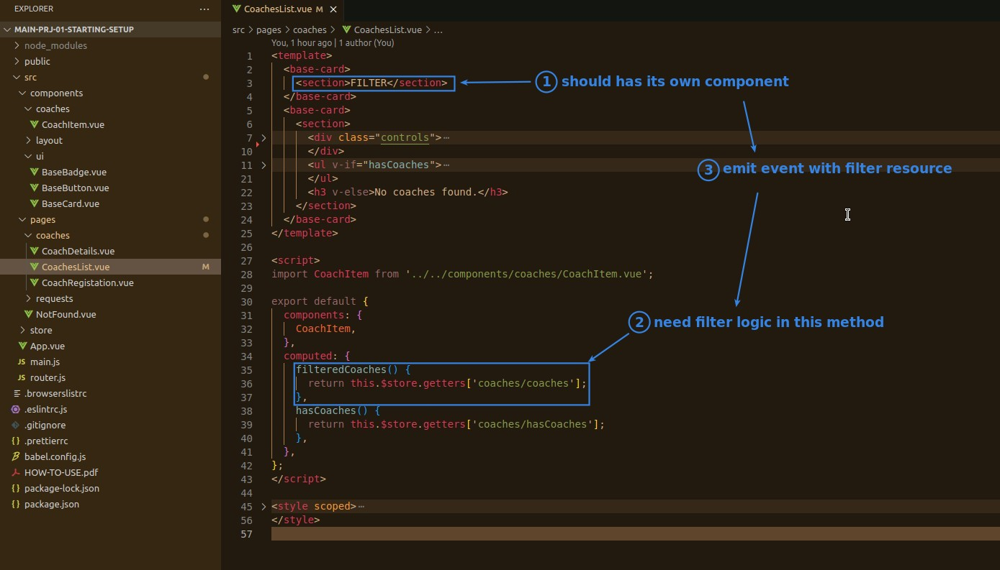
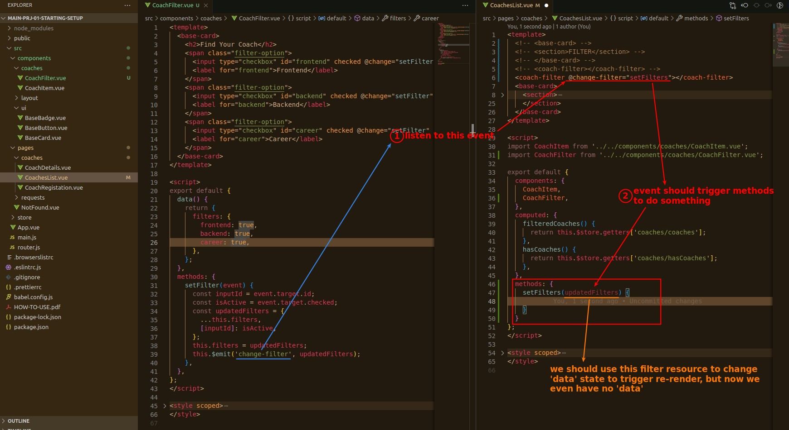

## **Plan**

## **CoachFilter**

### _Curving Appearence_

### _init states_

### _methods and event binding_

## **CoachesList**

### _stuck at methods..._

### _duplicated stats to let things forward_

### _relate to computed method (add filter logic to it)_

