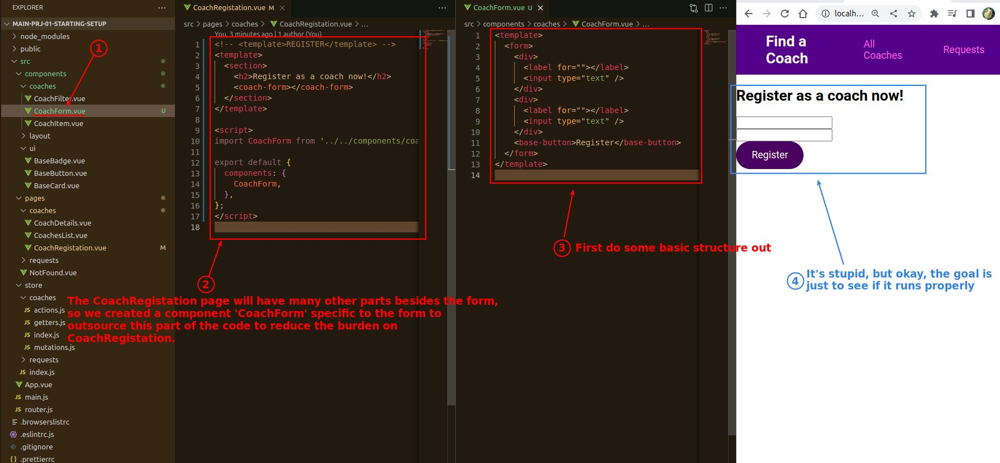
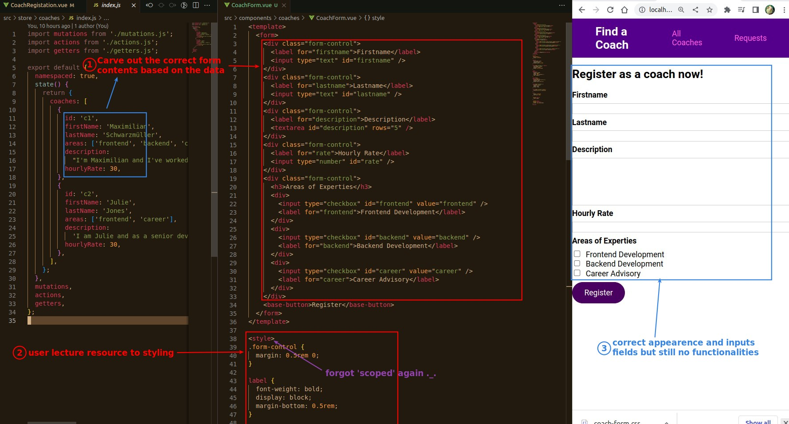
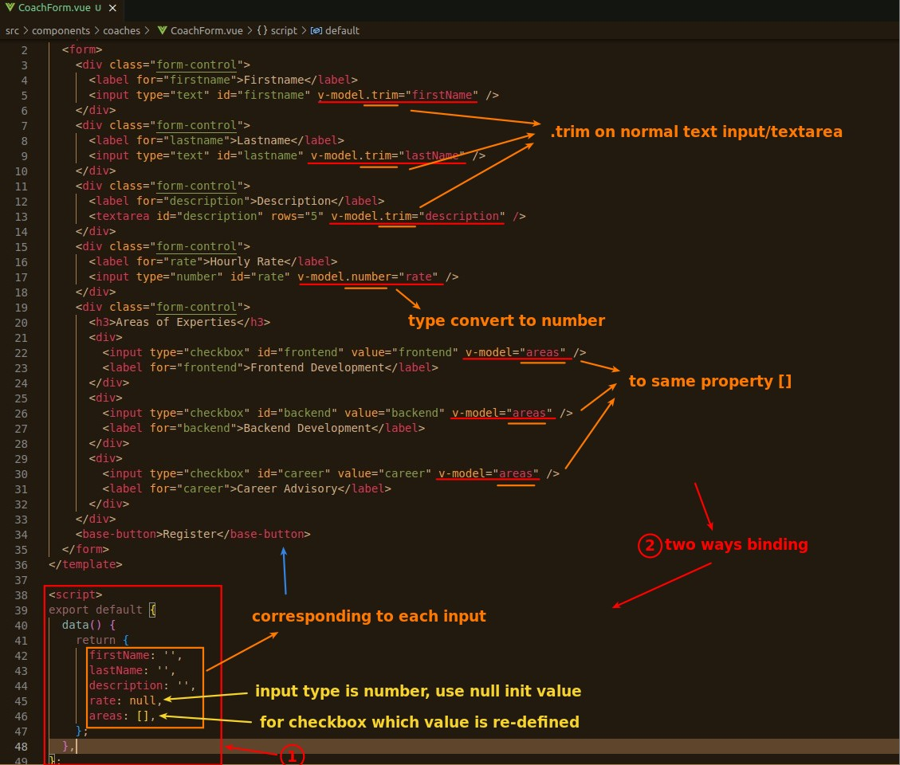
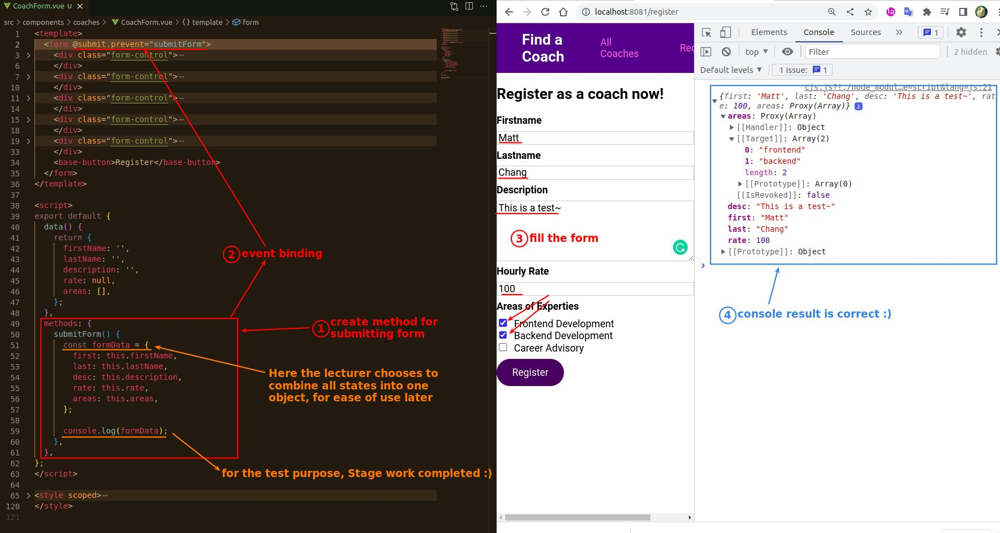

## **Outsource the form to CoachForm**

> In the registration page, there are many other parts besides the form, so we outsource the form first and use a separate component to handle the form.

## **Curve Form contents based on data**

## **Build stats and binding to form**

## **Build method binding to Form submit**

