## **Form submit to store data into vuex**

### _emit event with submitting data_

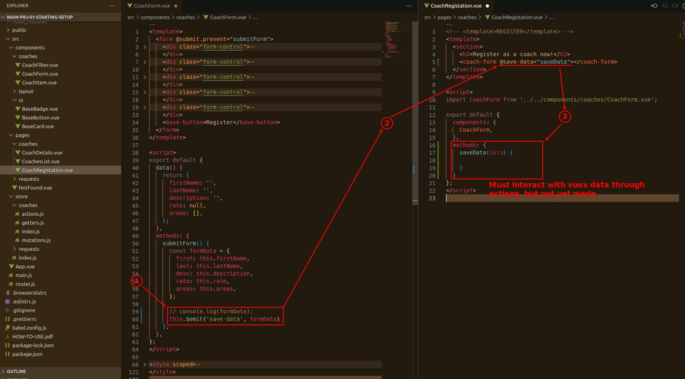

### _mutations and actions_

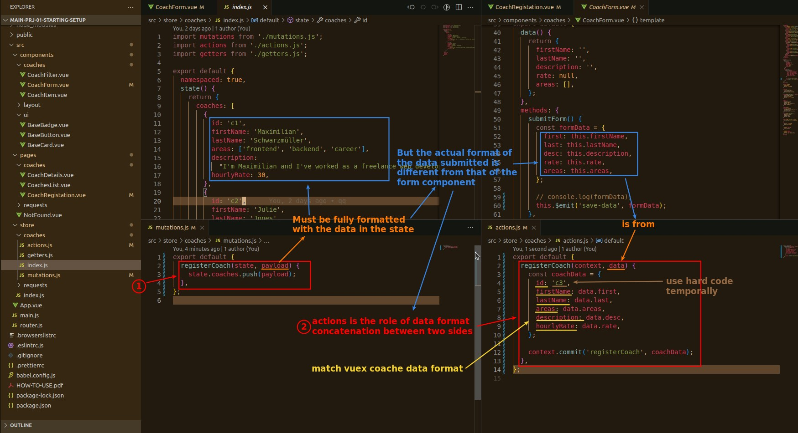

### _dispatch_

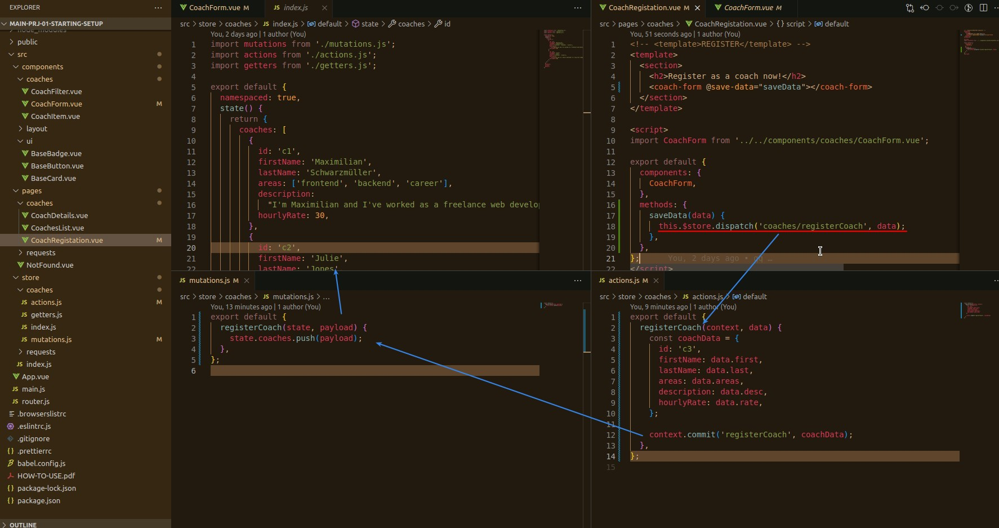

## **Test**

### _fill the form_

### _new coach present_

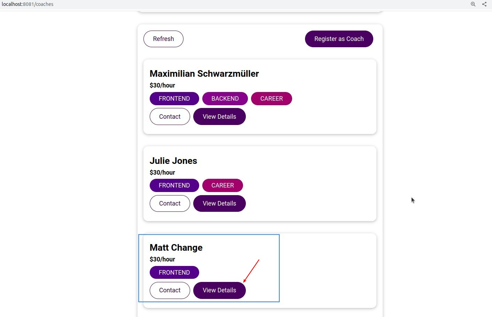

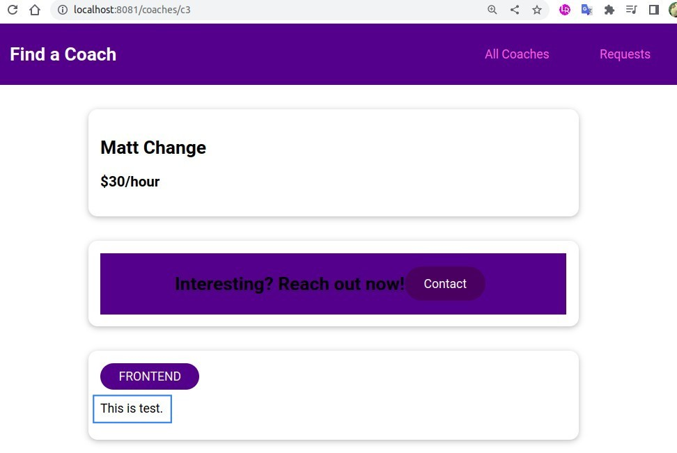

## **Prevent user back to form after submitting**

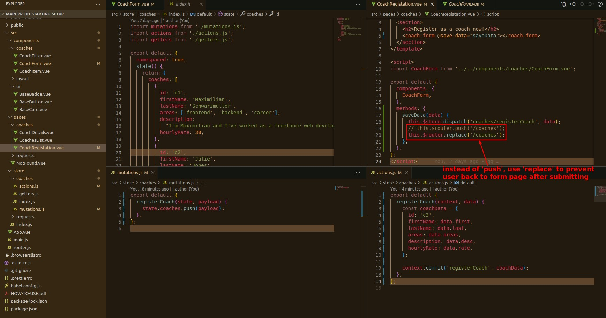

## **Destroy register button after registering coach**

### _explain_

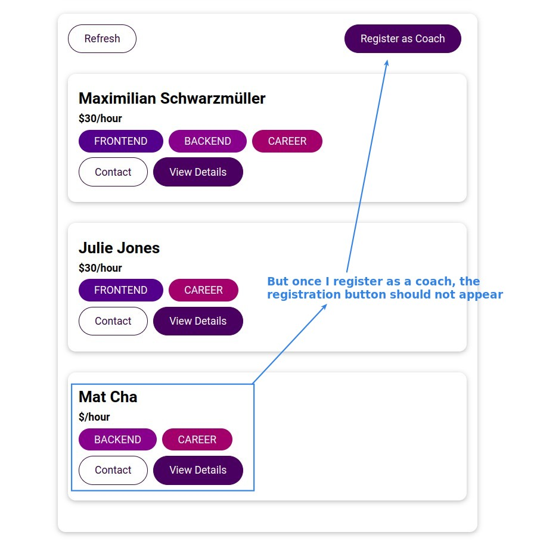

### _root state: userId_

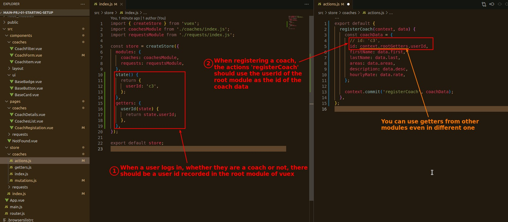

### _getters & computed: isCoach_

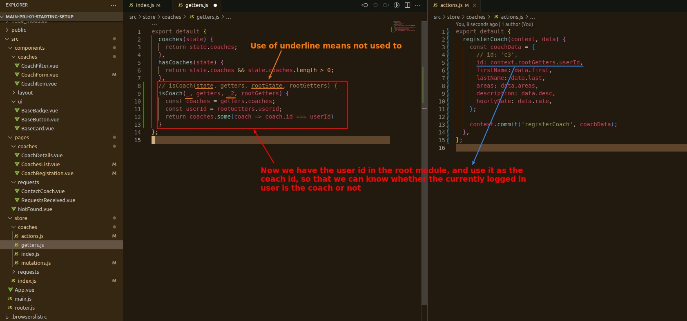

### _dynamic render element_

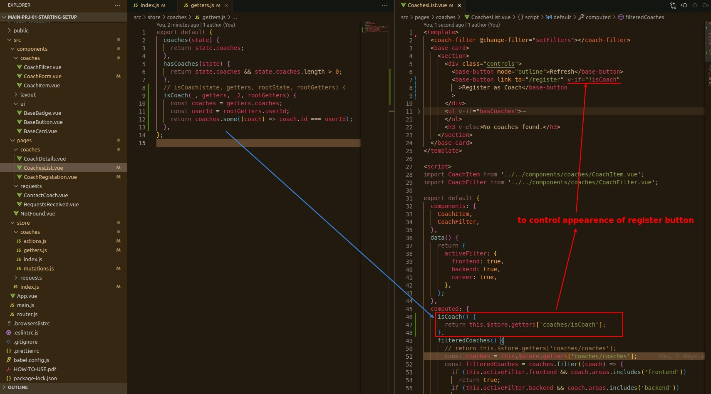

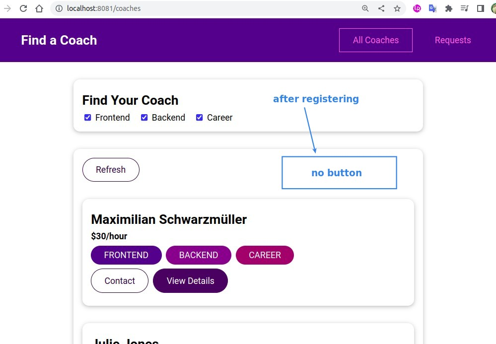

### _better way_

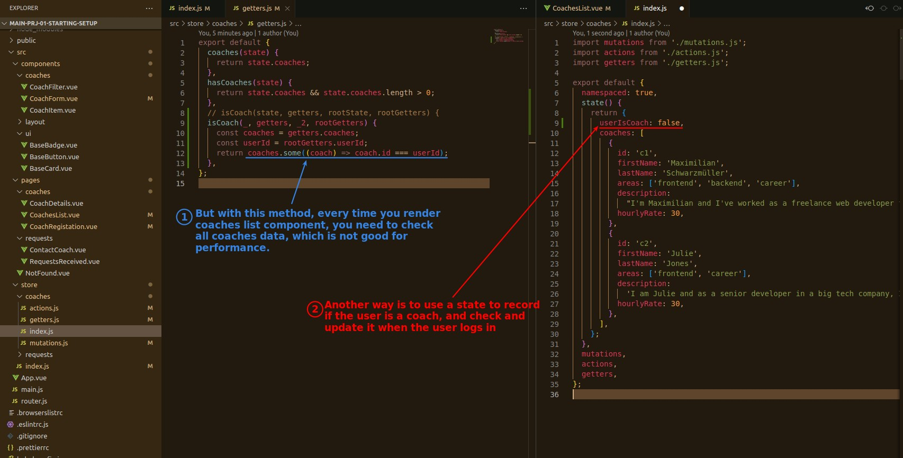
