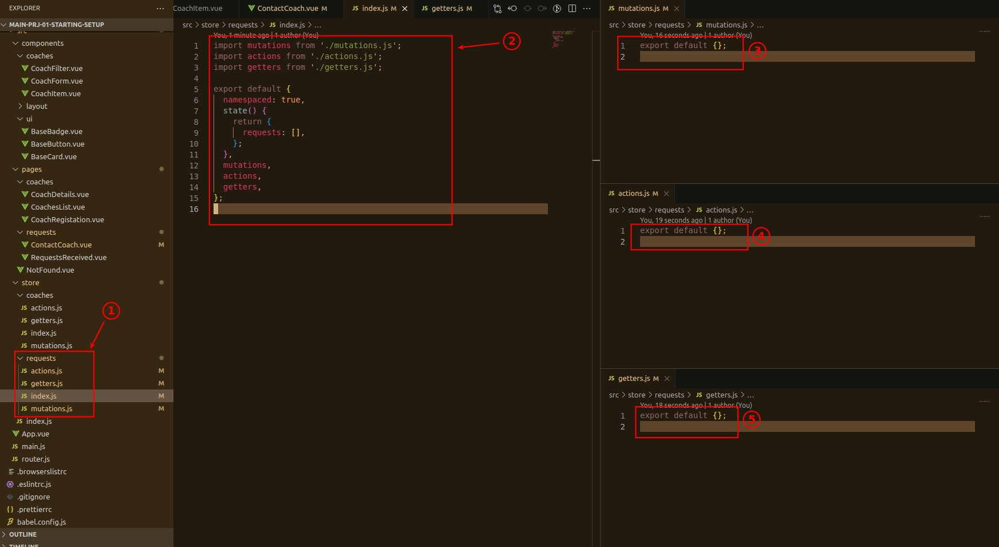
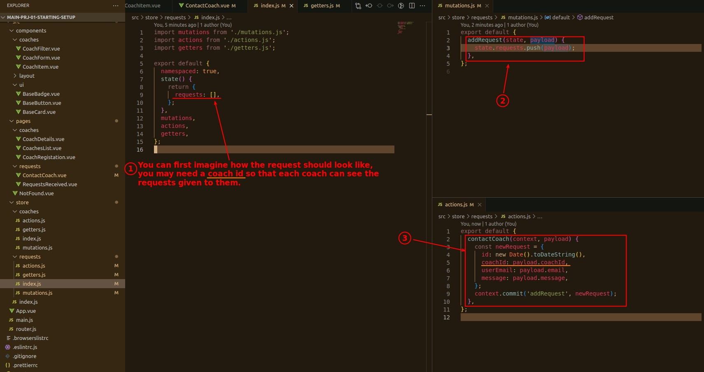
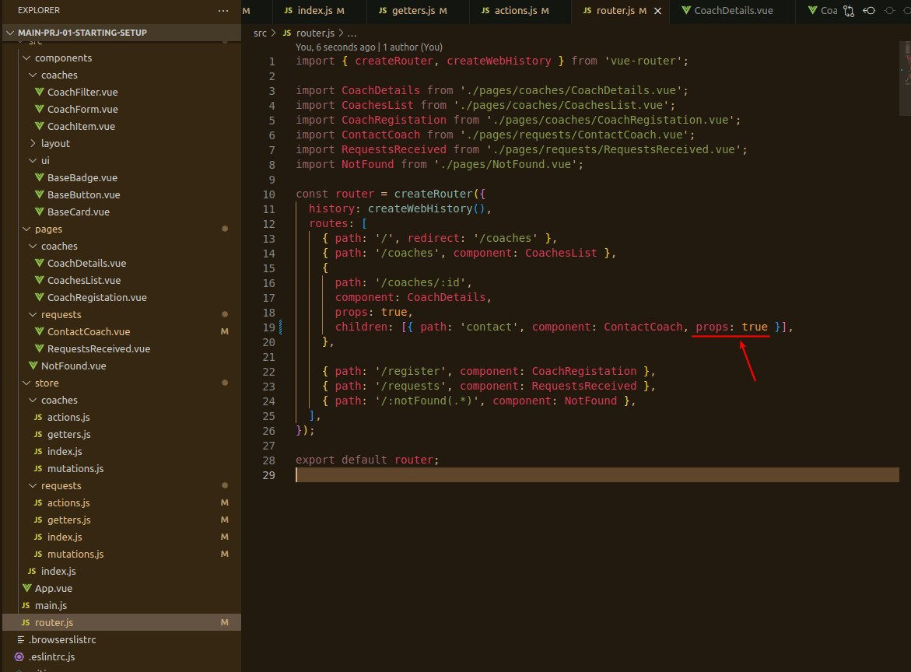
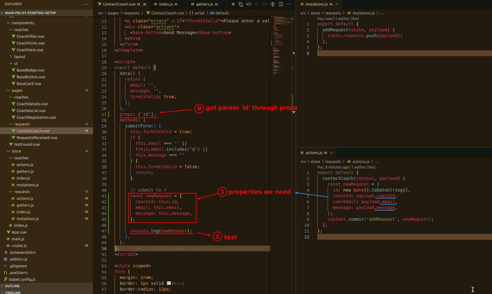
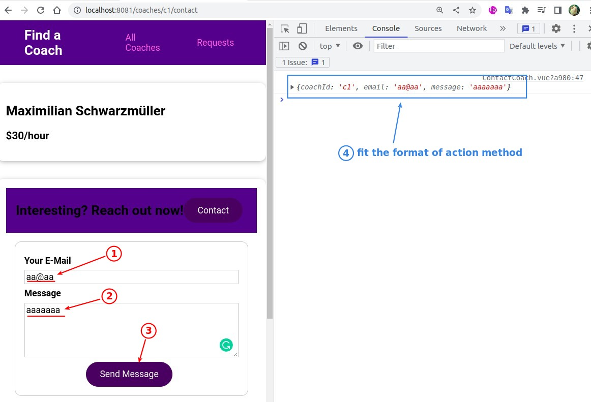
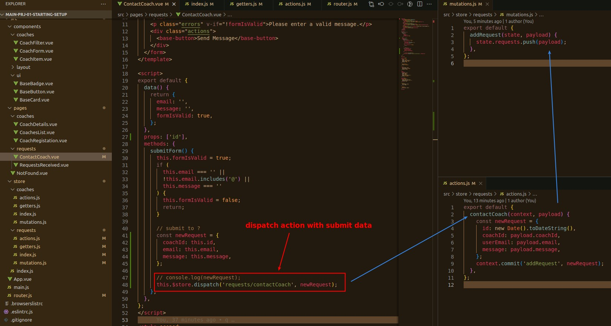

## **Requests Module in Vue Store**

## **Design state/mutations/actions**

- Personally, I think actions is the most important, because it is related to both Vuex store and Vue component.

## **Build submit object to fit payload design**

### _set route: props = true_

> In order to get value of params.

### _build correct object to submit_

### _page test_

## **Dispatch in component**

