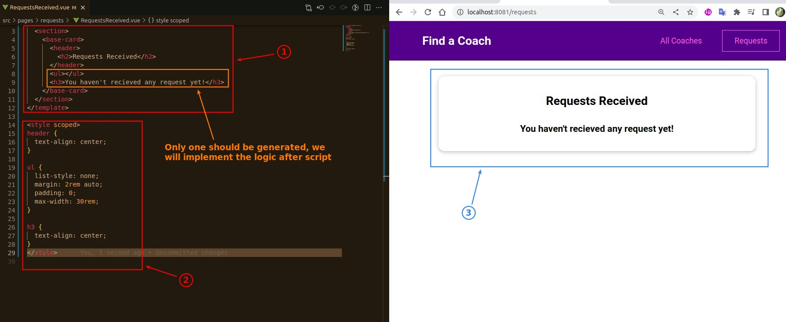
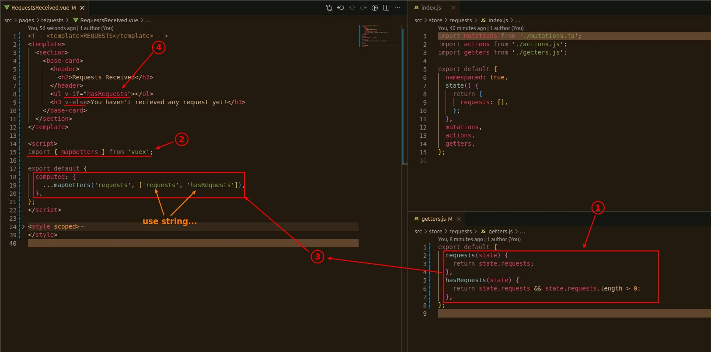
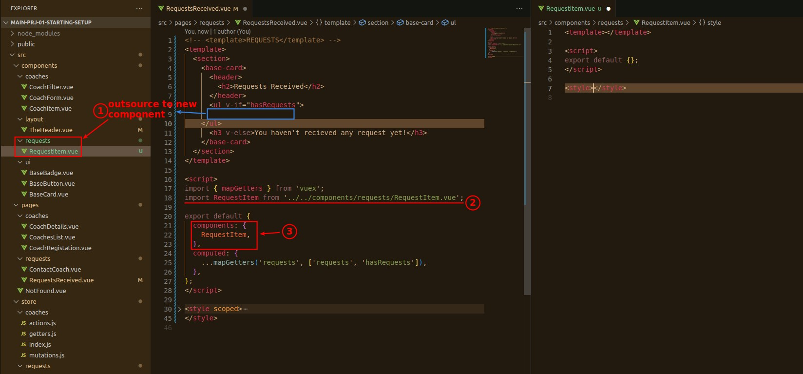
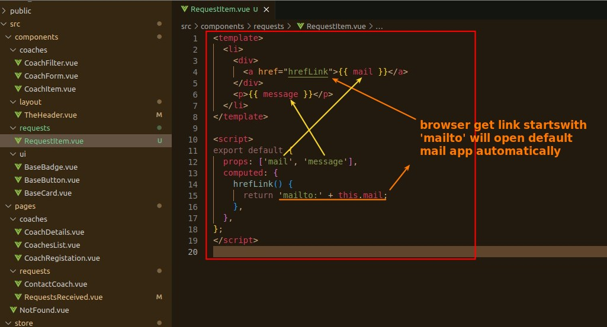
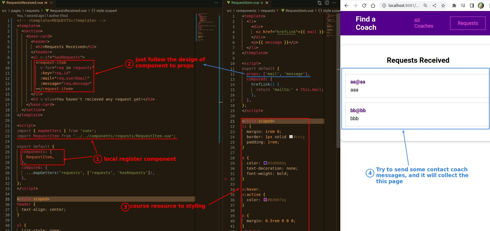

## **Curve Appearence**

## **Get data from vuex store and dynamic render(v-if)**

## **Outsource \<li\> to new component**

### _setup(create file, register...)_

### _design_

### _use it in parent_

