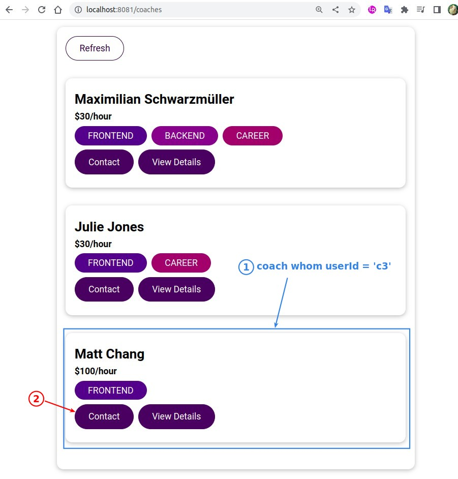

## **Direct filtering with getters**

> Filter the data that can be given to the logged-in user based on the user, which is suitable for filtering directly in the getters.

- Although the root module is currently using dummy data for the userId, the filtering is already done.

## **Test**

