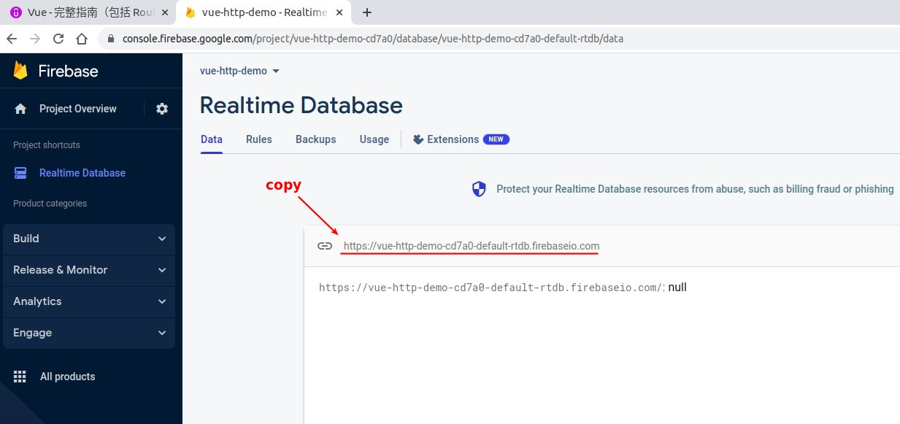
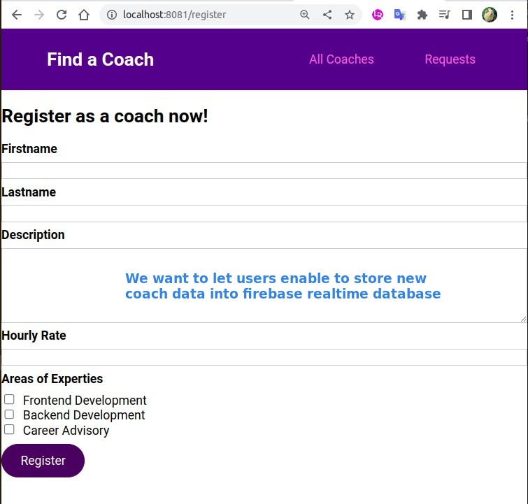
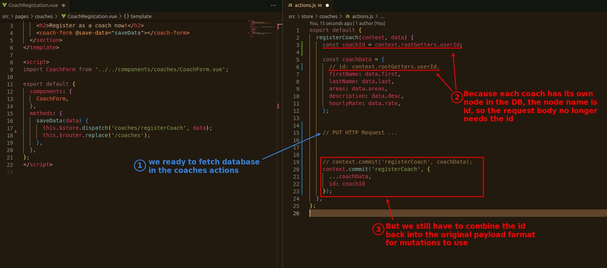
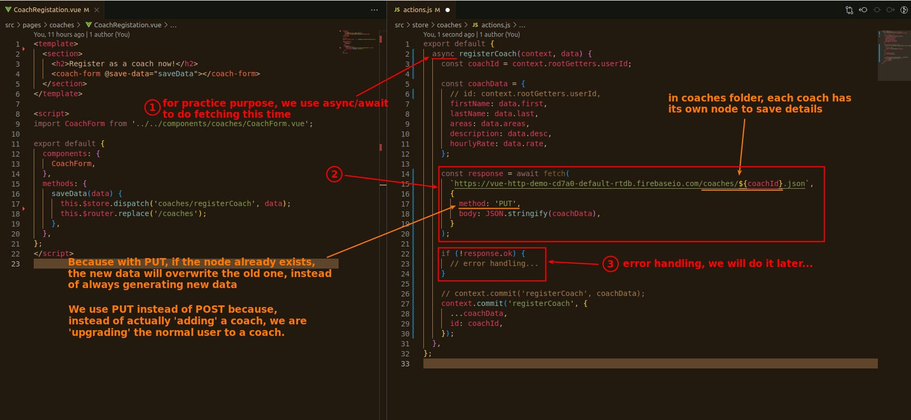
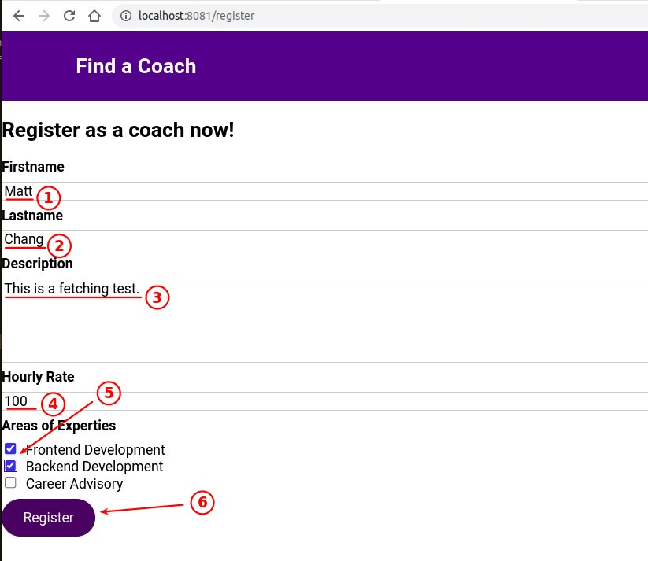
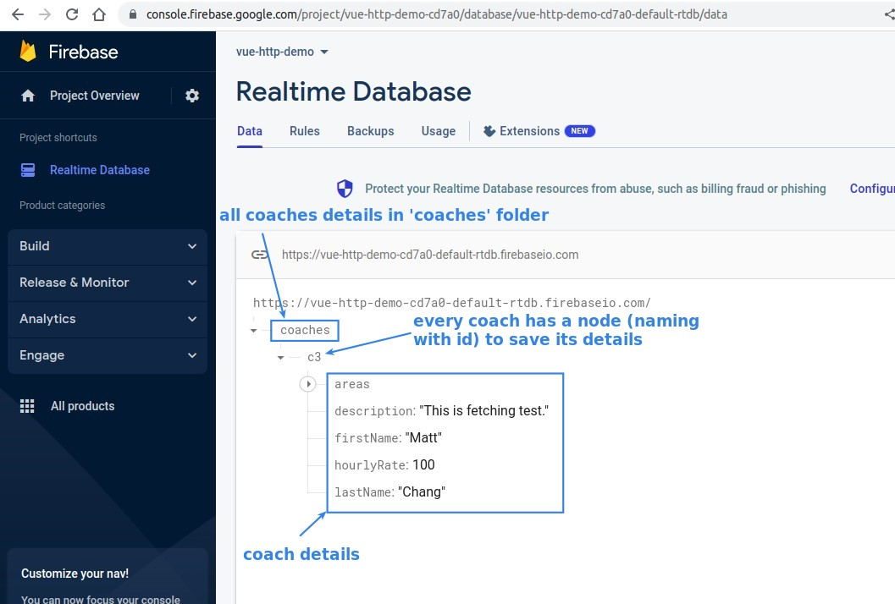

## **Firebase & Our goal**

### _Firebase realtime database_

> Check if the Firebase account is still working, and copy the api url btw.

### _our goal_

## **PUT HTTP Request**

## **Test**

