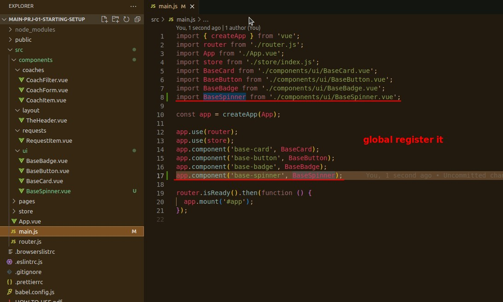
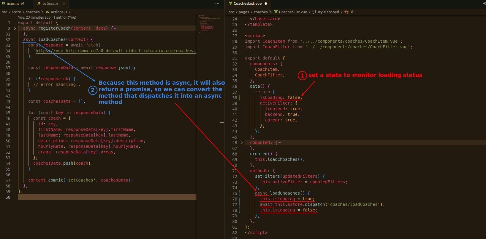
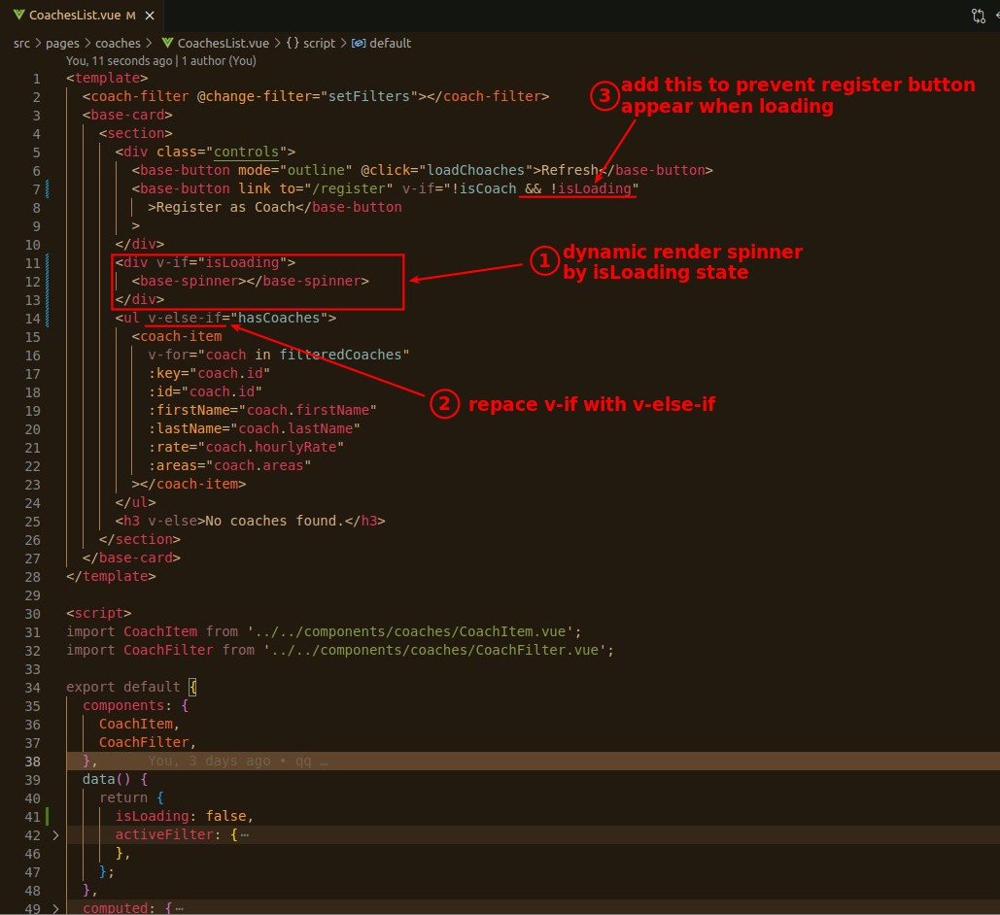
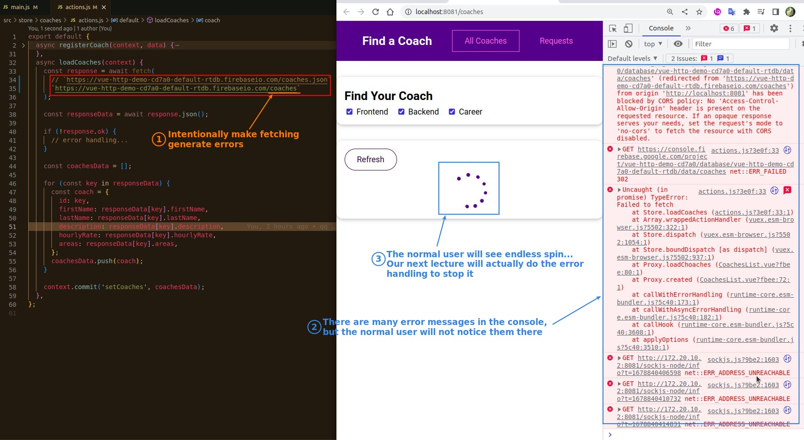

## **Goal & Register**

## **State: isLoading**

> Create a state to represent the loading state as before, but this time the problem is fetching in the action instead of the component.

## **Template**

## **Fetching error case**

