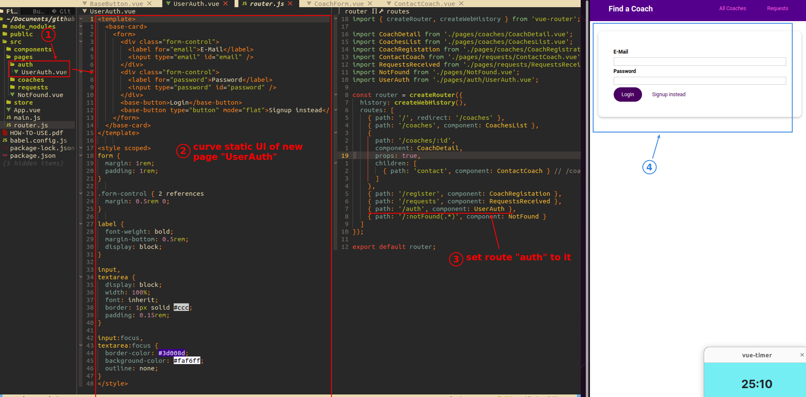
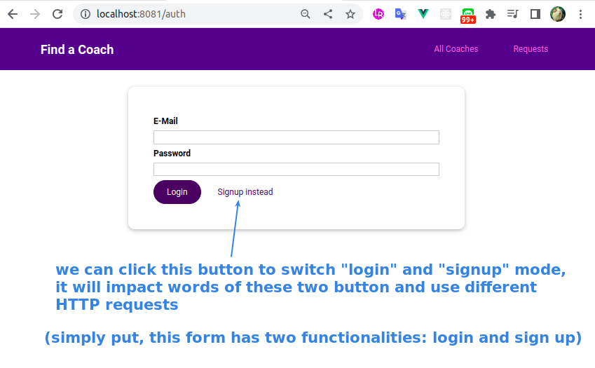
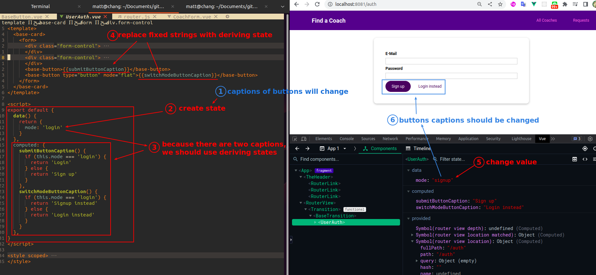
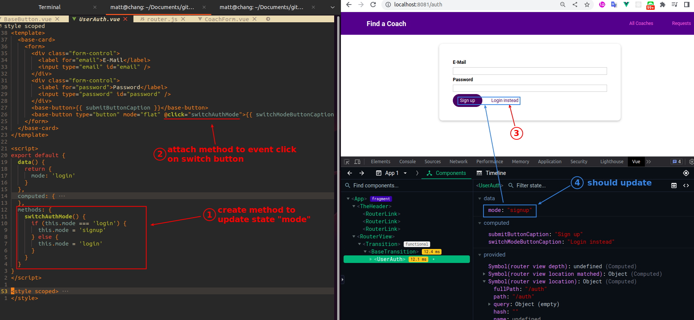
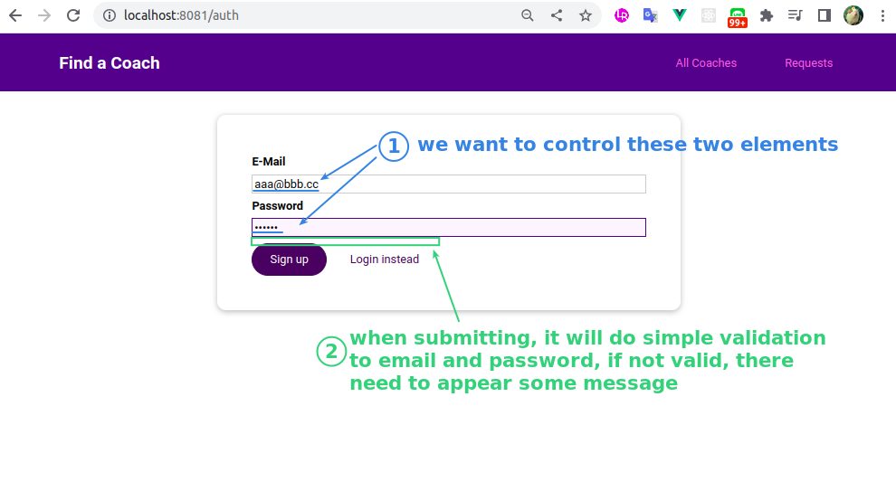
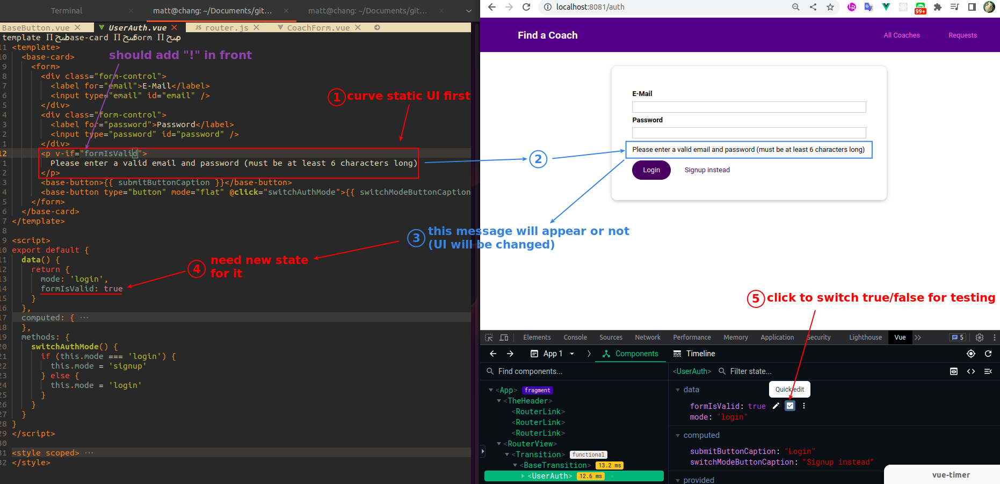
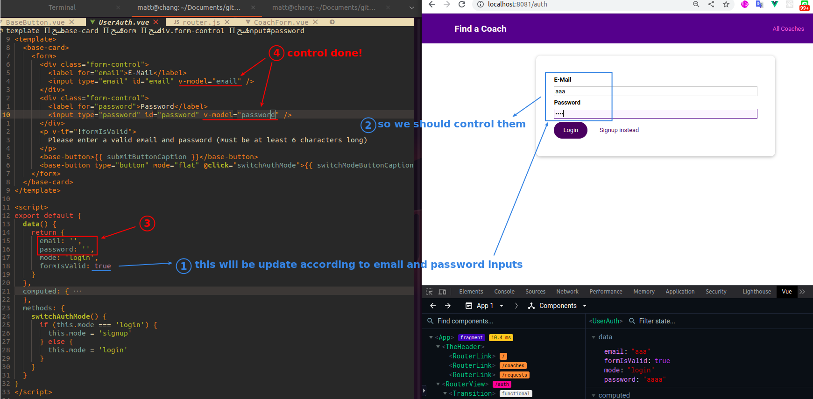
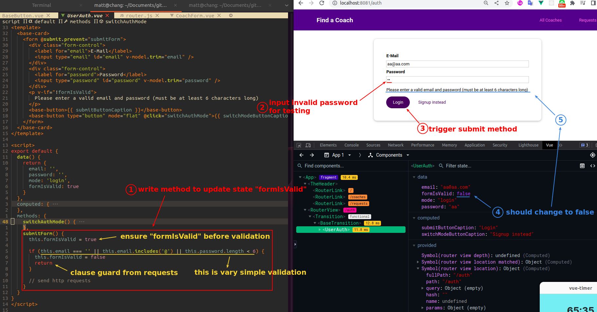

## **Curve static UI of UserAuth page**

 

## **Implement two mode of form (login/sign up)**

 

 

 

- computed is very similar to React's deriving state, so it's natural that the computed value cannot be changed.

## **Validate inputs and show message if got invalid submit**

 

 

 

 

- If we think of the method as a setter or handler in React, it won't feel too complicated.

- We have already done complete validation in other forms of this project, so here is only a simple validation, because this chapter focuses on authentication.

- The more important purpose of state "mode" is to switch the type of request, but let's finish the UI first, and then start the request in the next lecture.
