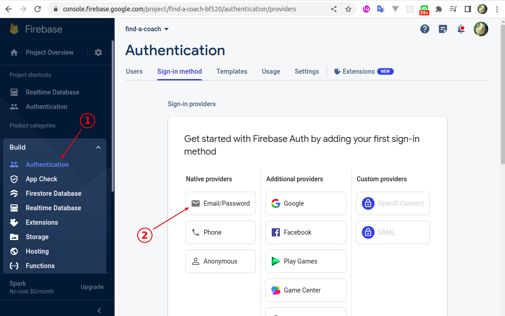
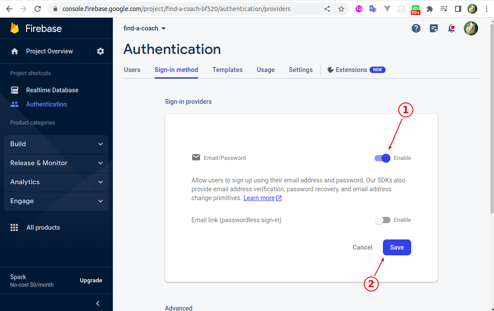
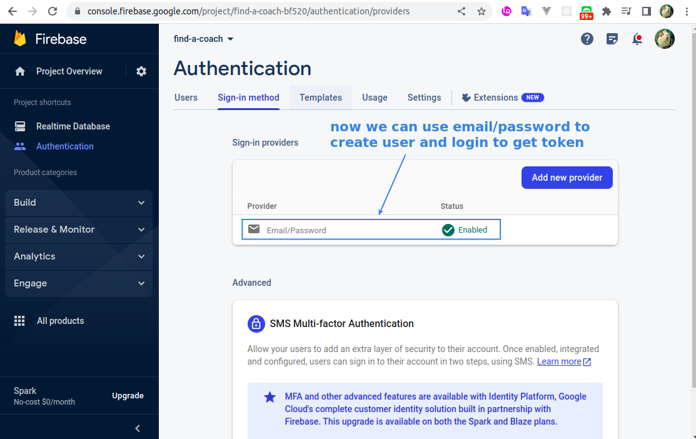
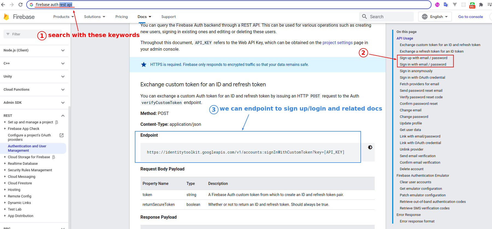
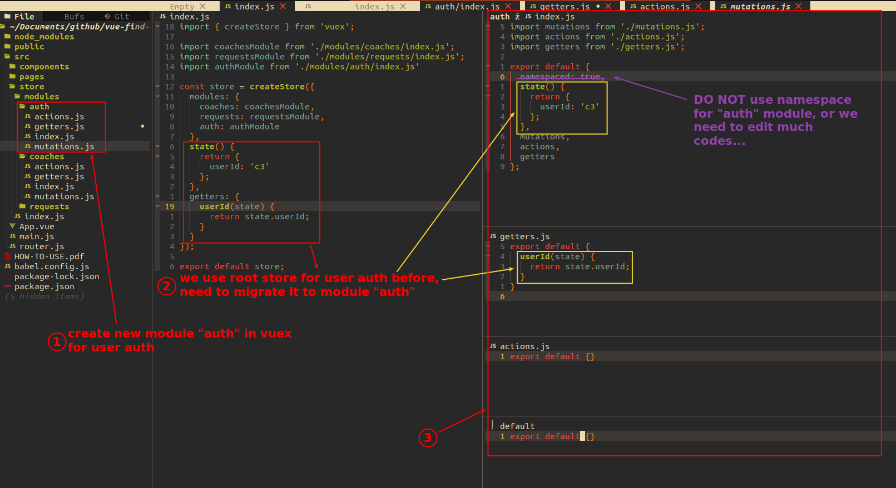

## **Enable auth of Firebase**

 

 

 

## **Documents of Firebase RESTful API about auth**

 

## **Prepare "auth" module of Vuex**

> Before we really use the Firebase endpoint, we have to prepare the vuex "auth" module, because the status of login/logout will impact the UI of the entire APP, so it should not be handled in a certain component.

 
