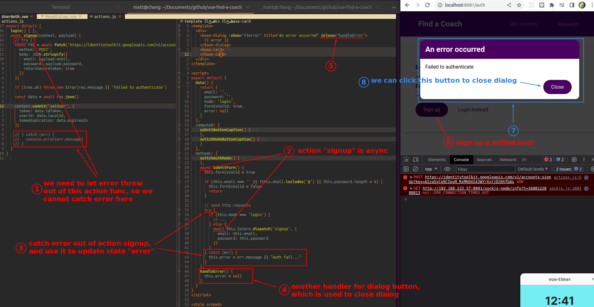
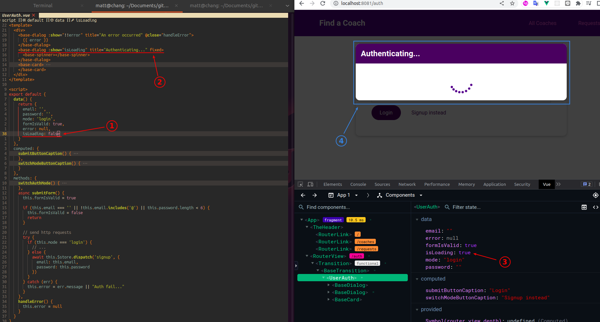
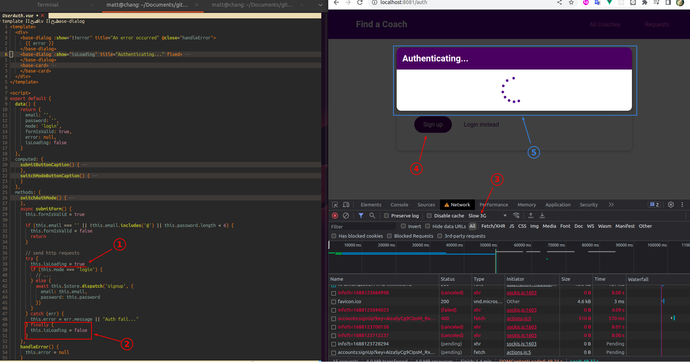

## **Fetching error feedback in UI**

 

 

 

## **Spinner**

 

- The key to this lecture is that the states of the Spinner and Error message UI must be in the component, but the actual fetching is handled in Vuex store.
