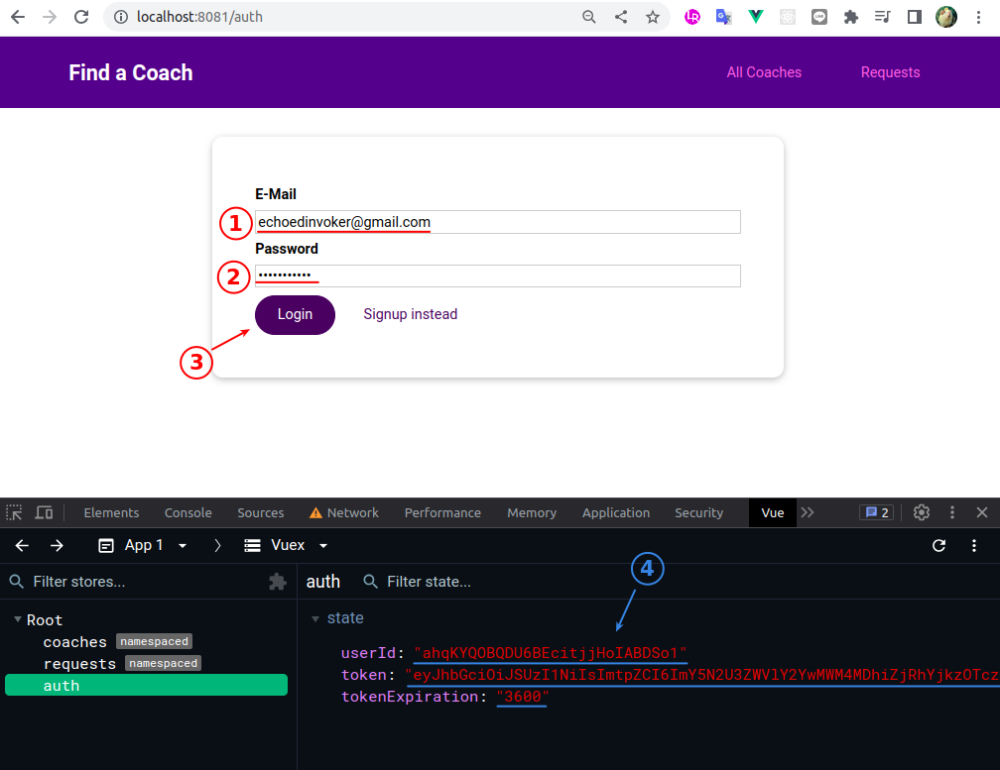
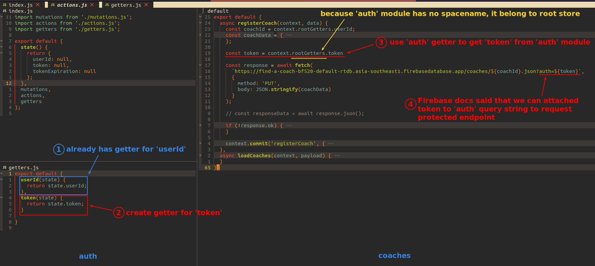
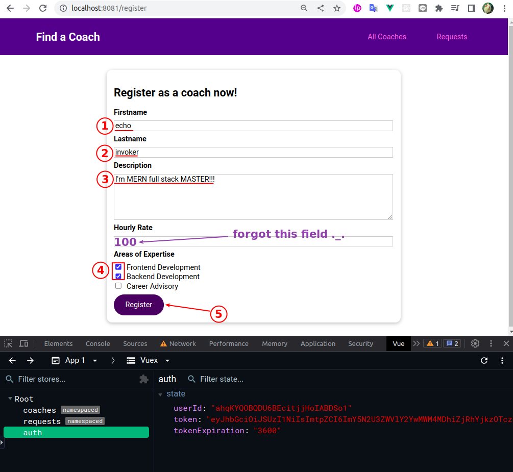
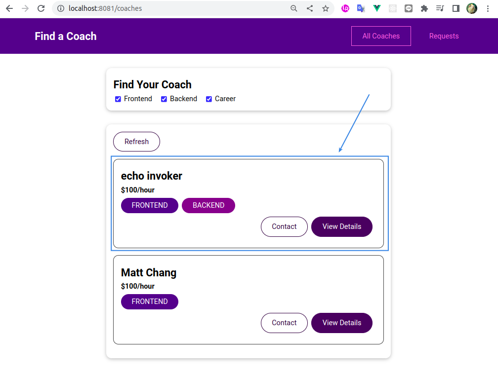
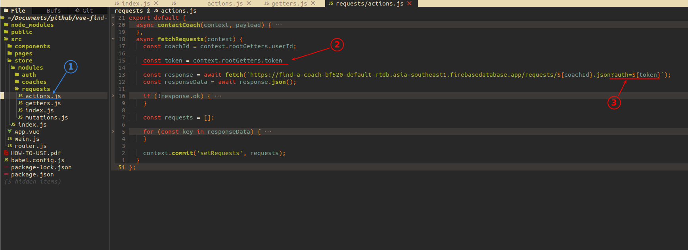

## **Login to get token**

 

- Now we can login to get the token and store it in Vuex's 'auth' store.

- But we have not yet used tokens to request the protected endpoint, we will implement it bellow.

## **Register a coach**

### _setter & request with token_

 

### _test in UI_

 

 

## **Get requests**

### _request with token_

 

### _test in UI_

 
