## **Fix problem: auto-login even user already logout**

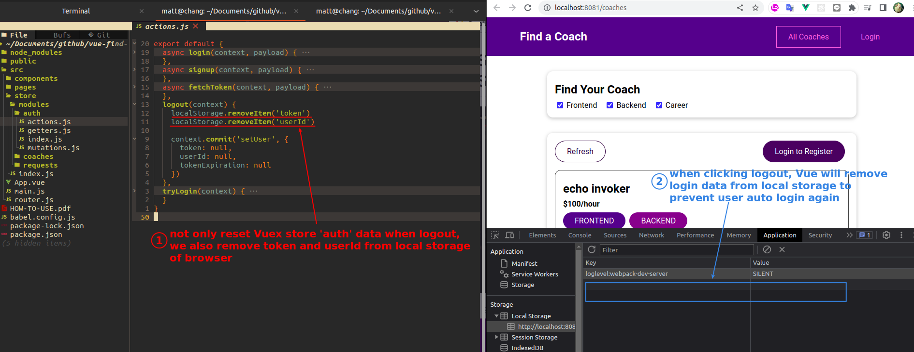 

## **Demand: auto-logout based on 'expireIn' from Firebase**

### _documents_

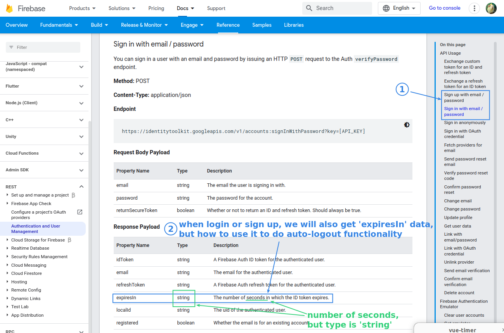 

### _get future expiration date and store it to local storage_

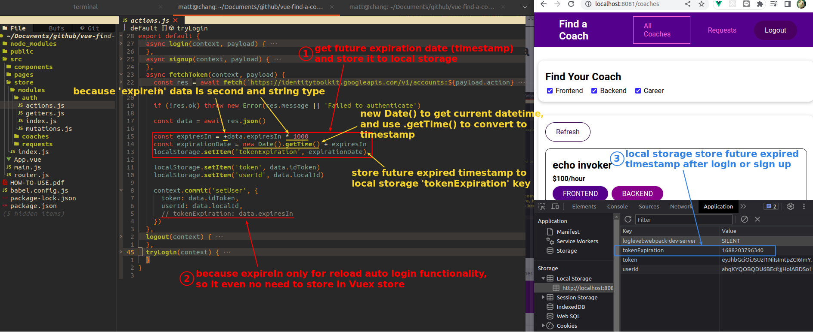 

### _Vuex store actually do NOT need expiration related data_

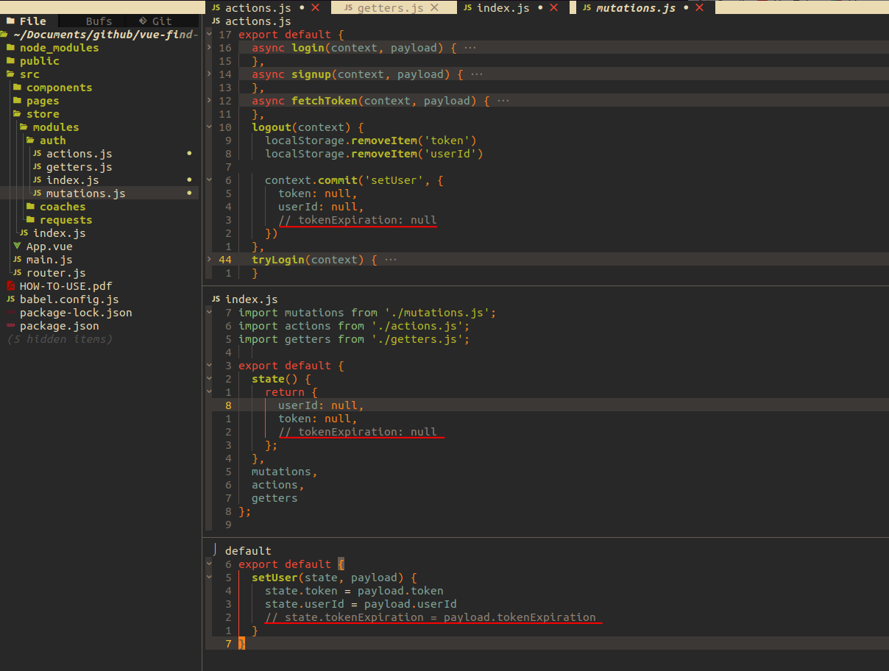 

### _set timer_

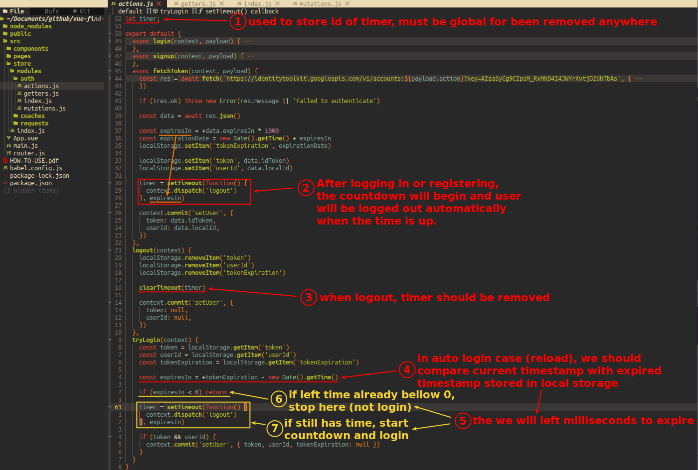 

### _test_

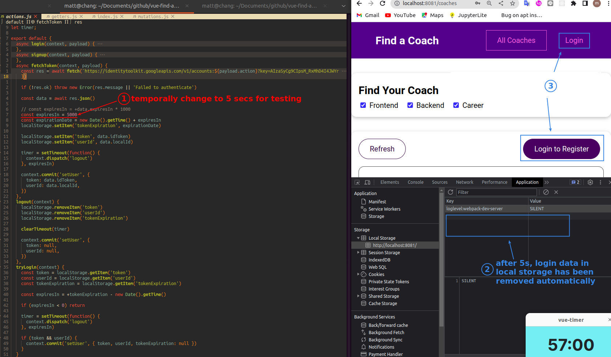 

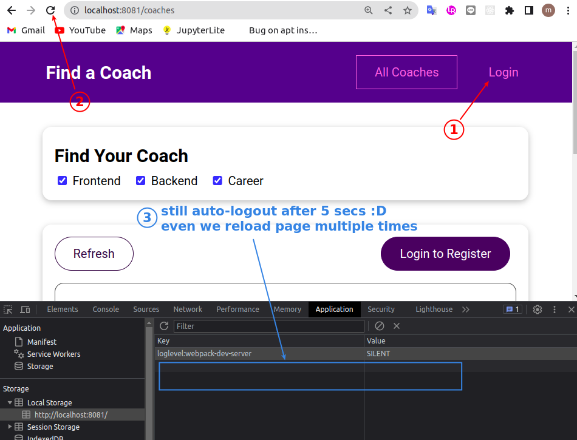 

## **Demand: switch page after auto-logout automatically**

> url change is a side effect, but must be changed under certain circumstances(auto-logout) rather than just using the component load or destroy to make a judgment, so we need a new state in Vuex store, which is the same as the useEffect dependencies in React use state.

### _demand_

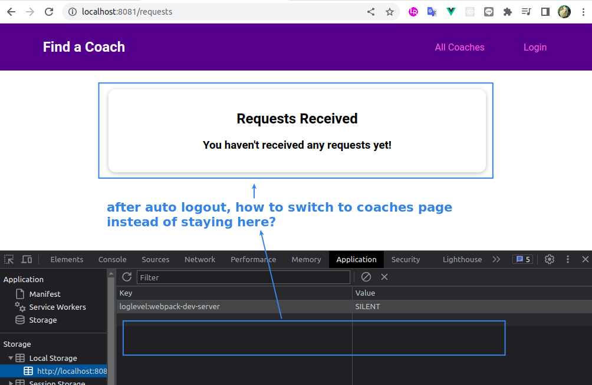 

### _set new state in Vuex store 'auth' to monitor this behavior_

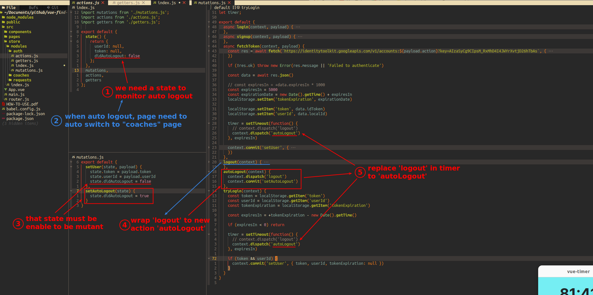 

- The most difficult part is that we don't just use this state to determine login and logout, but to determine whether the logout is "automatic" or not.

### _TEST auto-logout mechanism_

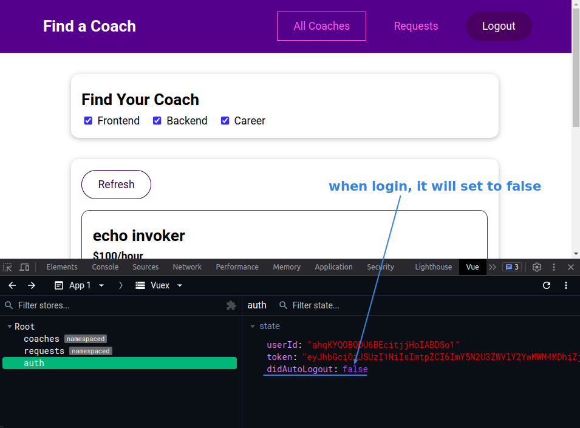 

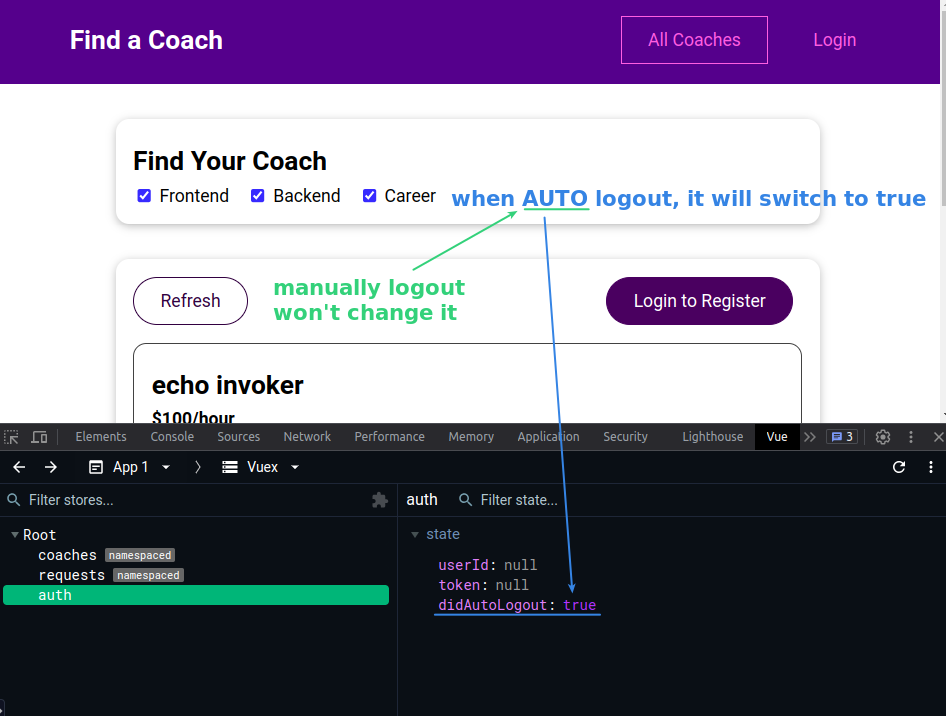 

### _Watch 'didAutologout'_

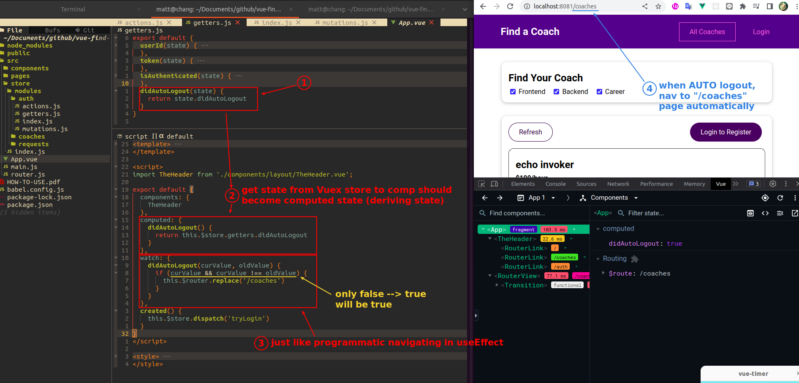 

