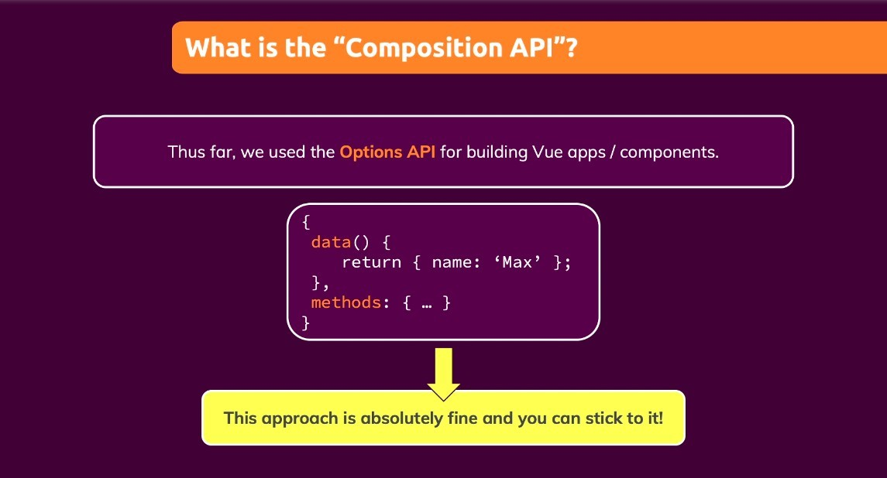
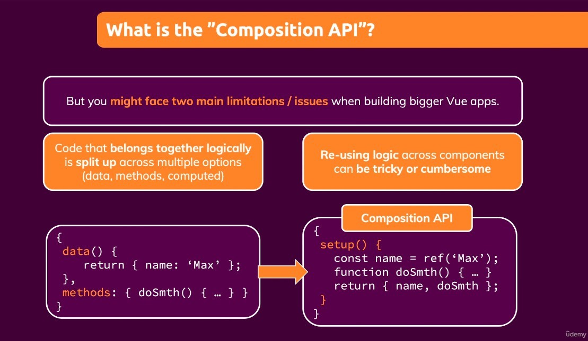
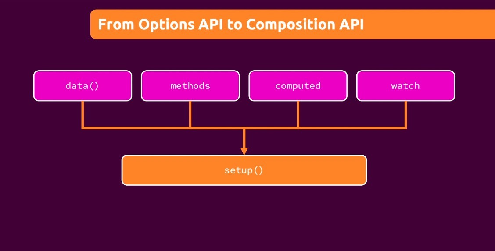

## **Option API (old way)**

- Separate the different logic to write.
  - There are some issues that arise when a vue app grows to a very large size.

## **What Issues?**

> All because the codes are split.

## **How the composition API works?**

> So, combine codes...

- Even if you move to composition API, option API learned things (v-if, v-model ...) they all still work.
- It can be said that knowledge of the option API is necessary to use the composition API.
