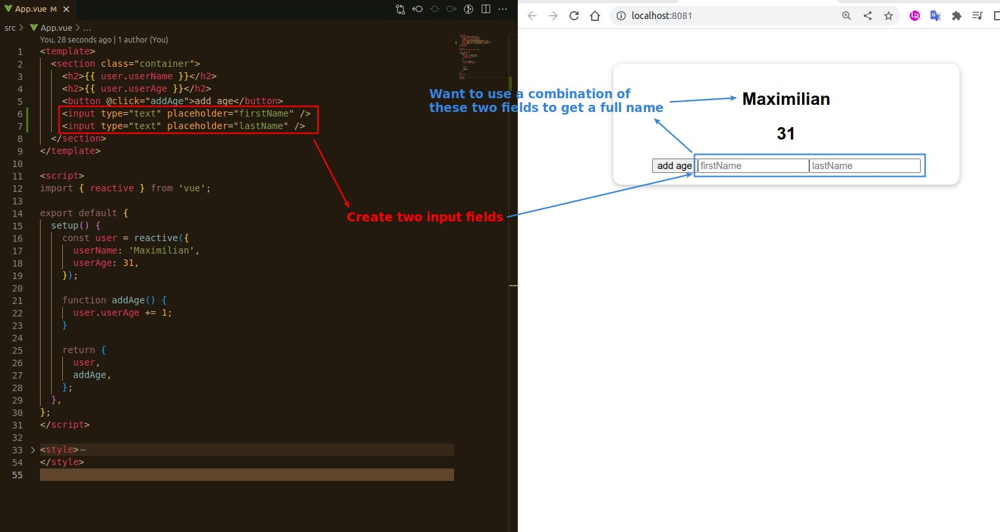
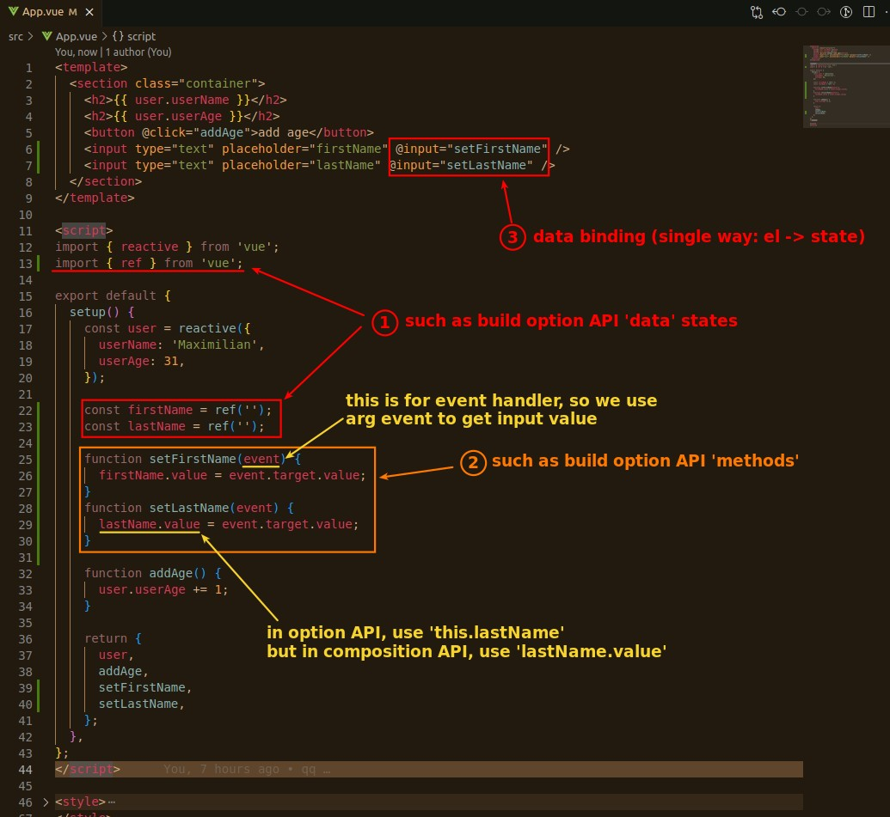
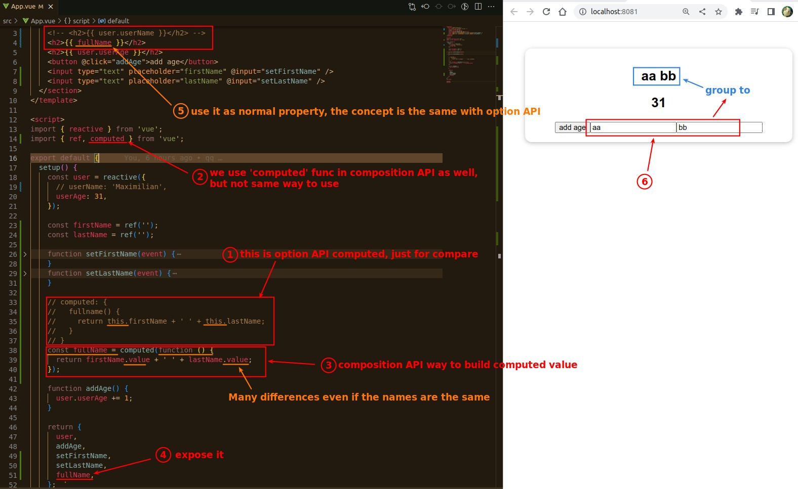

## **Goal**

## **Create data, methods and Data binding**

## **computed function**

- The computed function actually returns the ref object as well.
  - So you can use .value to get its return value.
  - But that value is read only.
