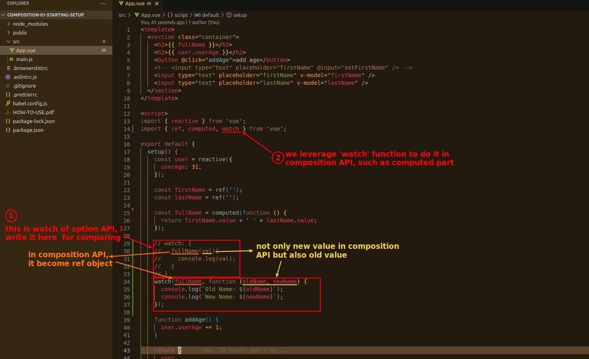
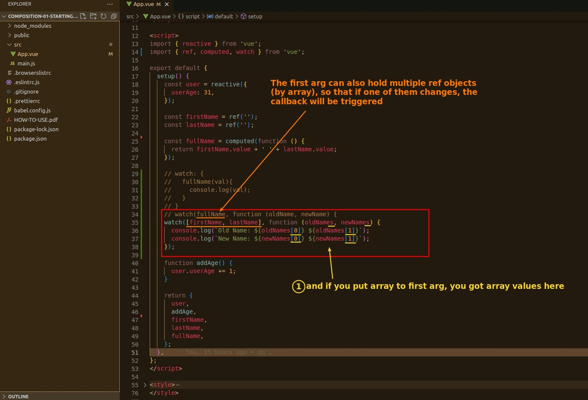

## **How to implement watch in Composition API**

## **Multiple dependencies**

> The first argument of the watch function is usually called 'dependency', and dependency can also be a combination of multiple ref objects.

