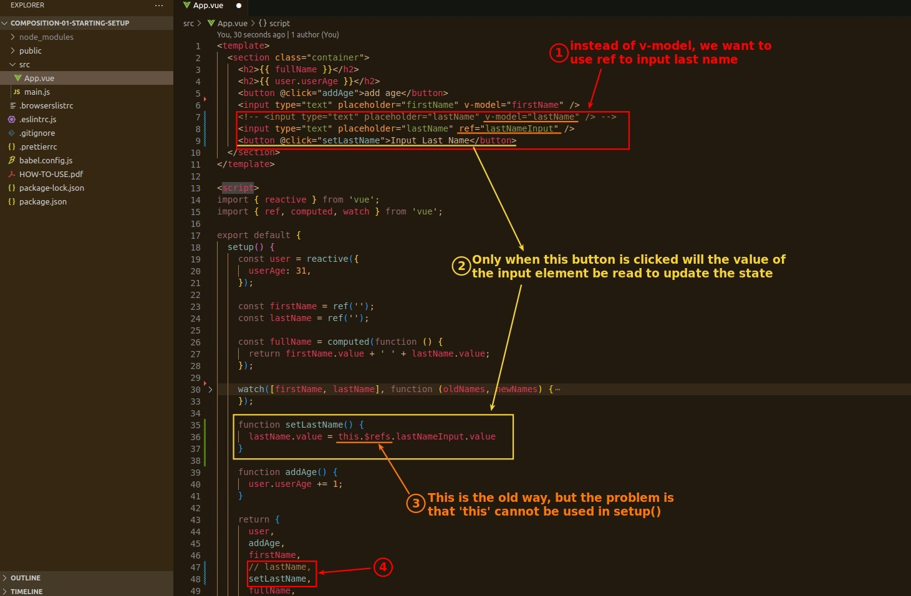

## **Use ref from v-model instead**

## **Cannot Use this.$refs, how to fix it?**

> Because there is no 'this' object to point to the DOM element, we create our own ref object to point to the DOM element.

