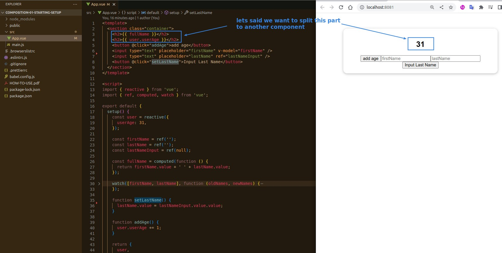
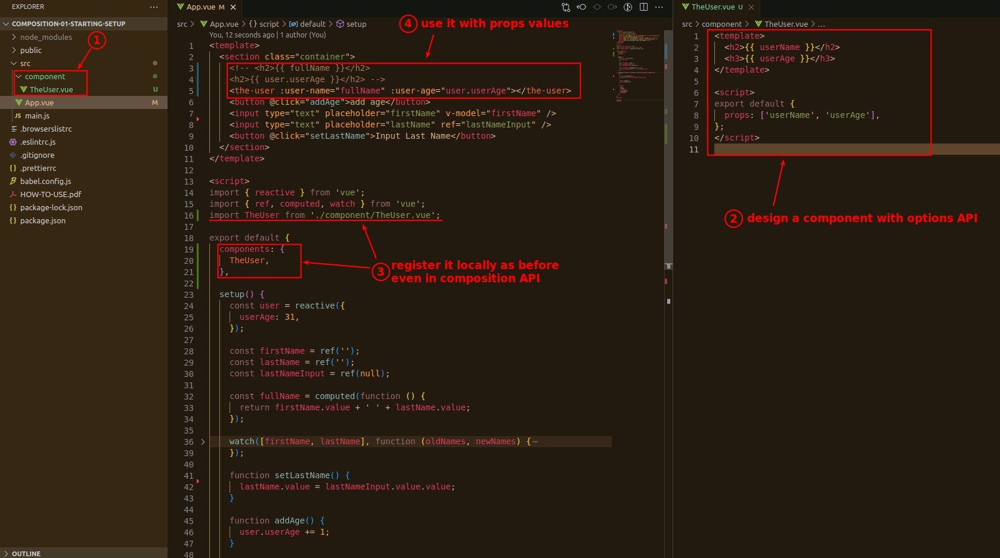
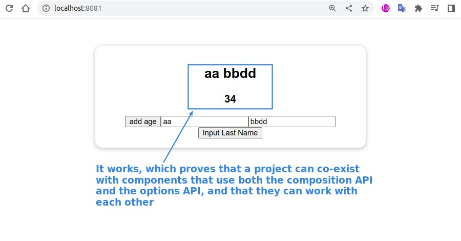
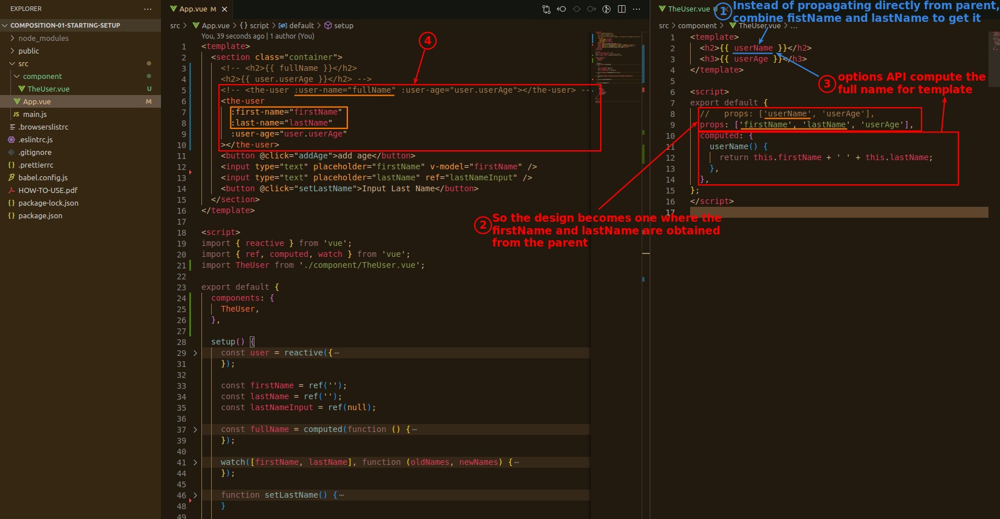
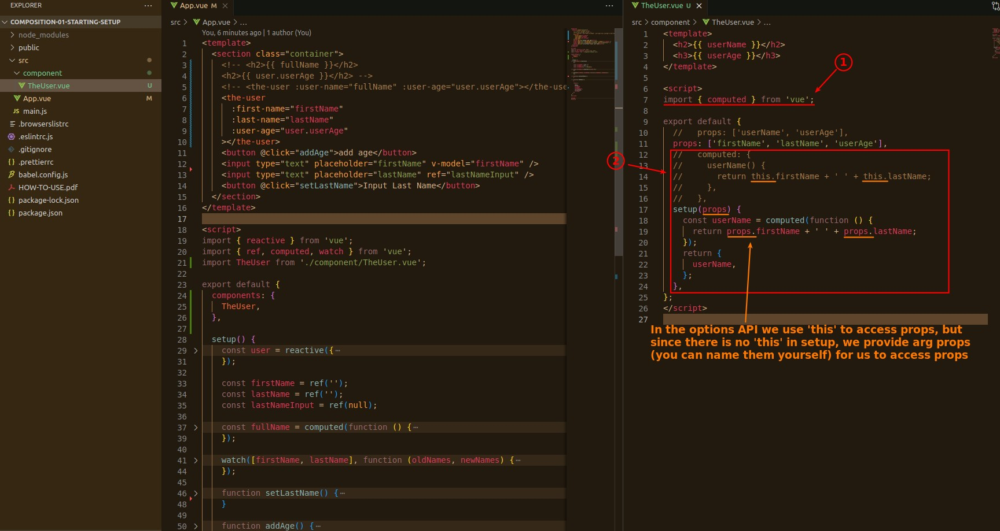

## **Goal**

## **Options API**

### _props from compositions API comp to options API comp_

### _add computed logic_

## **Composition API**

> The key is setup() without 'this', so how to access the props.

