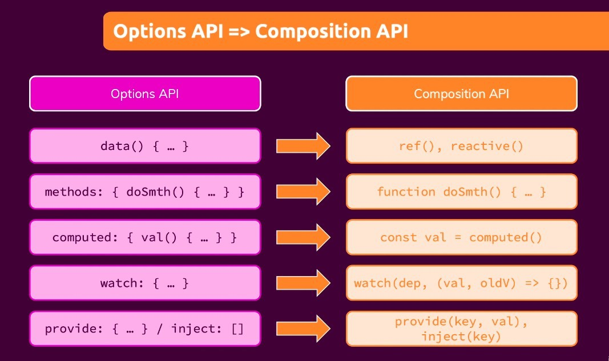
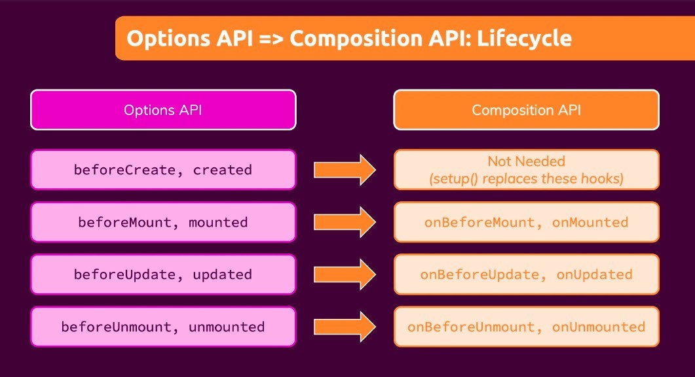
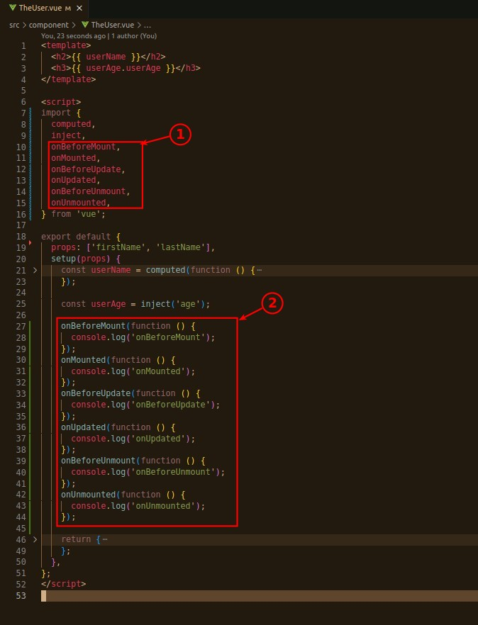
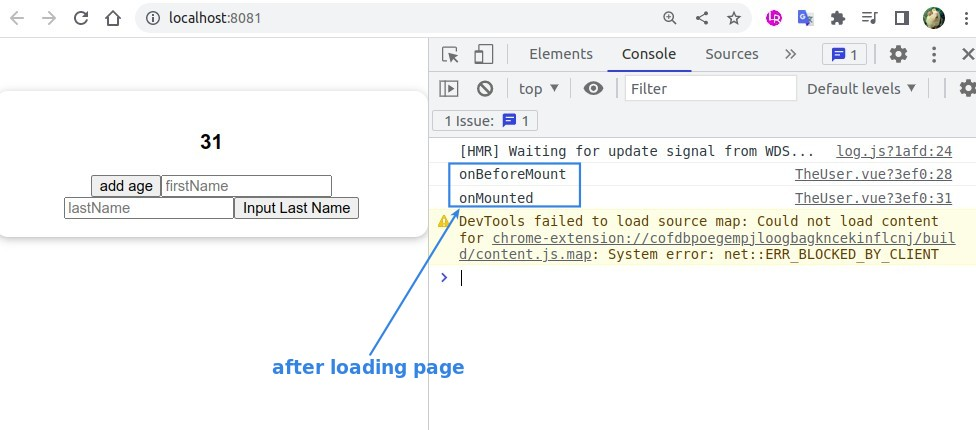
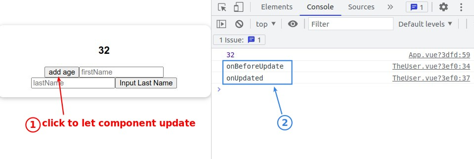
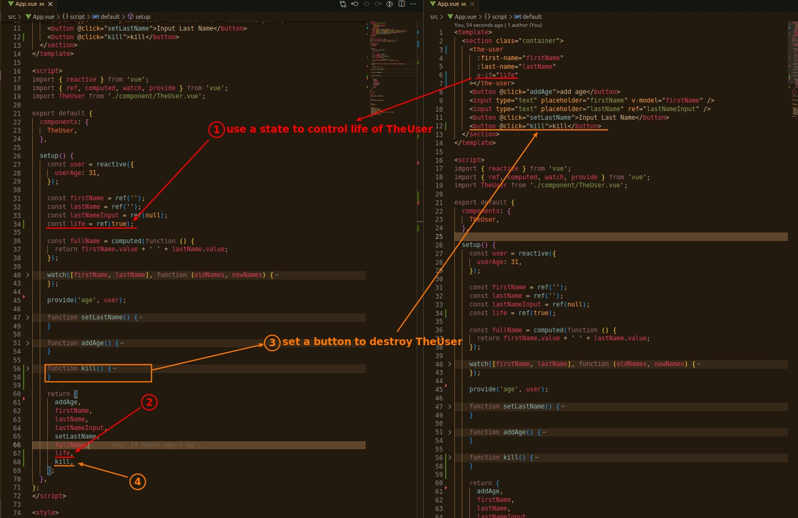
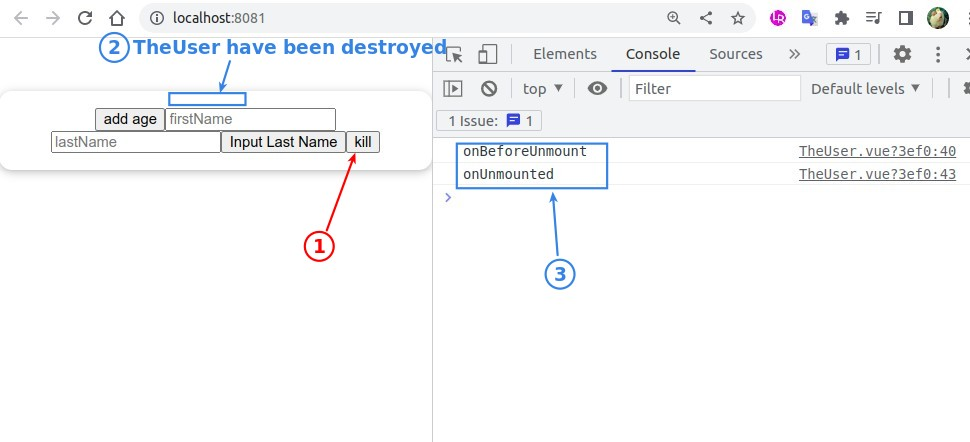

## **Concept**

## **Test All lifecycle methods in Composition API**

### _mount, update_

- To use the lifecycle function in setup(), you need to first import.

- setup itself equals to onBeforCreate and onCreated.

### _unmount_

> Create a simple button to kill TheUser.

