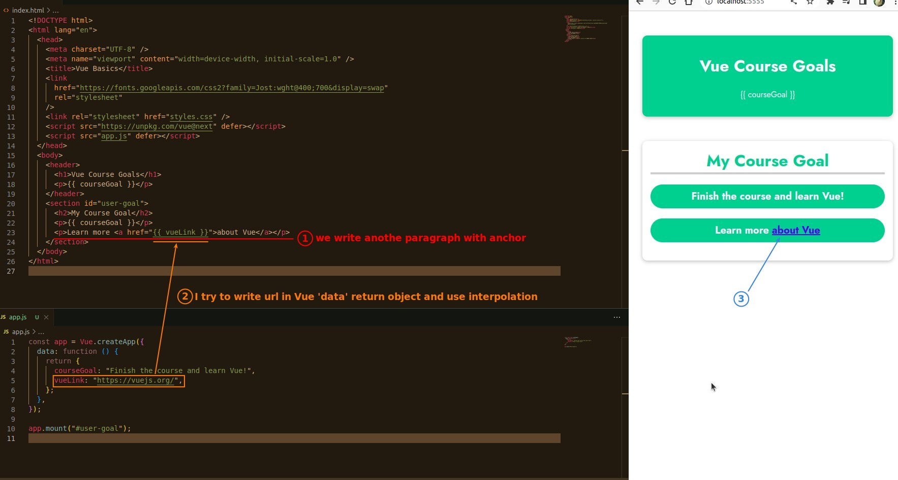
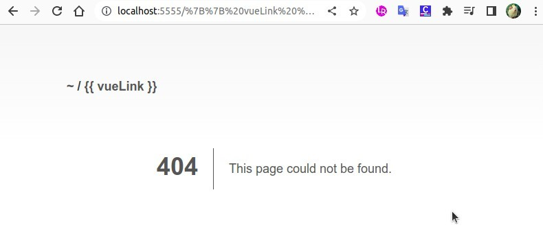
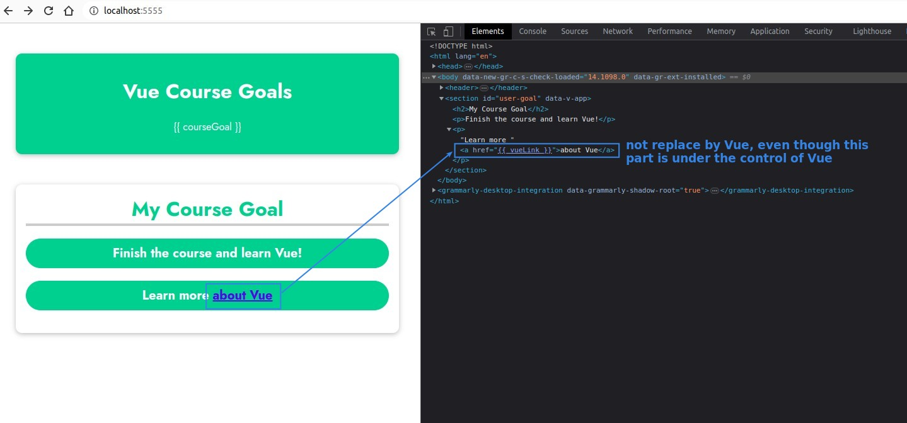
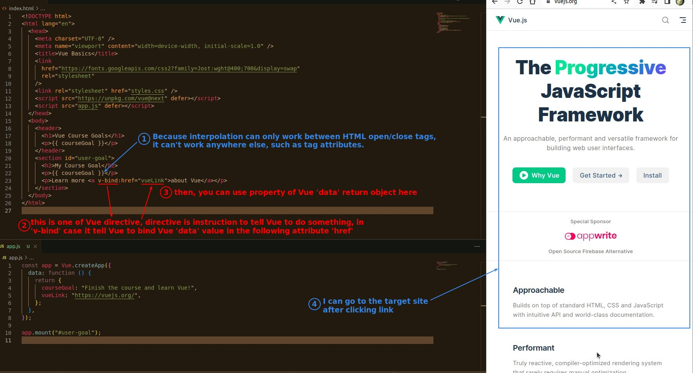

## **Try to bring the Vue data into the attribute of the HTML tag**

### _Using interpolation_

### _Result_

### _Reason_

## **Vue deractive: v-bind**

- Vue deractive is a instruction that tells Vue to do something.
