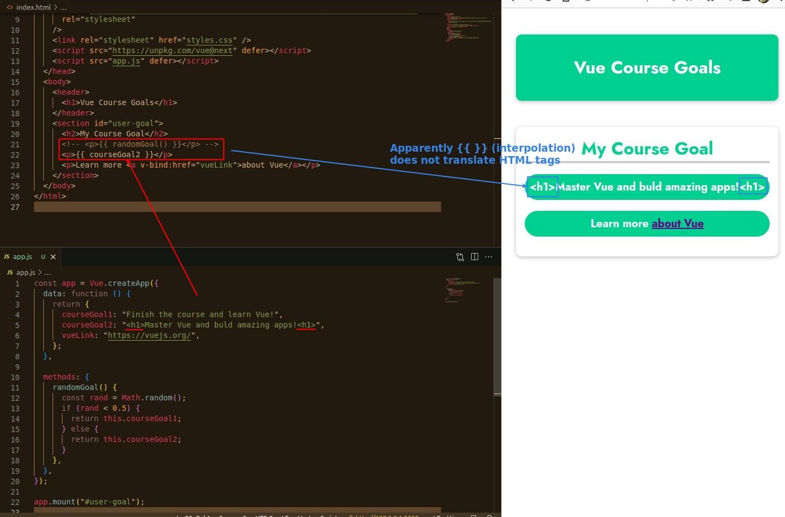
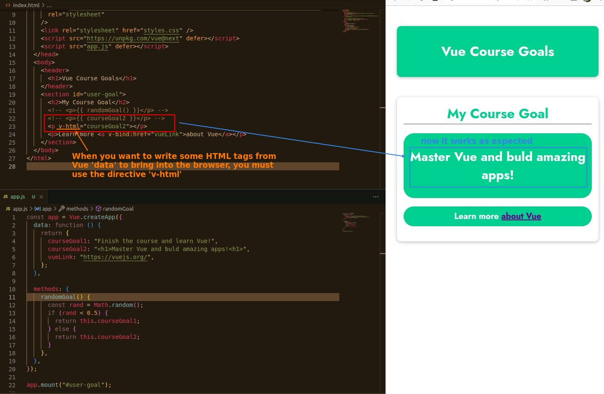
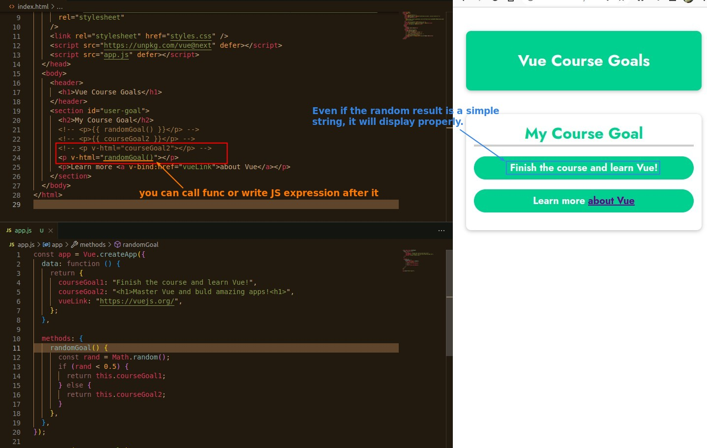
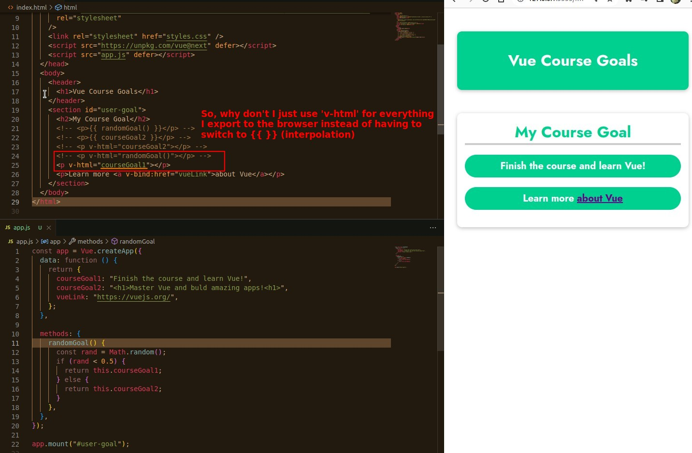

## **I use some HTML tags in my Vue 'data'**

## **Directive: v-html**

- v-html can write JS express, and of course it can also output plain strings.

## **Do not use v-html to output plain text**

- In fact, interpolation can protect us from cross site scripting attacks, so it is necessary to use interpolation when outputting just plain text.
