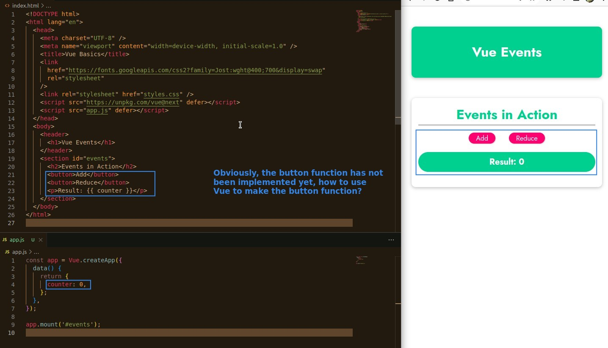
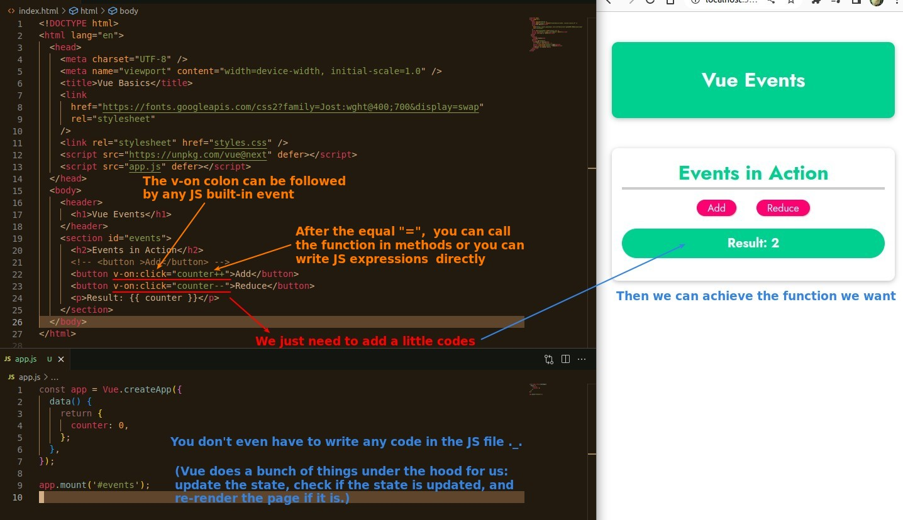

## **Before Implement Buttons functions**

- Think about what you would do if you were using native JavaScript.

  - You need to start with 'querySelector' to get all DOM elements you need.
  - set event listener to each button element.
  - and more...

- If using React, several key hooks may be needed to update the state and re-render it in real time.

## **Implement Buttons functions with Vue**

- That's the value of Vue, it helps us handle all the complex things under the hood.
