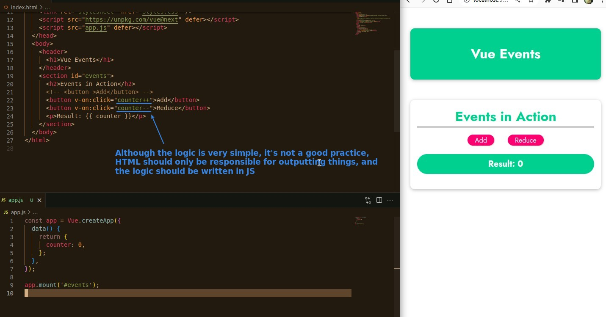
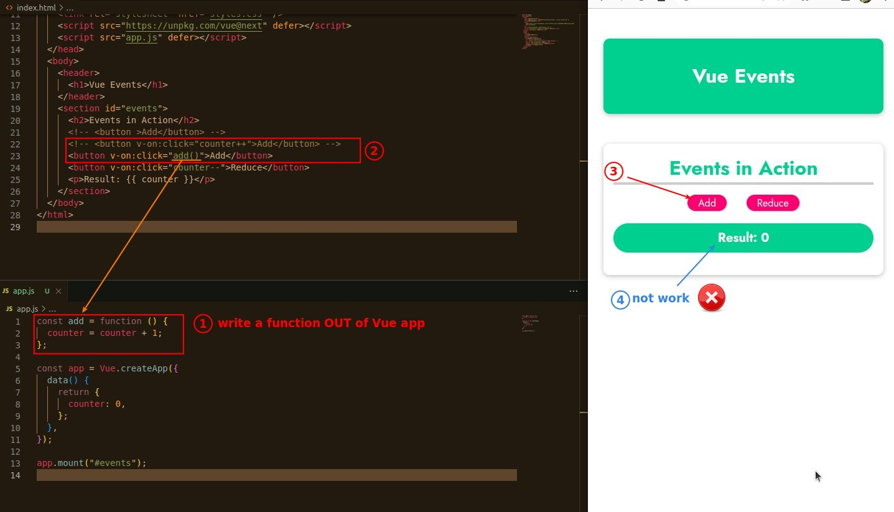
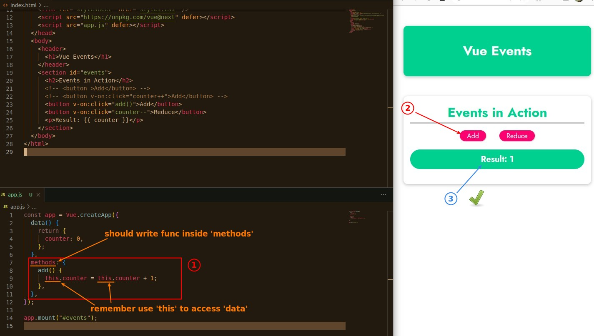
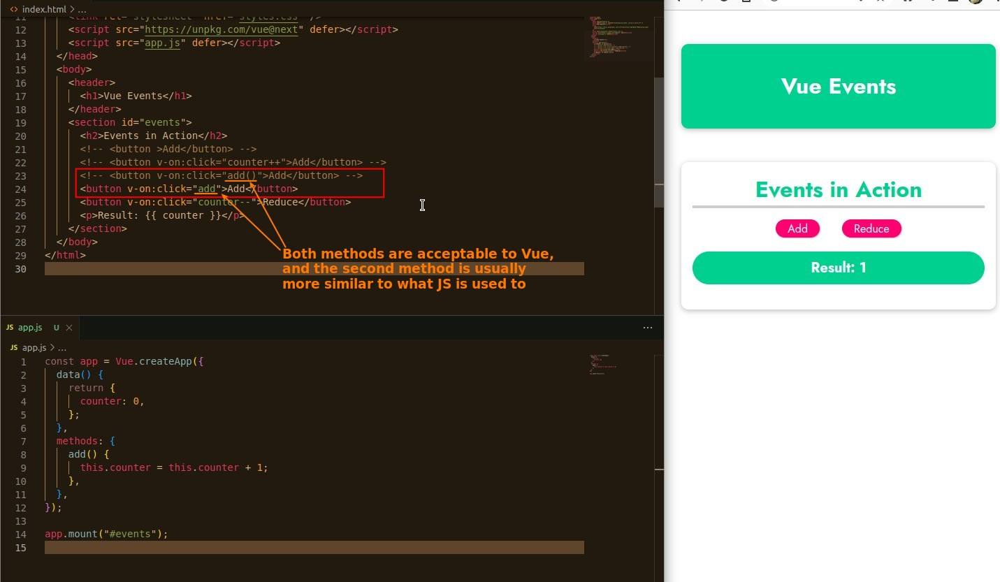

## **Disctrict Jobs from HTML**

## **How to write logic in JS?**

### _Try to just write a normal function_

- There are many reasons why it does not work, and there are two main reasons:
  - counter is not a global variable, it is just a property in the option 'data' in the Vue object.
  - This is written as a global function, but it will not be access by the Vue mount section.

### _Write function in option 'methods' of Vue_

## **Two ways to set function to event listener in HTML**

