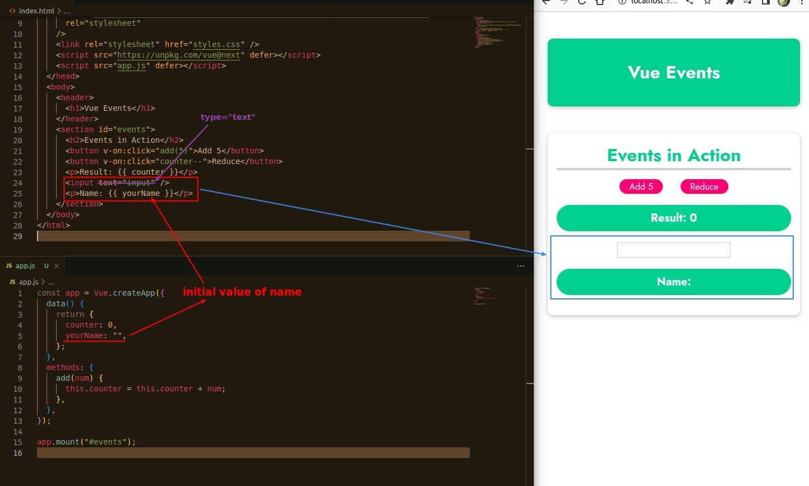
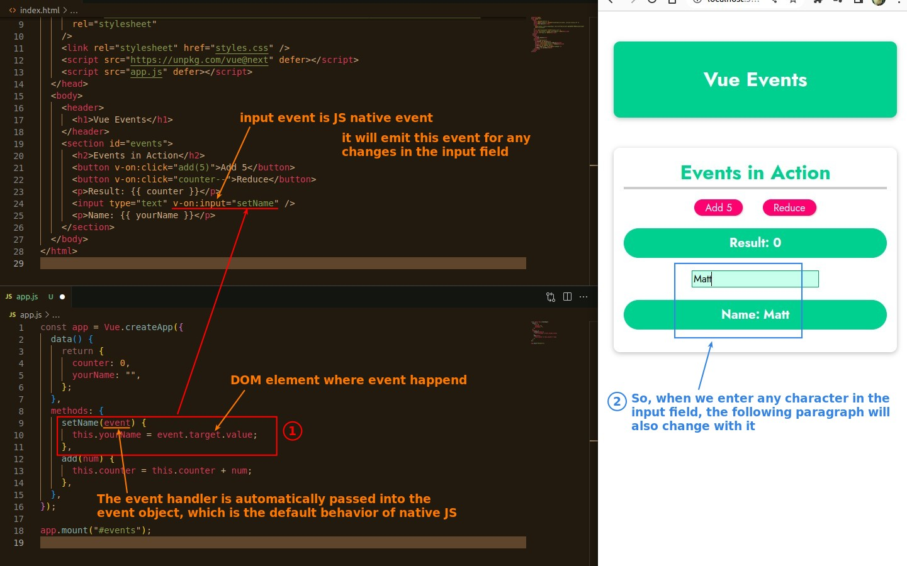

## **New section, New question**

- We have added a new section as above, how do we print the input field value in the parapraph tag below?

## **'methods' function with event object**

- There are a lot of features that native JS has, but of course Vue can use them as well.

## **Add custom argument in this case**

### _Try fail_

[!Alt try](pic/05.jpg)

### _Correct solution_

[!Alt sol](pic/06.jpg)
