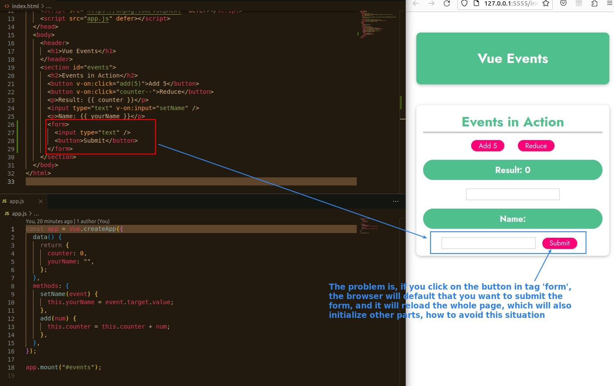
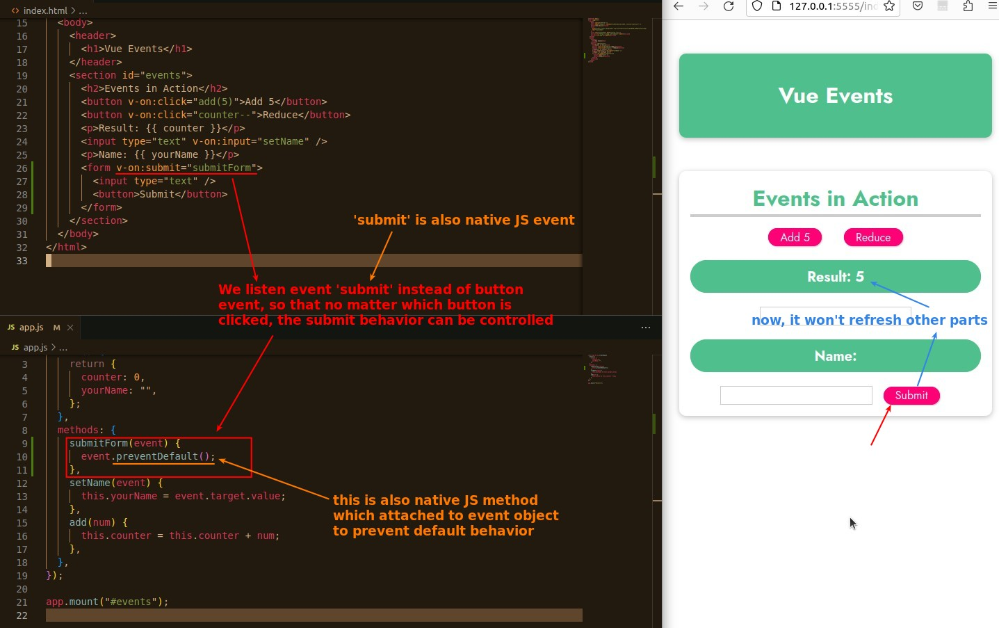
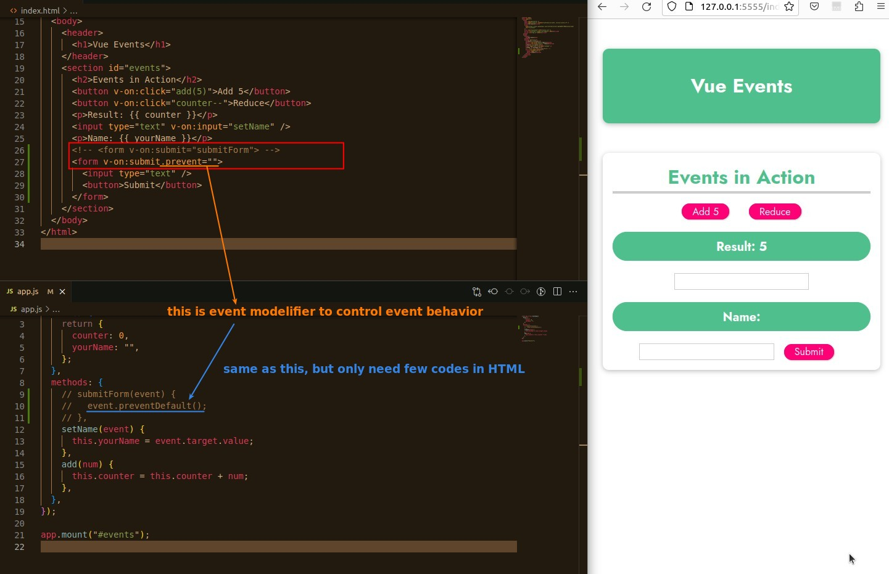
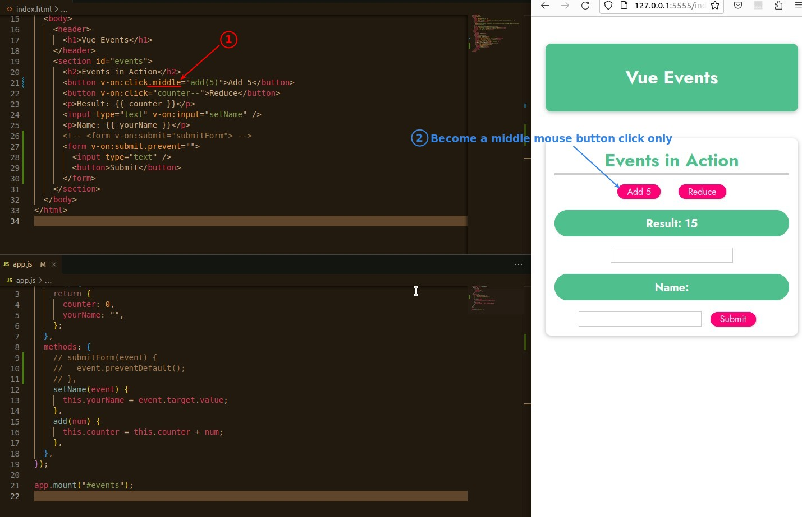
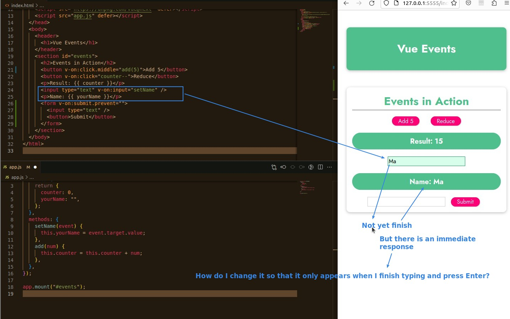
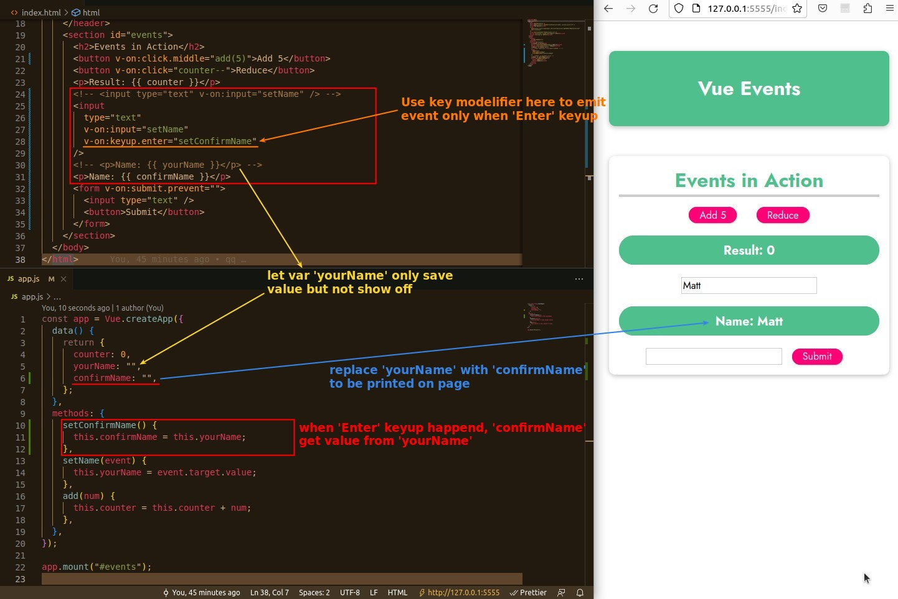

## **Prevent Default Submit Form**

### _Solution 1: event.preventDefault (native JS)_

### _Solution 2: event modelifier - .prevent (Vue)_

## **Other Event Modelifier Usages**

### _Click_

> To speify which button on the mouse.

### _Keyboard_

> Most of the Keyboard events can use the event modelifier to specify which key.

> We use a common example to explain the following.

- The point is that the data 'yourName' originally used to be presented on the page becomes the middle data (not presented on the page).
