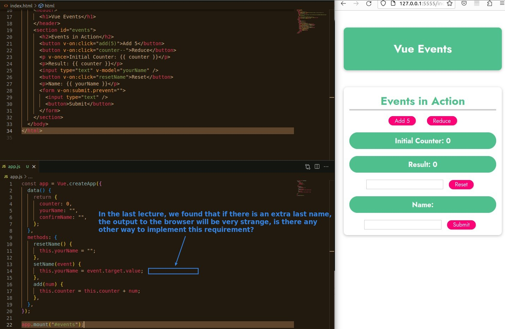
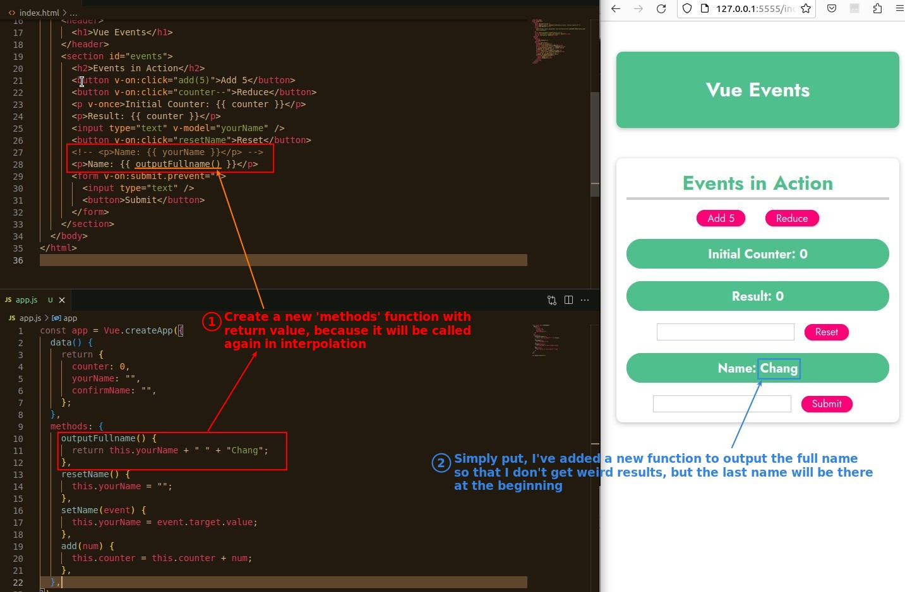
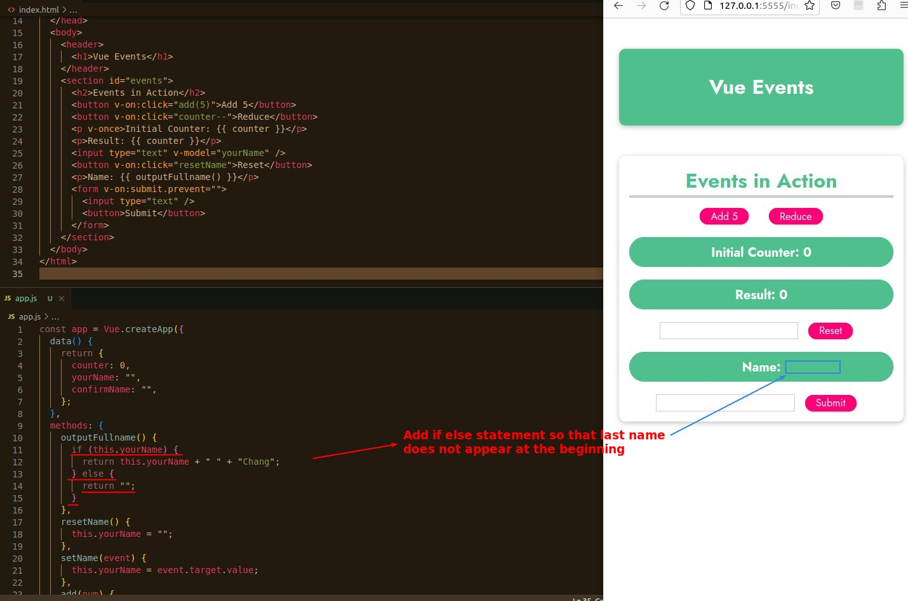
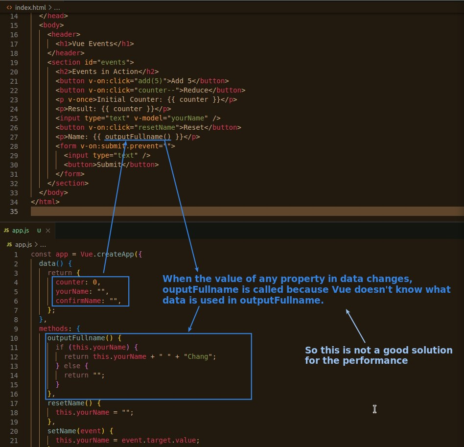
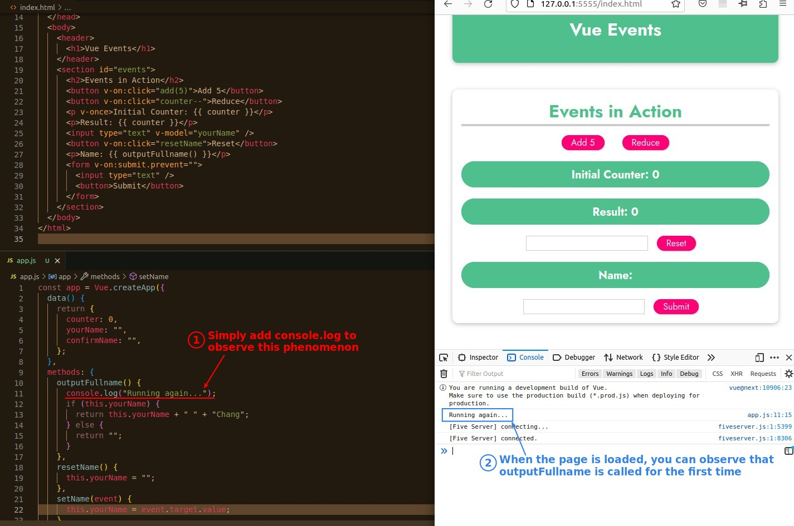
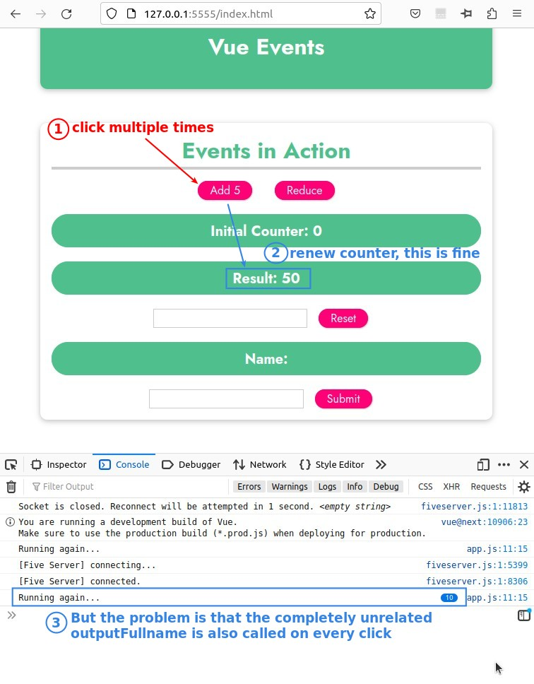

## **Add Last Name back**

### _Describe problem_

### _Solve it by adding another 'mothods' function_

### _Add if else into function_

## **Re-execution problem**

### _Describe problem_

### _Using console.log to observe it_

### _Testing result_

> In fact, as long as the function is not specified by v-on, other parts such as interpolation, v-bind, v-html ... As the program gets bigger and bigger, it will slow down the performance of the app.
