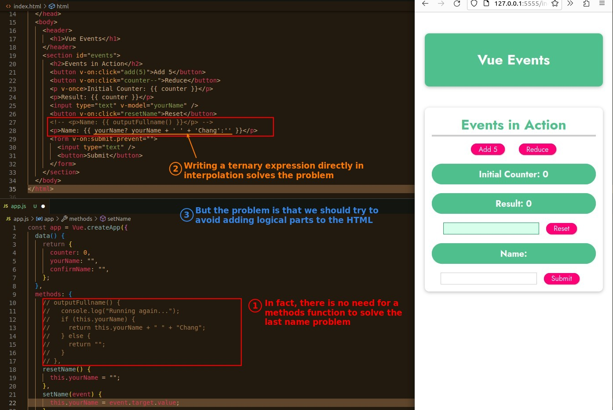
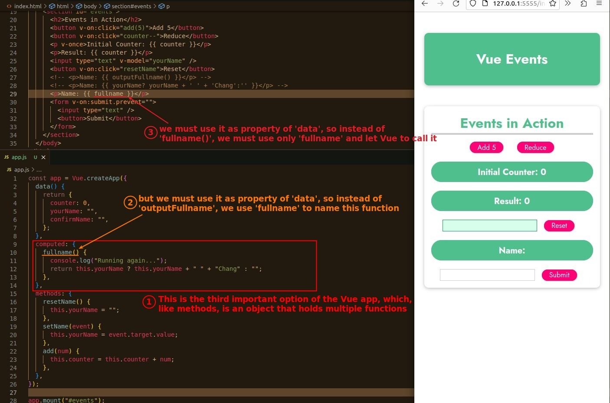
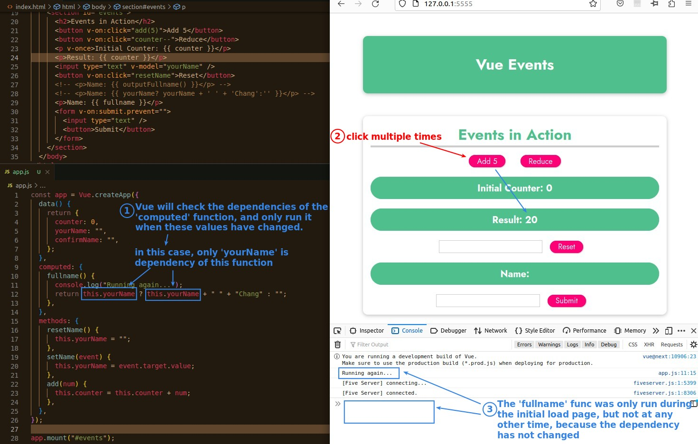

## **Solve last name problem with Ternary expression in HTML**

## **Move logic back to JS & Intro third option - 'computed'**

## **But when we use 'methods' functions?**

> The functions we call directly in HTML are usually 'computed' rather than 'methods', so when do we use a function with 'methods'?

- In some cases, if some functions must be executed when any data on the page changes, these functions should be written in 'methods'.

- 'v-on' can only be linked to a function in 'methods'.
