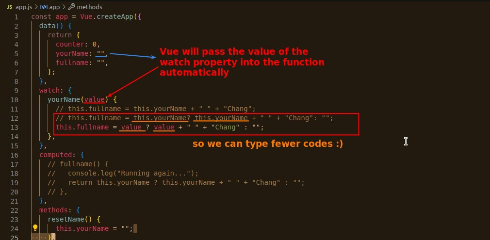
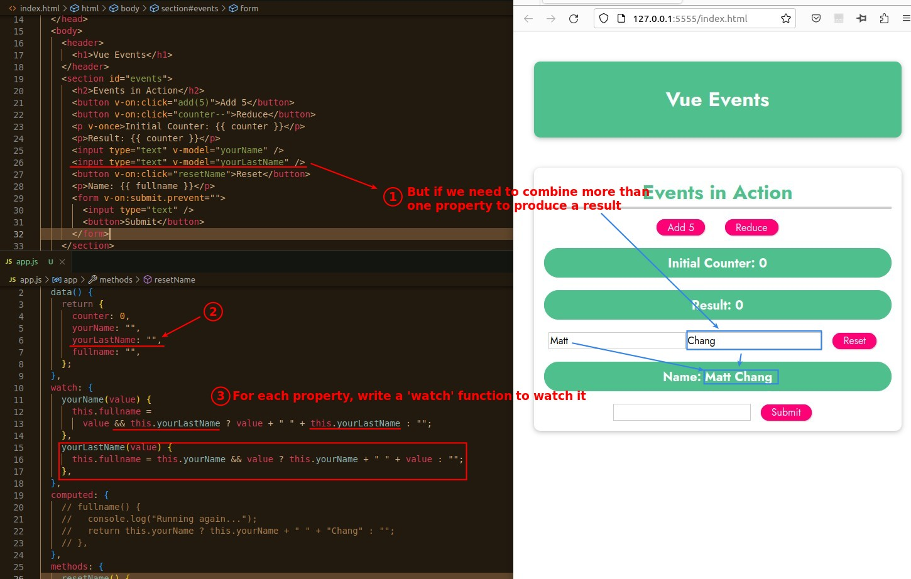

## **Vue option - 'watch'**

## **When to use 'watch' better instead of 'computed'**

### _Focus on property 'change' instead of computing result_

> In fact, 'watch' is not suitable for generating results, and here are some practical examples to illustrate why.

### _Time delay update_

> Because 'watch' is focused on property changes, it can easily handle this kind of requirement, which would be very difficult if it were all implemented in 'computed'.

