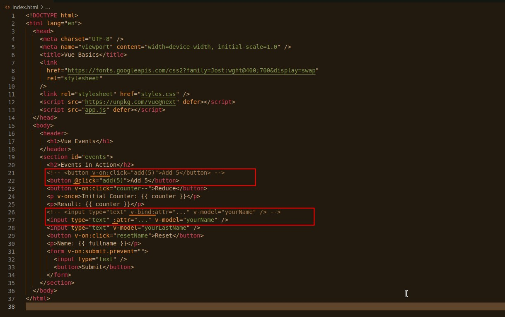

- 'v-on' and 'v-bind' are used too often so there are shorter syntax as above.

  - Whether or not to use shorter syntax is up to the individual, but note that there should be consistency.

- 'v-model' has no shorter syntax .\_.
