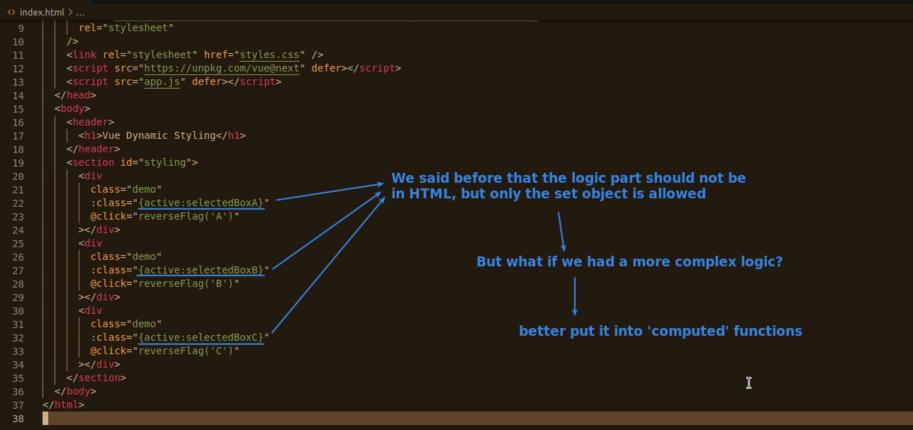
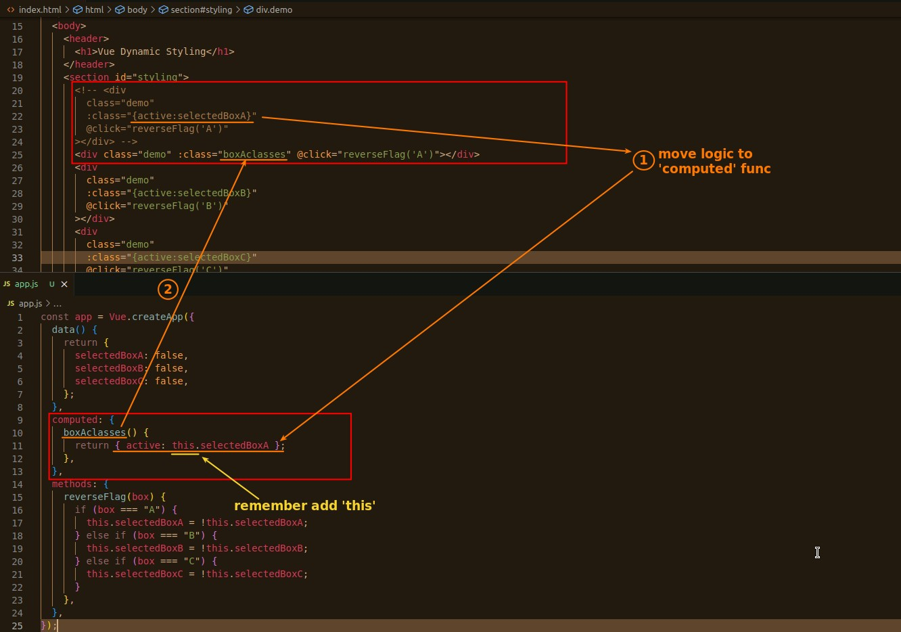

## **Isn't HTML not allowed to have logic?**

- It is allowed to write in HTML if it is just a simple boolean to set the on/off of each class.
  - Can make the code more concise
- But if the logic is more complex, it must be written in 'compute'.

## **Write CSS classes selection in 'computed' functions**

