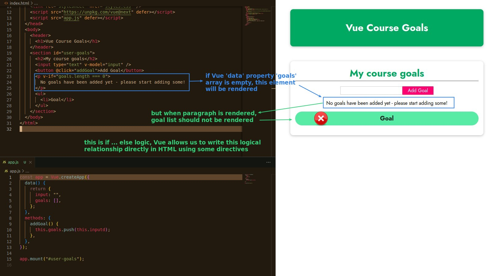
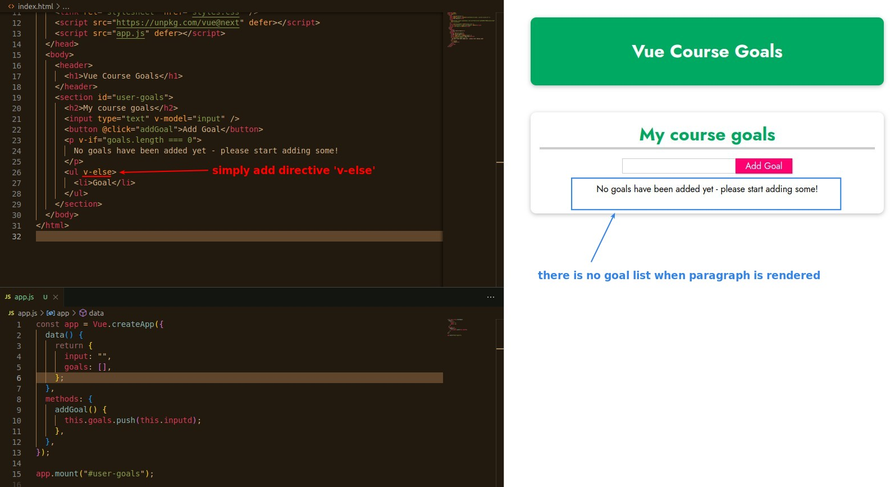
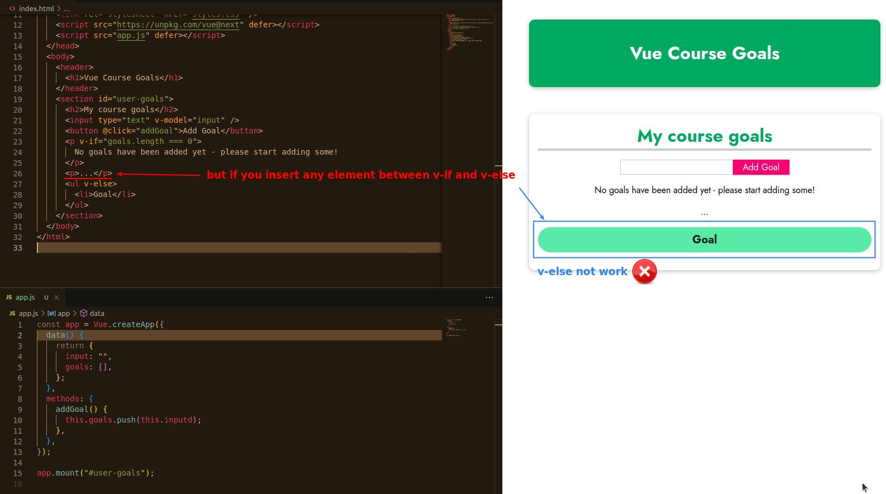
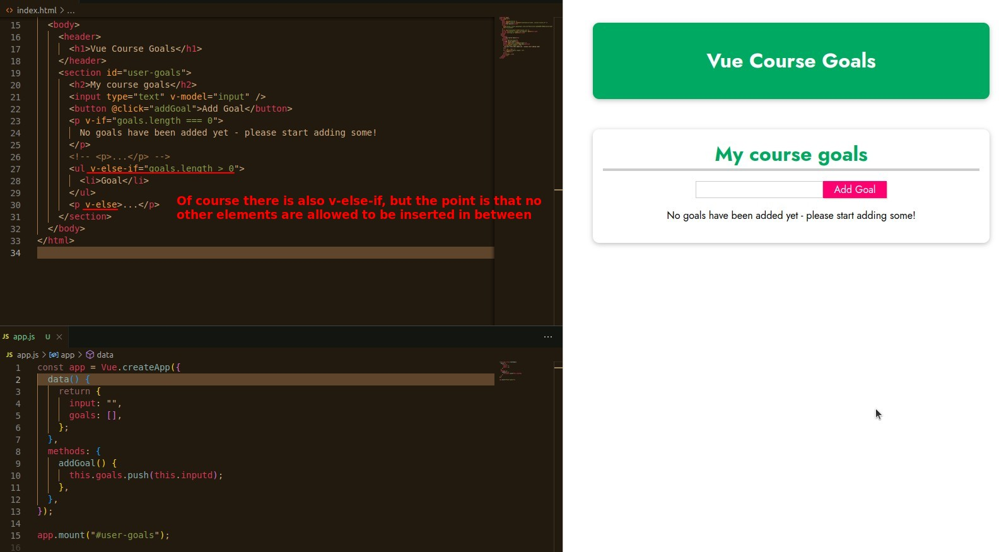
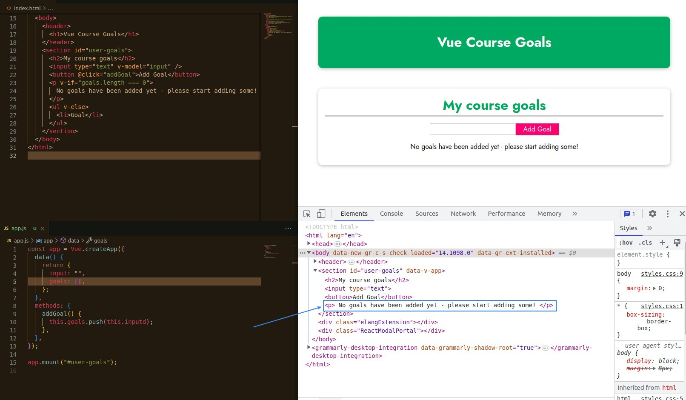
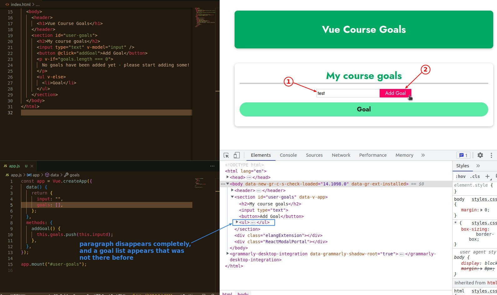

## **Our purpose**

## **Vue directive: v-else, v-else-if**

## **Not visible and hide, but ...**

- Vue does this by completely removing, adding, or attaching, dettaching elements to make elements rendered or not, which is very different from using JS alone.
