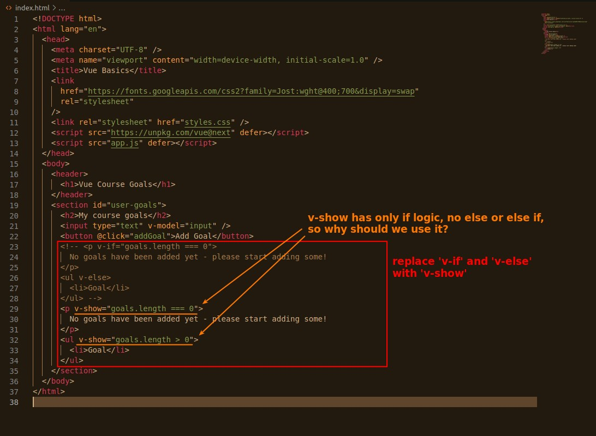
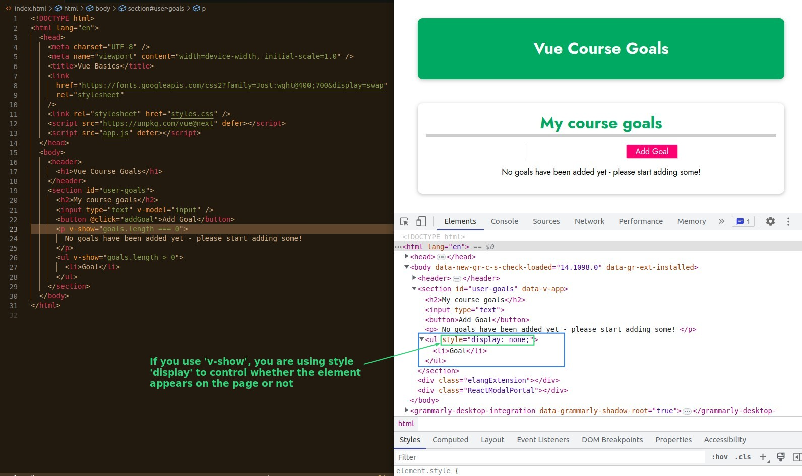

## **Replace 'v-if' with 'v-show'**

## **How 'v-show' switch render on/off**

## **Which one? 'v-if' or 'v-show'**

- **v-if** - adding and removing elements from and in DOM, it costs performance.
- **v-show** - swith with style may not cost much performance, but it also leaves a lot of elements in the DOM unused.

### _conclution_

- We usually use 'v-if', but if this element displays and hides switching status very frequently, we will consider using 'v-show' instead.
