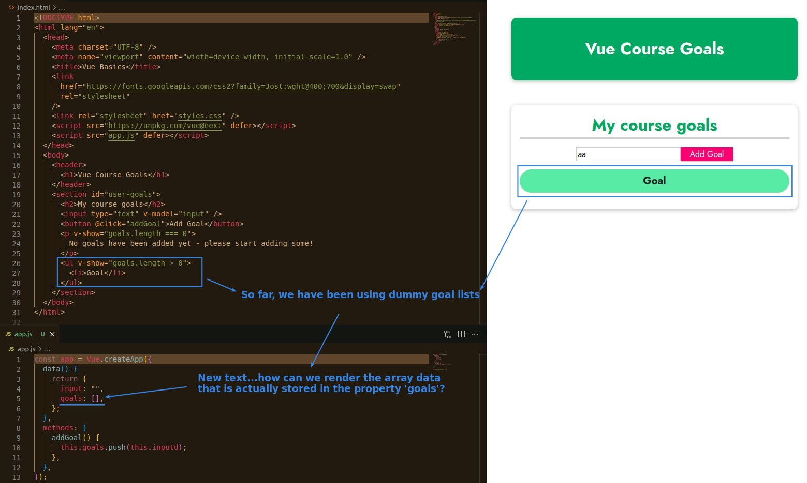
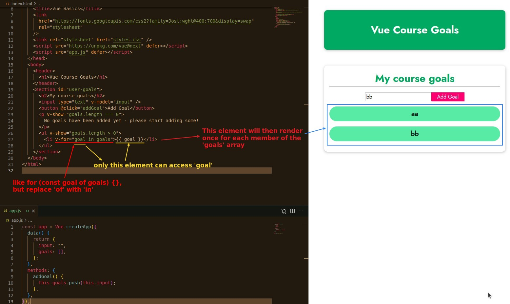
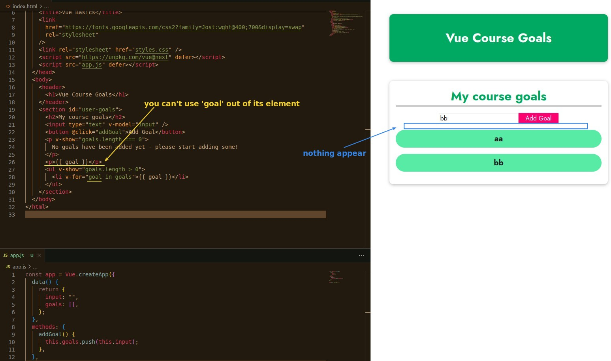
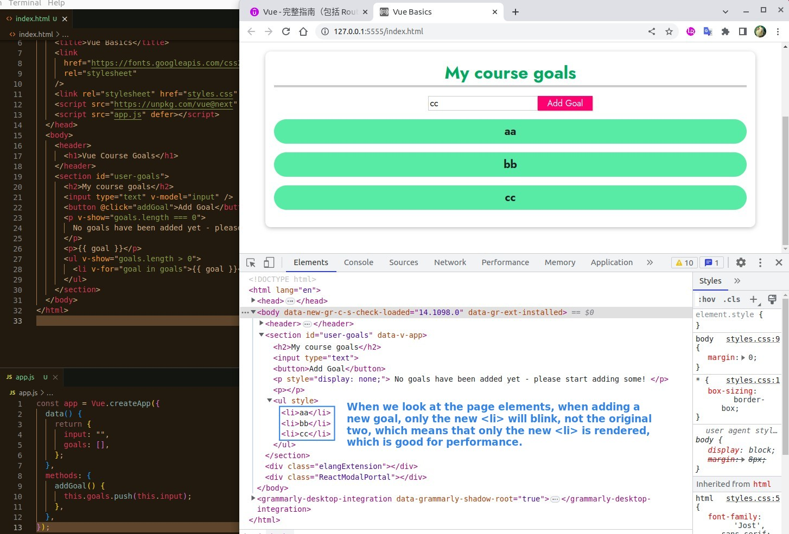

## **Purpose: render goal list instead of dummy goal**

## **Vue directive: v-for**

- In fact, it is the same concept that i in for(const i of nums) cannot be used outside of for.

## **About v-for performance**

> In some apps with poor performance, it is observed that every time a member is added to a list, all the lists are re-rendered once, so let's see if this is also the case with the Vue app.

