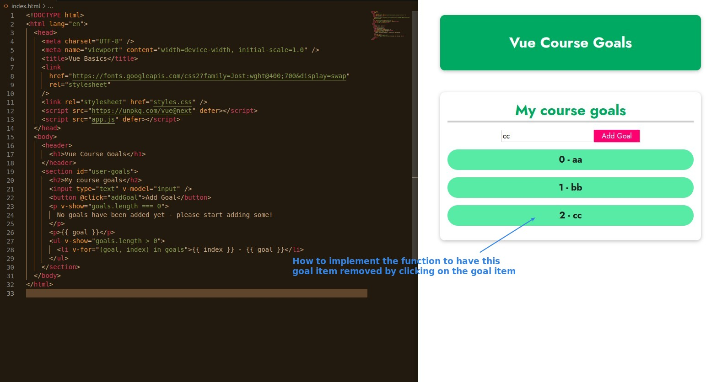
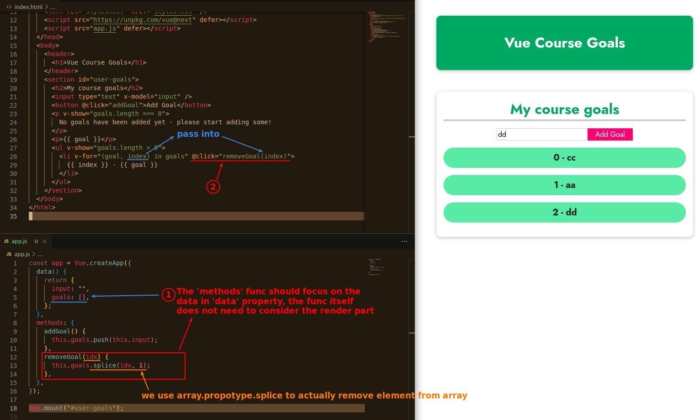

## **Purpose: remove goal item when clicking it**

## **Manipulate data -> event/data binding to effect render**

- The data binding part has already been done, so you just need to write the 'methods' function and then bind it to the 'click' event and you're done.
