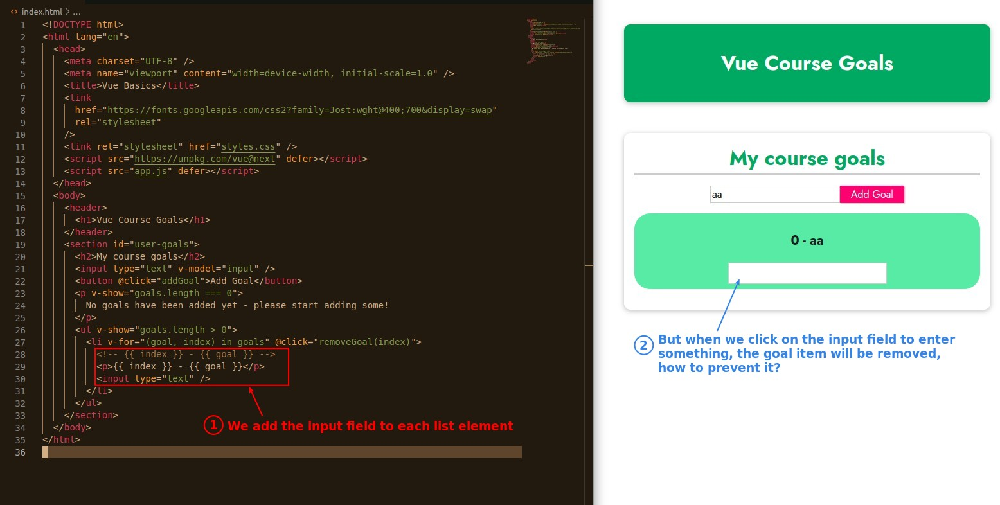
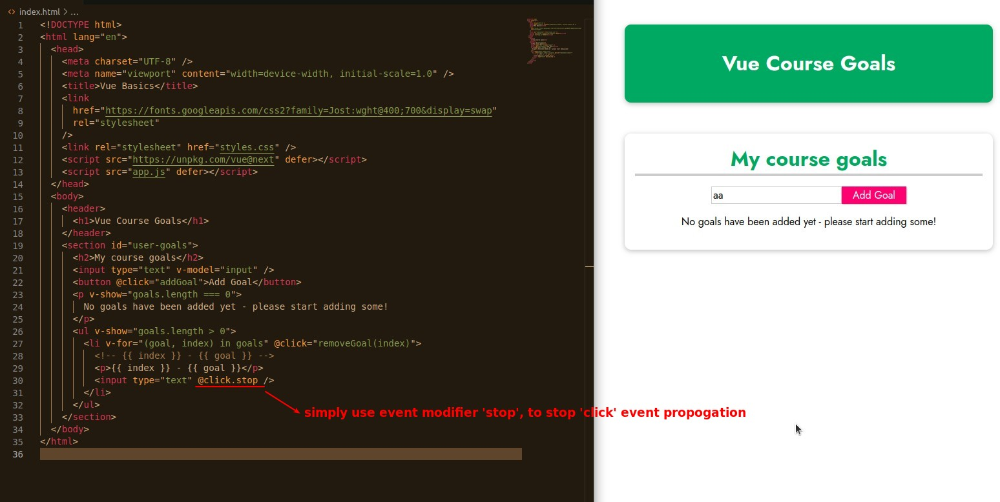
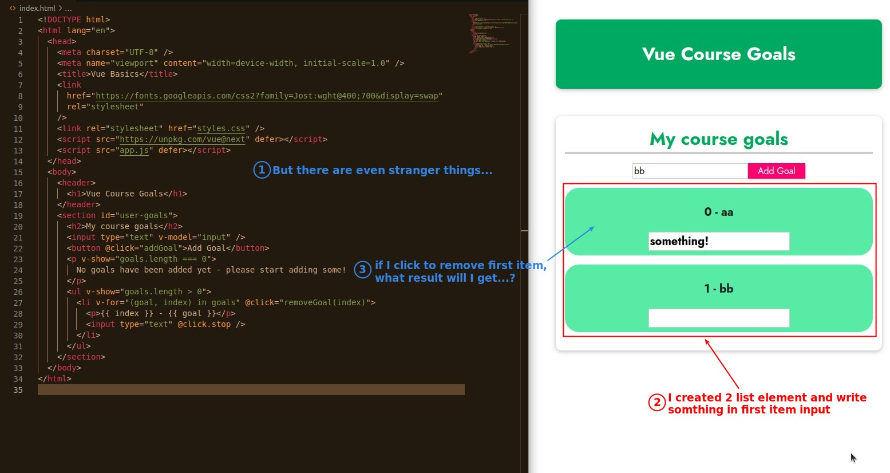
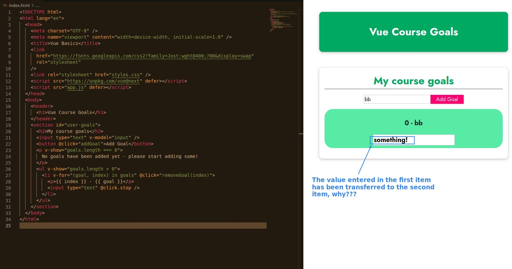
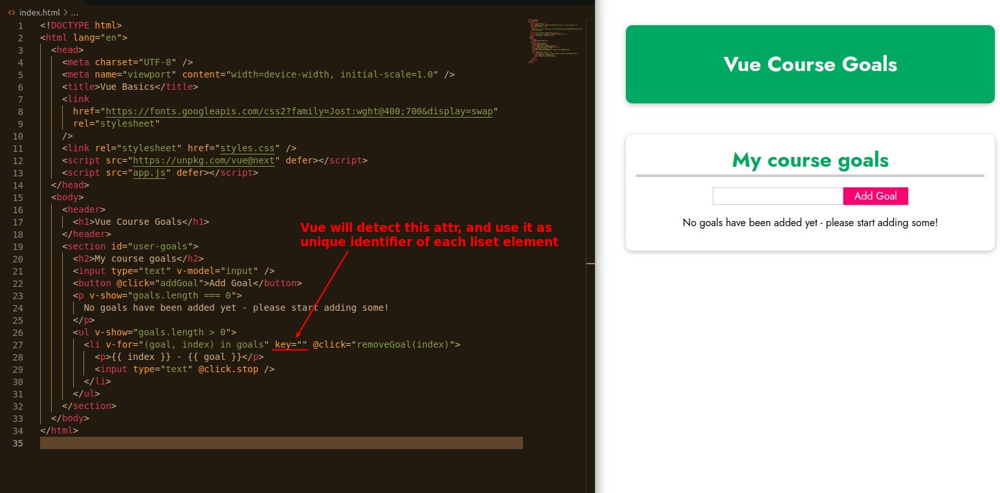
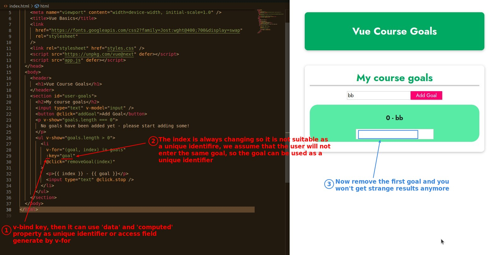

## **Event Propagation Issues**

## **Issues arising from the high performance instense process of Vue**

- The problem arises because Vue does not distinguish between elements in a list.

- So Vue does not delete the first element in this case, but moves the dynamic data of the 2nd elements to the first element.

  - dynamic data is which wrapped with curly brackets.
  - The input data will be treated as something that the original DOM element has, so it will not be moved or deleted.
  - This approach works pretty effectively in the right cases, but it can create bugs and even slow down performance if there are more complex requirements.

## **Vue attribute - key (unique identifier)**

- In fact, if the data is obtained from a database, the data itself usually has a unique identifier, so the source of the unique identifier is not a problem in the real case.
