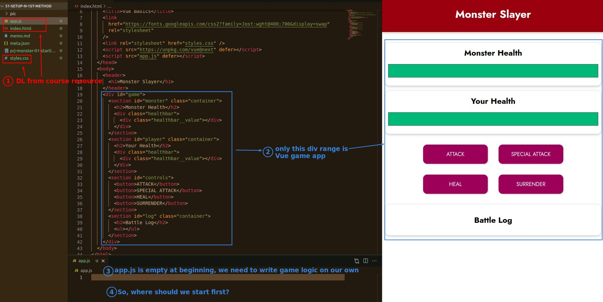
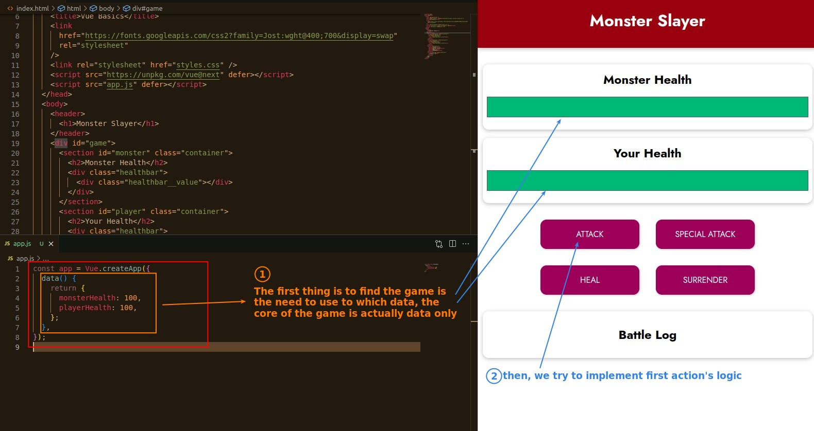
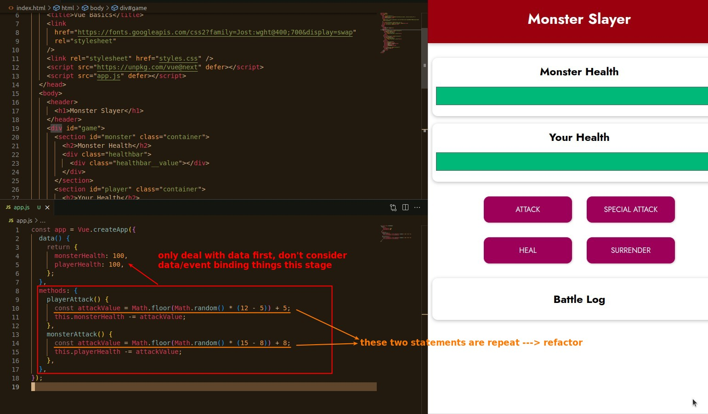
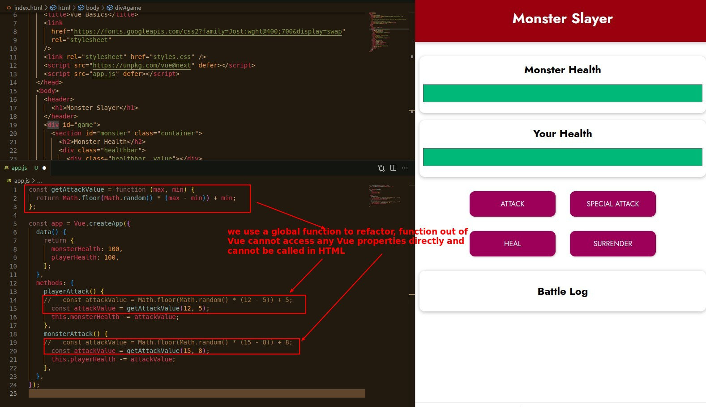
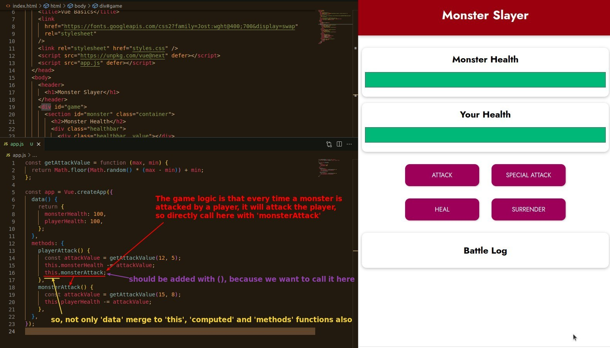

## **Download backbond of Monster Slayer Game**

## **First thing: data**

## **Build some 'methods' func for ATTACK**

- The monster's attack should be stronger than the player, so that the player has a reason to use other actions.

### _Refactor with global function_

- In other words, functions that don't need to access Vue property and won't be called in HTML shouldn't be written in a Vue app.

### _Call 'methods' function in 'methods' function_

## **Conclusion**

- So when implementing a Vue app, don't think about binding first, whether it's data binding or event binding, you should start with data and data handling first to avoid confusion.
