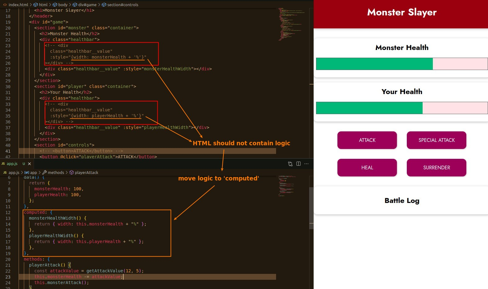

## **Event Binding: ATTACK clicking**

## **Data Binding: Health Bar width**

- We choose a percentage for the unit of width style, and the initial value of 100 for health saves a lot of complicated logic.

- Usually data binding is last thing to do.

- This is particularly suitable for inline style, because the value of width is constantly changing, and it is impossible to use class to set each width value.

### _Move HTML logic to Vue 'computed' option_

- Functions that are not called by v-on or no need to be run every time any data changed are put in 'computed' option.

