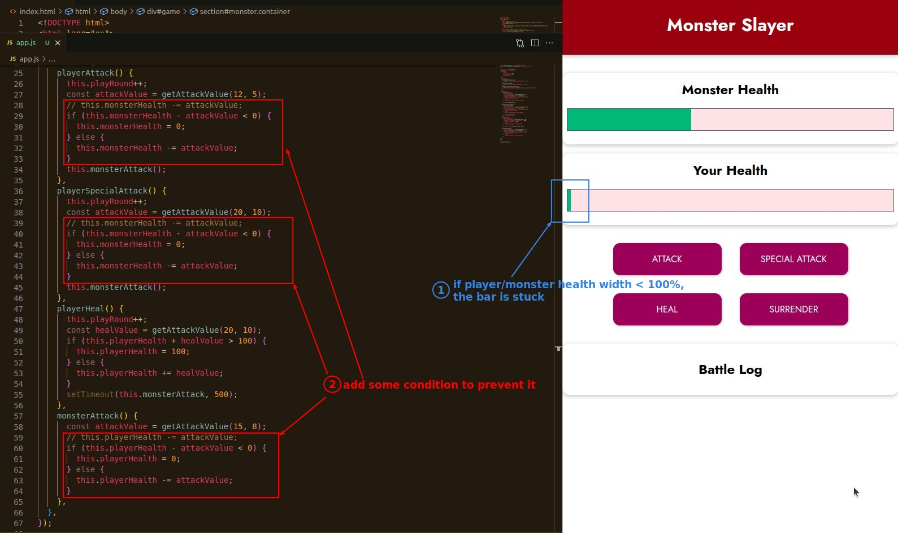
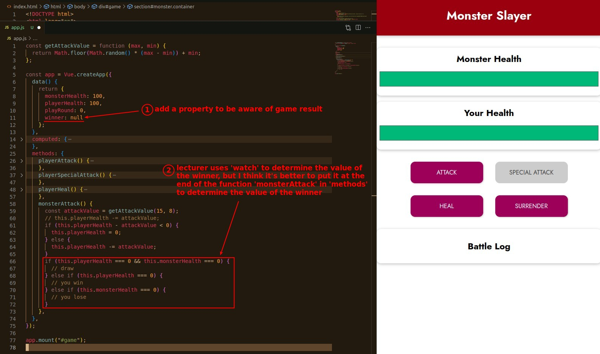
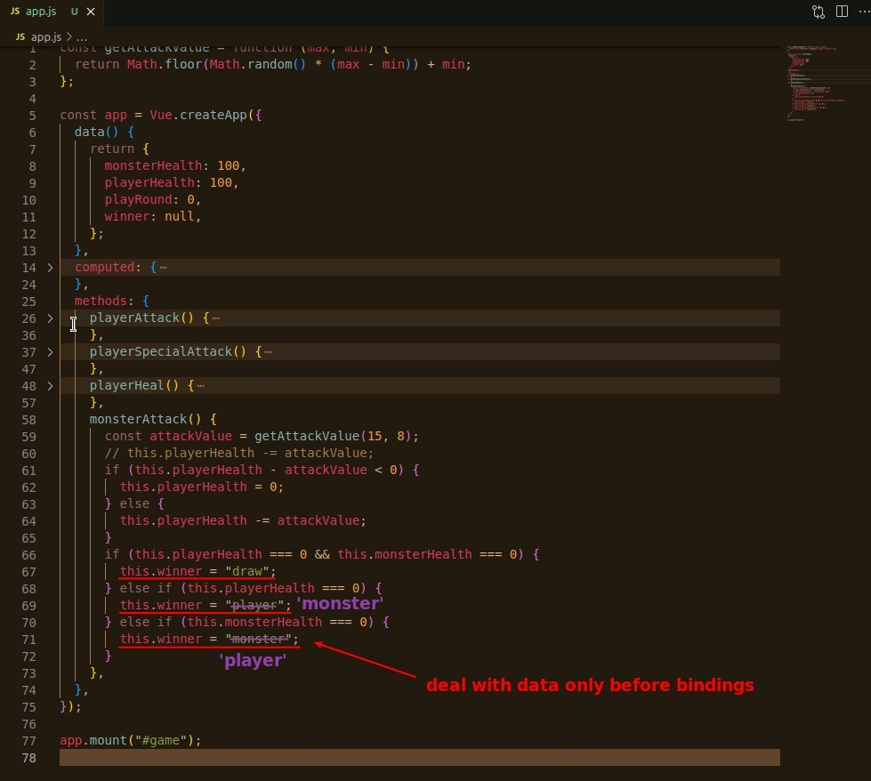
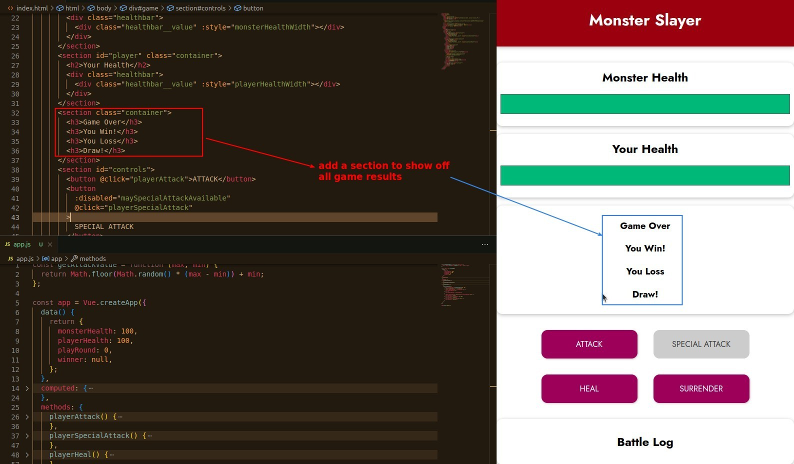
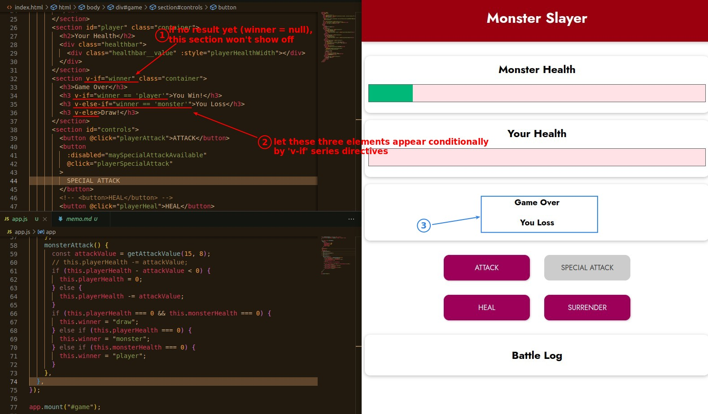

## **Fix Health Bar Stuck at Low Level Issue**

- The reason for the stuck is mainly because the width is assigned a negative value, so after the correction the minimum width will only be assigned zero.

## **Logic of Game Results**

- The null value is very useful, because it can be placed directly in the condition position to produce a false result.

- Because I added timeout in the heal function, it is the safest way to put the logic of game result judgment in monsterAttack.

- First make sure the data part can be processed correctly, and then figure out how to render to the browser.

## **HTML Game Results Rendering**

