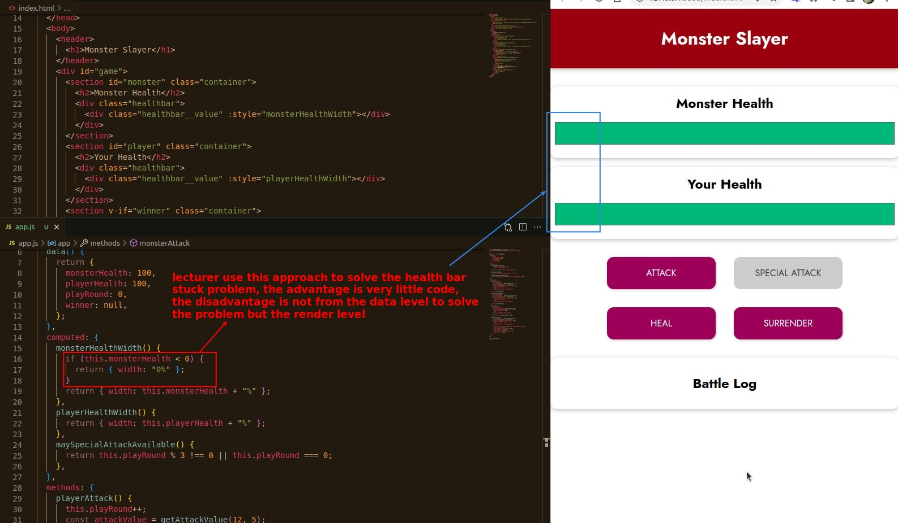
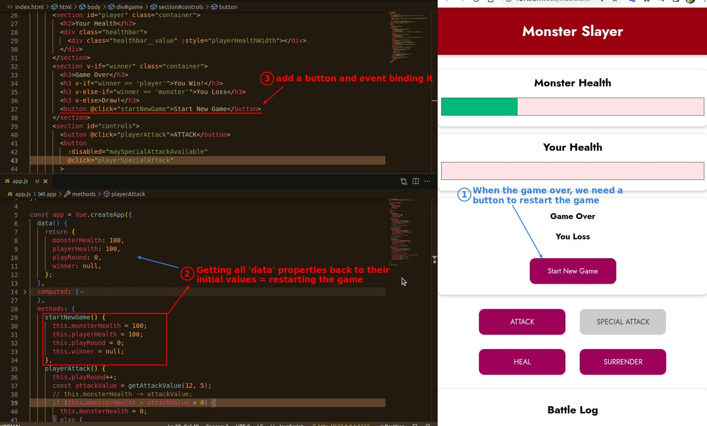
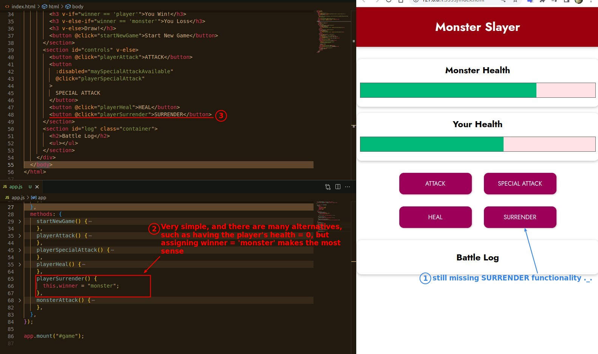

## **Fix Low Health Stuck Issue in another way**

- Because computed functions usually need to return a value, so use if ... return method codes will be more concise.

- But I think it is more logical to solve the problem from the data level. (my personal opinion)

## **Start New Game**

- If all the game variables (not only the general values that change, but also the status) are written in the property 'data', the new game = initial all properties values.

## **Avoid Any Actions After GAME OVER**

- It may be easy to overlook that the result section and the action section are siblings, because both elements have many children, but if you do notice, you can save a lot of code with v-else.

## **Surrender**

- Very simple, there are many options, but the logic of the game is the point.
