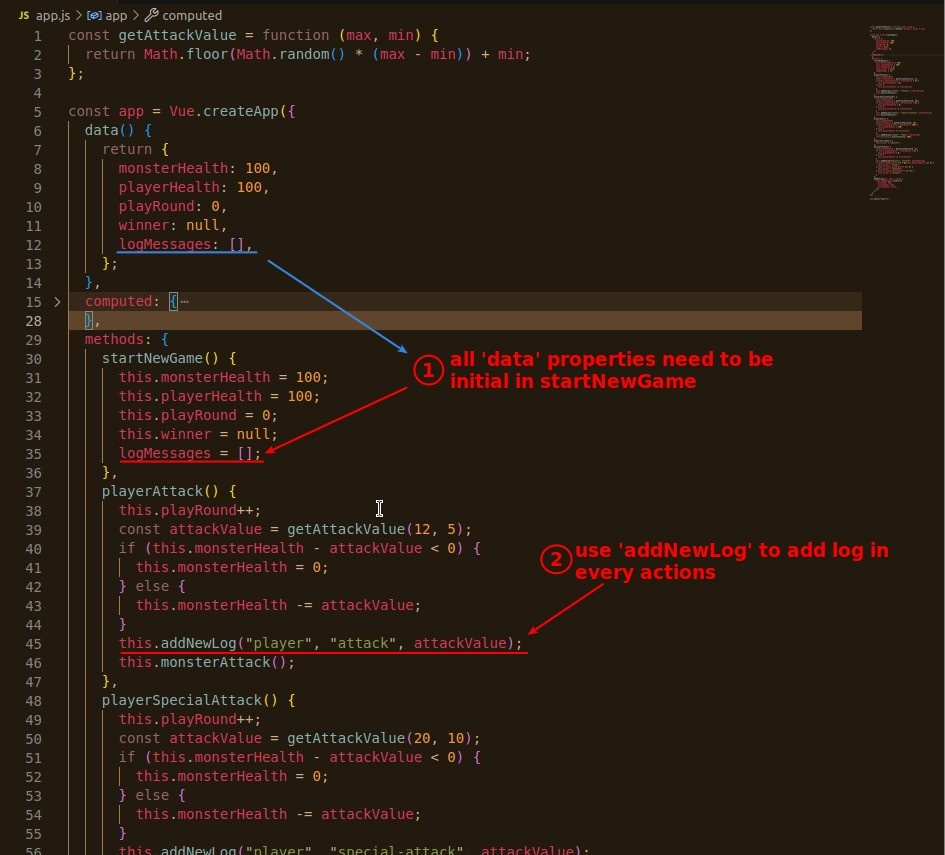
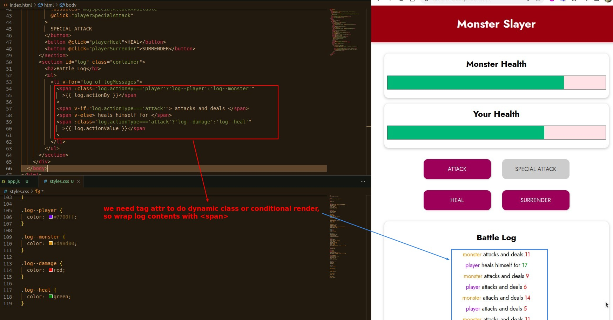

## **Logic of Log Messages (Data Layer)**

### _Basic setup: 'data' property, 'methods' func to add log_

### _Initial part & Add Logs in Every Actions_

## **Render Logs, Dynamic Style/Class**

### _Without any style, just print log_

### _Dynamic Style and Conditional Render_

