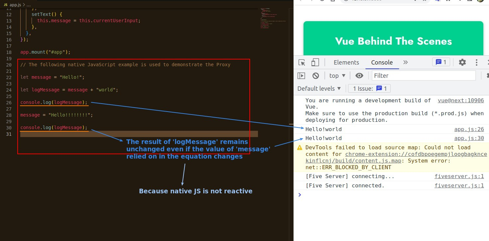
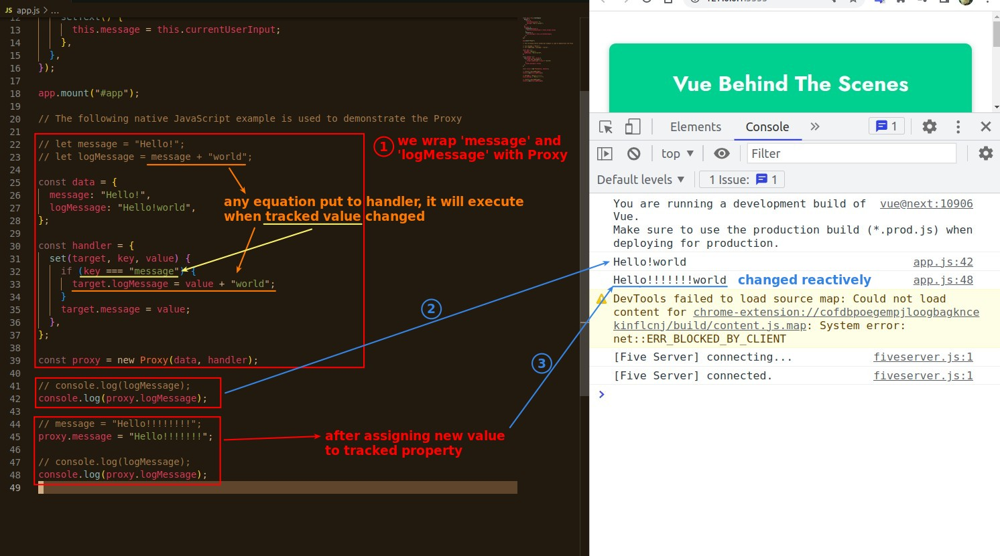

## **Native JavaScript is not reactive**

- The value of the variables in the equation depends only on the state at the time of execution, and any subsequent changes in the variables used in the equation are irrelevant, which is a non-reactive feature.

## **Proxy of JavaScript**

> Vue uses JavaScript's Proxy to make its own built-in reactive logic.

- Proxy is a special class that uses the concept of setter to generate.
  - It allows us to track changes in the data it wrap, and change the content of the related data in real time.
- The actual operation is more complex, but at the heart of it all is the Proxy.
