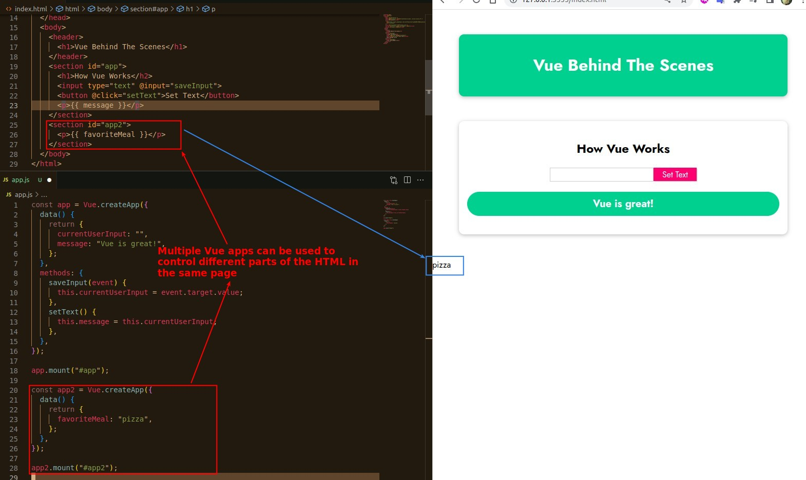
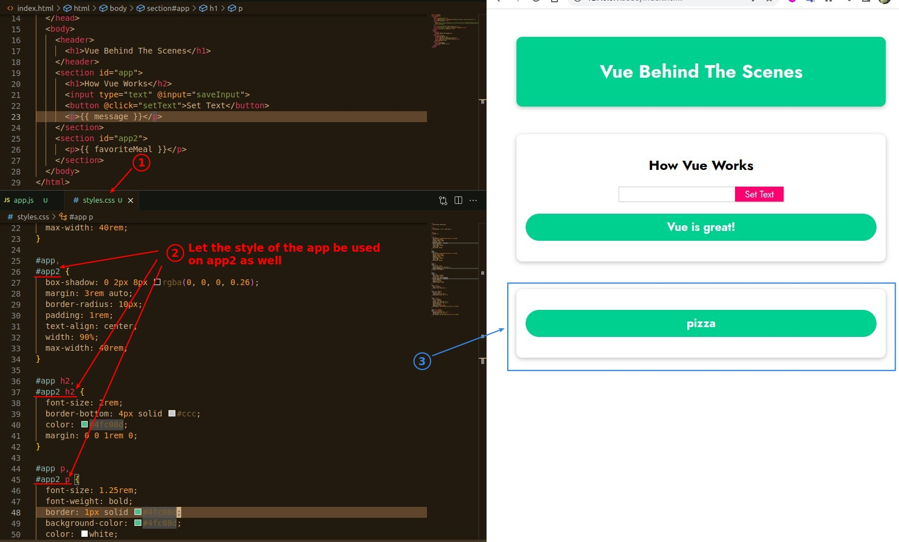
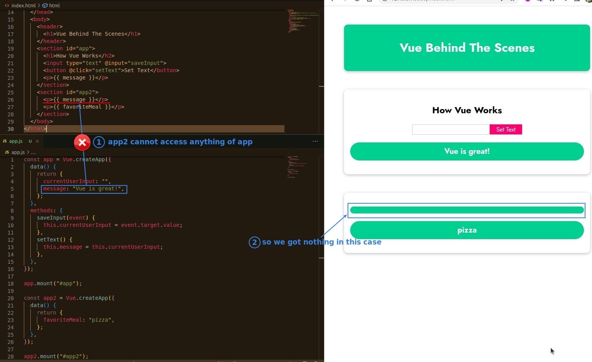

## **Add Second Vue App in the same page**

## **Use Styles of app to app2 as well**

## **Relate or Not Relate?**

- From the above results, it is clear that the different Vue apps work independently of each other, without any connection between them.
